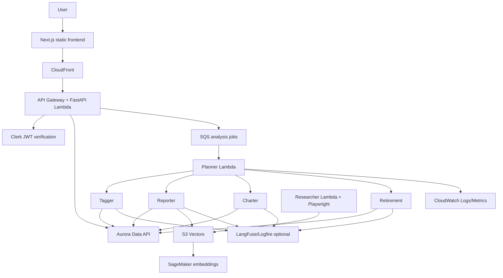
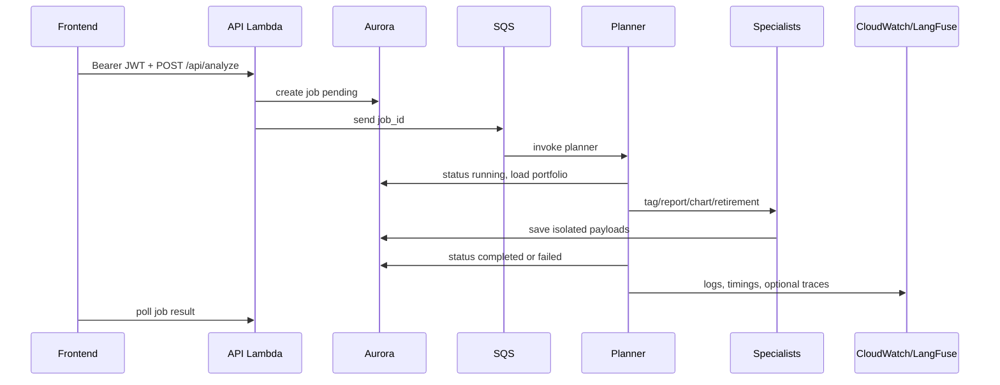

# Enterprise Architecture của Alex

Tài liệu này là bản đồ enterprise xuyên suốt toàn bộ dự án Alex. Guide 8 không chỉ nằm trong `terraform/8_enterprise`: các cơ chế Scalability, Security, Monitoring, Guardrails, Explainability và Observability được phân bổ trong frontend, API, agent Lambda, database và infrastructure của các Guide 2-7.

Nó mô tả **evidence trong repository**, không xác minh AWS live state. Vì vậy, “đã áp dụng” có nghĩa là code/Terraform tồn tại và cần được deploy/cấu hình đúng để có hiệu lực.

## Cách đọc và quy ước trạng thái

| Trạng thái | Nghĩa |
|---|---|
| `Đã áp dụng trong code` | Source code trực tiếp thực hiện cơ chế này. |
| `Đã khai báo hạ tầng` | Terraform khai báo resource/configuration liên quan. |
| `Khuyến nghị chưa triển khai` | Guide 8 đề xuất, nhưng repo chưa có implementation tương ứng. |
| `Cần điều chỉnh` | Implementation tồn tại nhưng có mismatch runtime, scope hoặc giới hạn. |

Khong dua vao tai lieu nay: `.env`, `terraform.tfvars`, API keys, ARN/URL nhay cam, hay output cua AWS CLI. Dung README nhu tai lieu thiet ke va checklist; dung CloudWatch/AWS Console de xac minh van hanh that.

## Enterprise trong toàn kiến trúc

Luon co hai data plane can phan biet:

| Plane | Source of truth | Enterprise concern |
|---|---|---|
| Portfolio/business | Aurora PostgreSQL qua Data API | Tenant isolation theo `clerk_user_id`, validation, job state |
| Research/RAG | S3 Vectors + SageMaker | Ingest API key, embedding latency, content quality |

## 1. Scalability

**Muc tieu:** tach request cua nguoi dung khoi agent workload, scale compute theo traffic va tranh state trong Lambda.

| Evidence | Trang thai | Chi tiet |
|---|---|---|
| `terraform/6_agents/main.tf` | Da khai bao ha tang | SQS queue trigger `alex-planner`, batch size 1; Planner goi specialists. |
| `backend/planner/agent.py` va `lambda_handler.py` | Da ap dung trong code | Orchestration, tagger preprocessing va specialist invocations. |
| `terraform/5_database` | Da khai bao ha tang | Aurora Serverless v2 va Data API, khong can application connection pool. |
| `terraform/7_frontend/main.tf` | Da khai bao ha tang | CloudFront static origin + API Gateway HTTP API. |
| `terraform/7_frontend/main.tf` | Da khai bao ha tang | API stage throttle `100` requests/s va burst `100`. |
| `terraform/3_ingestion/main.tf` | Da khai bao ha tang | Usage plan ingest throttle `100` requests/s va burst `200`. |

**Gioi han hien tai**

- Planner timeout 900 seconds, specialist timeout 300 seconds; day la gioi han execution, khong phai SLO da duoc kiem chung.
- Khong co reserved concurrency, provisioned concurrency, load test script, Step Functions hay autoscaling policy rieng trong Part 8.
- UI poll job moi 2 giay; chua co SSE/WebSocket cho progress realtime.

**Roadmap Guide 8:** chi tang Aurora ACU, Lambda memory/concurrency va API throttle sau khi co load profile. Khong nen ap dung cac gia tri enterprise cao mac dinh, vi se tang chi phi.

## 2. Security

**Muc tieu:** authentication o HTTP boundary, authorization theo user, least privilege cho AWS service va tach secrets khoi source.

| Evidence | Trang thai | Chi tiet |
|---|---|---|
| `backend/api/main.py` | Da ap dung trong code | `ClerkHTTPBearer` verify JWT qua JWKS; lay `sub` lam user identity. |
| `backend/api/main.py` | Da ap dung trong code | CORS lay allowlist tu `CORS_ORIGINS`; error handler tra response than thien. |
| `terraform/7_frontend/main.tf` | Da khai bao ha tang | IAM role API chi co Data API, Secrets Manager, SQS va invoke permissions can thiet. |
| `terraform/6_agents/main.tf` | Da khai bao ha tang | Agent role, per-function env va SQS event source mapping. |
| `terraform/3_ingestion/main.tf` | Da khai bao ha tang | REST ingest endpoint bat buoc API key va usage plan. |
| `terraform/5_database` | Da khai bao ha tang | Aurora credential o Secrets Manager va Data API. |

**Can dieu chinh**

- API Gateway Part 7 CORS `allow_origins = ["*"]`; FastAPI co allowlist cu the, nhung gateway layer van rong.
- S3 frontend bucket dung public website origin thay vi private bucket voi OAC/OAI.
- `CLERK_ISSUER` duoc inject theo Terraform nhung API code hien khong dung truc tiep.

**Khuyen nghi chua trien khai:** AWS WAF, GuardDuty, VPC endpoints, API Gateway JWT authorizer, stricter CloudFront/S3 OAC va security scanning. Cac thay doi nay can threat model va chi phi ro rang, khong nen xem la checklist copy-paste tu Guide 8.

## 3. Monitoring

**Muc tieu:** quan sat latency, error, throughput va queue/agent health ma khong can log secrets.

| Evidence | Trang thai | Chi tiet |
|---|---|---|
| `terraform/3_ingestion/main.tf` | Da khai bao ha tang | Log group `/aws/lambda/alex-ingest`, retention 7 ngay. |
| `terraform/6_agents/main.tf` | Da khai bao ha tang | 5 log groups `/aws/lambda/alex-*`, retention 7 ngay. |
| `backend/*/lambda_handler.py` | Da ap dung trong code | Timing logs cho create, agent run, DB va Lambda total. |
| `backend/watch_agents.py` | Da ap dung trong code | Theo doi log cua agents tu terminal. |
| `terraform/8_enterprise` | Da khai bao ha tang | Hai CloudWatch dashboards. |

`terraform/8_enterprise` document chi tiet tai [README.md](terraform/8_enterprise/README.md). Dashboard agent theo doi Duration, Errors, Invocations, ConcurrentExecutions va Throttles cua ca nam Lambda.

**Can dieu chinh:** dashboard AI model theo doi Bedrock metric trong khi Part 6 su dung `openai/gpt-5.4-mini` va `openai/gpt-5.4-nano` qua LiteLLM. SageMaker widgets van phu hop cho embedding flow, nhung Bedrock invocation/token/latency widgets khong dai dien cho agents hien tai.

**Khuyen nghi chua trien khai:** `aws_cloudwatch_metric_alarm`, SNS notification, DLQ alarms, API Gateway/Aurora dashboard va centrally managed log retention policy.

## 4. Guardrails va resilience

**Muc tieu:** ngan input/output khong hop le, retry loi tam thoi va luu job failure ro rang.

| Evidence | Trang thai | Chi tiet |
|---|---|---|
| `backend/api/main.py` | Da ap dung trong code | Pydantic request models va validation/HTTP/general exception handlers. |
| `backend/database/src/schemas.py` | Da ap dung trong code | Pydantic schemas cho business data truoc khi ghi DB. |
| `backend/tagger/agent.py` | Da ap dung trong code | Structured output va allocation validators gan tong 100%. |
| `backend/charter/lambda_handler.py` | Da ap dung trong code | Chi parse JSON object, log parse failure va khong save chart khi fail. |
| `backend/{charter,retirement}/lambda_handler.py` | Da ap dung trong code | Tenacity exponential retry cho rate limit/temporary failures. |
| `backend/researcher/{server.py,tools.py,context.py}` | Da ap dung trong code | Verified-web-only gate, source URL validation, retry constrained browser path. |
| `terraform/6_agents/main.tf` | Da khai bao ha tang | SQS/DLQ path cho job processing. |

**Gioi han:** Charter chua co schema validation day du cho tung chart data point nhu vi du trong Guide 8; no chi extract/parse JSON va build payload. Sanitizer prompt-injection generic, response-size limiter va retry wrapper chung trong guide khong phai implementation chung cho moi agent trong repo.

## 5. Explainability va auditability

**Muc tieu:** ket qua tai chinh co context, rationale va dau vet van hanh ma khong exposing chain-of-thought nhay cam.

| Evidence | Trang thai | Chi tiet |
|---|---|---|
| `backend/tagger/agent.py` | Da ap dung trong code | Structured classification va allocation fields co validation. |
| `backend/database/src/schemas.py` | Da ap dung trong code | Recommendation schema co field `rationale`. |
| `backend/reporter` | Da ap dung trong code | Luu narrative report vao `jobs.report_payload`. |
| `backend/retirement/agent.py` | Da ap dung trong code | Tinh Monte Carlo/projection trong Python truoc khi LLM dien giai. |
| `backend/planner/lambda_handler.py` | Da ap dung trong code | Job status va timing logs tao audit trail van hanh co ban. |

**Gioi han:** chua co `AuditLogger` chung, immutable audit store, input hash, retention/compliance policy hay UI hien rationale co cau truc. Guide 8 dua ra cac pattern nay nhu roadmap; khong nen mo ta chung da duoc deploy.

## 6. Observability

**Muc tieu:** trace agent workflow, model/tool behavior va performance, trong khi app van chay duoc neu tracing optional khong co credentials.

| Evidence | Trang thai | Chi tiet |
|---|---|---|
| `backend/{planner,tagger,reporter,charter,retirement}/observability.py` | Da ap dung trong code | Context manager khoi tao Logfire instrumentation va LangFuse client khi co secret key. |
| `terraform/6_agents/main.tf` | Da khai bao ha tang | Inject `LANGFUSE_PUBLIC_KEY`, `LANGFUSE_SECRET_KEY`, `LANGFUSE_HOST` vao 5 agents. |
| `backend/watch_agents.py` | Da ap dung trong code | Hien thi LangFuse-related logs khi theo doi CloudWatch. |
| `backend/researcher/server.py` | Da ap dung trong code | Structured research telemetry va outcome classification. |

**Can dieu chinh:** observability context cho agent co delay 15 giay khi flush LangFuse; do tre nay anh huong Lambda tail latency va can duoc danh gia truoc khi dat SLO. LangFuse credentials la optional trong Terraform, nen trace chi xuat hien khi configuration duoc cap.

## Evidence index

| Khu vuc | Files chinh | Co che enterprise |
|---|---|---|
| Ingest | `backend/ingest`, `terraform/3_ingestion` | API key, usage plan, log retention, S3 Vectors/SageMaker |
| Researcher | `backend/researcher` , `terraform/4_researcher` | verified web content, structured telemetry, container Lambda |
| Data | `backend/database`, `terraform/5_database` | Aurora Data API, Pydantic validation, user/job separation |
| Agent orchestra | `backend/{planner,tagger,reporter,charter,retirement}`, `terraform/6_agents` | SQS, DLQ, agent boundaries, retries, LangFuse, logs |
| API/frontend | `backend/api`, `frontend`, `terraform/7_frontend` | Clerk JWT, CORS, error handling, API throttle, CloudFront |
| Monitoring | `terraform/8_enterprise` | CloudWatch dashboards va gap Bedrock/OpenAI |

## Operational flow

## Runbook ngắn

1. Package va deploy code theo README cua component, sau do `terraform plan` truoc `apply` trong dung Part.
2. Trigger mot analysis co kiem soat; kiem tra job status, SQS/DLQ va CloudWatch log group tuong ung.
3. Neu LangFuse da cau hinh, kiem tra trace sau khi Lambda flush; khong dump environment variables.
4. Deploy `terraform/8_enterprise`, mo dashboard agent performance va xac minh Lambda metric co data.
5. Khong dung Bedrock dashboard lam bang chung chi phi/latency cua OpenAI agents cho toi khi dashboard duoc thay the hoac bo sung.

## Release checklist

- Clerk JWT va CORS origin da khop frontend production.
- API Gateway throttle, SQS queue va DLQ duoc kiem tra.
- Aurora/Data API va Secrets Manager references khop region.
- `MODEL_ID_*` phu hop task va budget; khong ghi key vao docs/log.
- Charter invalid JSON, agent rate-limit va researcher browser failure co failure path da biet.
- CloudWatch logs, dashboard va LangFuse (neu bat) co owner va retention plan.
- AWS Billing/Cost Explorer duoc kiem tra; Aurora la chi phi can theo doi nhat.

## Cost va cleanup

- Aurora Serverless v2 la chi phi nen lon nhat; destroy Part 5 khi khong hoc/develop.
- SageMaker serverless, Lambda, SQS va CloudWatch phat sinh theo usage/retention.
- Part 8 chi tao dashboard; destroy no khong xoa agents, data hay frontend.
- Destroy theo thu tu nguoc cua cac Part khi can cleanup toan bo, va khong destroy database neu can giu portfolio/job data.

## Tài liệu liên quan

- [Guide 8](guides/8_enterprise.md)
- [Agent architecture](guides/agent_architecture.md)
- [Architecture overview](guides/architecture.md)
- [Terraform Part 8](terraform/8_enterprise/README.md)
- [Agent infrastructure](terraform/6_agents/README.md)
- [Frontend infrastructure](terraform/7_frontend/README.md)

## Tóm tắt

Alex co nhieu building block enterprise da nam trong cac Part truoc: serverless decoupling, JWT, IAM, Data API, validation, retry, verified research, logs va optional traces. Part 8 hien tap trung vao CloudWatch dashboard, khong tu dong bien toan bo cac khuyen nghi security/guardrail/observability thanh infrastructure. Dung quy uoc trang thai trong tai lieu nay de phan biet implementation da co, khai bao can deploy va roadmap can thiet ke them.
