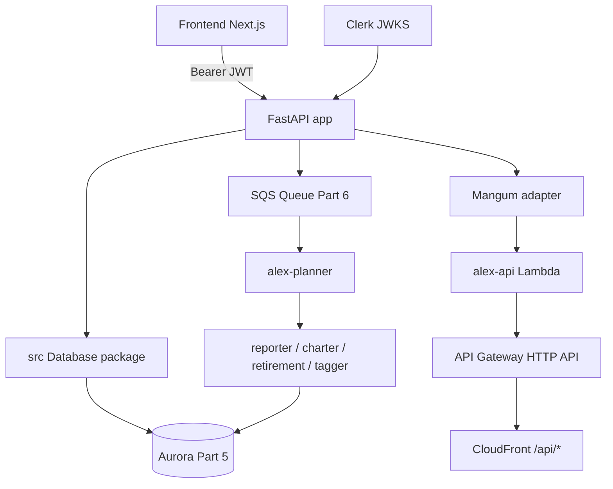
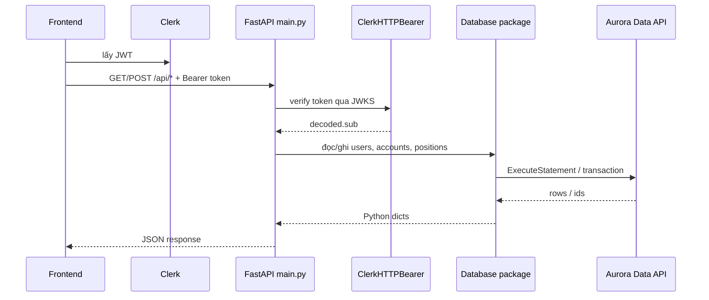
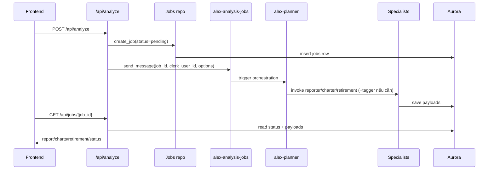
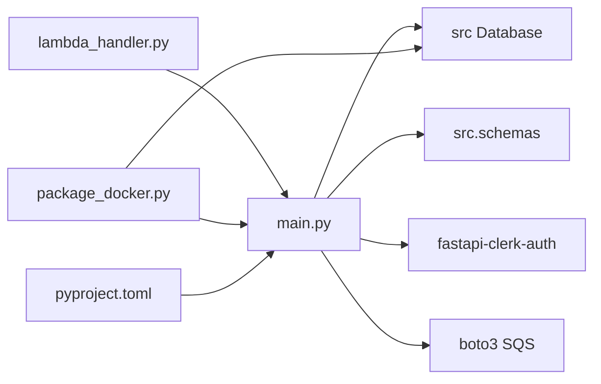
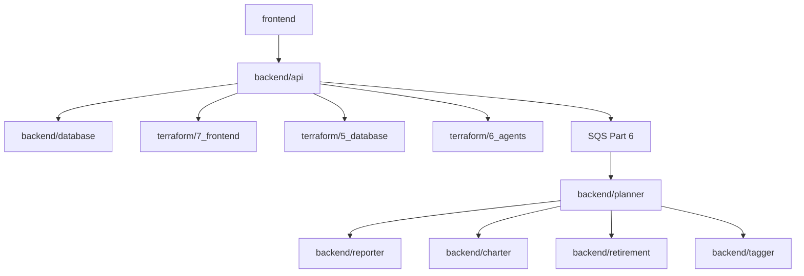

# `backend/api` — backend API cho Guide 7

`backend/api` là lớp HTTP backend của **Guide 7 - Frontend & API** trong Alex. Folder này cung cấp FastAPI app để frontend Next.js gọi sau khi người dùng đăng nhập bằng Clerk, đồng thời là cầu nối giữa UI với Aurora Part 5 và Agent Orchestra Part 6. Theo code hiện tại, API này chạy theo 2 chế độ: local qua `uv run main.py` và production qua AWS Lambda + Mangum. Source of truth ở đây là code hiện tại trong folder và hạ tầng Part 7, không phải guide cũ nếu có khác biệt.

## Cấu trúc thư mục

```text
backend/api/
├── main.py              # FastAPI app, auth Clerk, toàn bộ route CRUD + trigger analysis
├── lambda_handler.py    # Entry point Lambda riêng cho API Gateway
├── package_docker.py    # Build api_lambda.zip bằng Docker cho AWS Lambda
├── pyproject.toml       # Dependency của API backend
└── .python-version      # Python version hint cho uv project
```

## Sơ đồ tổng quan



## Hạ tầng liên quan

Folder Terraform tương ứng là [terraform/7_frontend/README.md](/home/hieu0606sunny/AiProduction_t6_2026_wsl/projects/alex/terraform/7_frontend/README.md). Ở mức tối thiểu cần nhớ:

- `terraform/7_frontend/main.tf` deploy Lambda `alex-api` từ `backend/api/api_lambda.zip`
- API được expose qua API Gateway HTTP API, rồi CloudFront route `/api/*` về API Gateway
- Lambda nhận env vars từ Part 5 và Part 6:
  - `AURORA_CLUSTER_ARN`, `AURORA_SECRET_ARN`, `AURORA_DATABASE`
  - `SQS_QUEUE_URL`
  - `CLERK_JWKS_URL`, `CLERK_ISSUER`
  - `CORS_ORIGINS`

## Chi tiết từng file

### 1. `main.py` — FastAPI app chính

**Vai trò:** Đây là core logic của cả folder. File này khai báo FastAPI app, middleware CORS, exception handlers, Clerk auth guard, models request/response, toàn bộ route CRUD, và logic gửi job phân tích lên SQS.

**Nhiệm vụ chi tiết:**
- load `.env` bằng `python-dotenv`
- khởi tạo `Database()` từ shared package `backend/database/src`
- cấu hình `ClerkHTTPBearer` với `CLERK_JWKS_URL`
- tạo SQS client bằng `DEFAULT_AWS_REGION`
- cung cấp CRUD cho `users`, `accounts`, `positions`, `jobs`
- tạo test portfolio mẫu qua `/api/populate-test-data`
- tạo analysis job và đẩy message sang SQS qua `/api/analyze`

**Entry points HTTP:**

| Method | Path | Chức năng |
|---|---|---|
| `GET` | `/health` | Health check local/prod |
| `GET` | `/api/user` | Lấy hoặc tự tạo user từ Clerk token |
| `PUT` | `/api/user` | Cập nhật user settings |
| `GET` | `/api/accounts` | Liệt kê account của user |
| `POST` | `/api/accounts` | Tạo account mới |
| `PUT` | `/api/accounts/{account_id}` | Sửa account |
| `DELETE` | `/api/accounts/{account_id}` | Xóa account và positions con |
| `GET` | `/api/accounts/{account_id}/positions` | Liệt kê positions kèm instrument data |
| `POST` | `/api/positions` | Tạo position mới; tự tạo instrument tối giản nếu chưa có |
| `PUT` | `/api/positions/{position_id}` | Sửa quantity |
| `DELETE` | `/api/positions/{position_id}` | Xóa position |
| `GET` | `/api/instruments` | Danh sách instrument cho autocomplete |
| `POST` | `/api/analyze` | Tạo job phân tích và đẩy SQS message |
| `GET` | `/api/jobs/{job_id}` | Lấy trạng thái/kết quả một job |
| `GET` | `/api/jobs` | Liệt kê jobs của user |
| `DELETE` | `/api/reset-accounts` | Xóa toàn bộ accounts hiện tại của user |
| `POST` | `/api/populate-test-data` | Nạp 3 account + positions mẫu |

**Models request/response nội bộ:**

| Model | Vai trò |
|---|---|
| `UserResponse` | gói `user` + `created` |
| `UserUpdate` | patch user settings |
| `AccountUpdate` | patch account |
| `PositionUpdate` | patch quantity |
| `AnalyzeRequest` | payload trigger analysis |
| `AnalyzeResponse` | trả `job_id` + message |

**Biến môi trường đọc trực tiếp:**

| Biến | Mặc định | Dùng ở đâu |
|---|---|---|
| `CORS_ORIGINS` | `http://localhost:3000` | FastAPI CORS middleware |
| `DEFAULT_AWS_REGION` | `us-east-1` trong code | tạo SQS client; thực tế môi trường hiện tại dùng `ap-southeast-1` |
| `SQS_QUEUE_URL` | `""` | gửi analysis job sang Part 6 |
| `CLERK_JWKS_URL` | không có mặc định | verify JWT từ Clerk |

**Hàm/class then chốt:**

| Hàm/Class | Chức năng |
|---|---|
| `get_current_user_id()` | lấy `sub` từ token đã được Clerk guard verify |
| `validation_exception_handler()` | map lỗi Pydantic về 422 thân thiện hơn |
| `http_exception_handler()` | map lỗi HTTP thường gặp sang message thân thiện |
| `general_exception_handler()` | fallback 500 và log exception |
| `trigger_analysis()` | tạo job trong DB rồi `send_message()` lên SQS |
| `populate_test_data()` | tạo instruments thiếu, 3 account mẫu, và positions đi kèm |

**Điểm implementation quan trọng:**
- `main.py` có `handler = Mangum(app)` ở cuối, nhưng Terraform production thực tế dùng `lambda_handler.handler`
- khi user thêm symbol chưa tồn tại, API tự tạo instrument tối giản để UI không bị chặn; metadata đầy đủ sẽ được tagger xử lý về sau
- `CLERK_ISSUER` được Terraform inject nhưng code hiện tại không dùng trực tiếp
- route `/api/analyze` vẫn tạo job kể cả khi `SQS_QUEUE_URL` trống; chỉ log warning và không queue job

### 2. `lambda_handler.py` — Lambda entry point

**Vai trò:** File mỏng dùng riêng cho AWS Lambda runtime. Nó import `app` từ `api.main` rồi bọc bằng `Mangum`.

**Nhiệm vụ chi tiết:**
- làm entry point ổn định cho API Gateway HTTP API
- đặt `lifespan="off"` để tránh lifecycle handling không cần thiết trên Lambda

**Thông số chính:**

| Thuộc tính | Giá trị |
|---|---|
| Lambda handler export | `handler` |
| Adapter | `Mangum(app, lifespan="off")` |
| Import app từ | `api.main` |

### 3. `package_docker.py` — build artifact cho Lambda

**Vai trò:** Build `api_lambda.zip` trong môi trường Docker Lambda Python 3.12 để đảm bảo binary compatibility.

**Nhiệm vụ chi tiết:**
- kiểm tra Docker đang chạy
- copy source code API vào temp package
- copy shared database package `backend/database/src` vào zip
- tự viết `requirements.txt` tối thiểu
- build image `alex-api-packager` với `--platform linux/amd64`
- extract `/var/task` từ container
- zip toàn bộ thành `api_lambda.zip`

**Thông số build:**

| Thuộc tính | Giá trị |
|---|---|
| Docker base image | `public.ecr.aws/lambda/python:3.12` |
| Target architecture | `linux/amd64` |
| Artifact output | `backend/api/api_lambda.zip` |
| Bỏ qua khi copy | `__pycache__`, `.pyc`, `.env*`, `*.zip`, `package_docker.py`, `test_*.py` |

**Hàm then chốt:**

| Hàm | Chức năng |
|---|---|
| `run_command()` | wrapper chạy subprocess và fail fast |
| `main()` | orchestrate toàn bộ packaging flow |

### 4. `pyproject.toml` — dependency của API

**Vai trò:** Khai báo uv project cho API backend.

**Dependencies:**

| Package | Mục đích |
|---|---|
| `alex-database` | shared database layer từ Part 5 |
| `fastapi` | framework HTTP API |
| `mangum` | bridge FastAPI sang Lambda |
| `boto3` | gọi SQS và AWS services |
| `fastapi-clerk-auth` | verify Clerk JWT |
| `python-dotenv` | load `.env` local |
| `uvicorn` | run local server |
| `python-jose` | JWT-related dependency |
| `httpx` | helper HTTP dependency |

### 5. `.python-version` — Python version hint

**Vai trò:** File phụ trợ cho local tooling, giúp uv/pyenv-style tool chọn đúng Python version cho folder này.

## Workflow chính

### Workflow 1: Request CRUD từ frontend



### Workflow 2: Trigger AI analysis



## Mối liên kết giữa các file



## Mối liên hệ với folder khác



| Folder | Cần gì từ folder đó | Dùng ở đâu |
|---|---|---|
| `frontend` | gọi `/api/*` bằng Clerk token | UI local và production |
| `backend/database` | `Database`, repos, schema models | toàn bộ CRUD và job tracking |
| `terraform/5_database` | Aurora cluster ARN + secret ARN | env của Lambda API |
| `terraform/6_agents` | `SQS_QUEUE_URL` + queue ARN | trigger analysis pipeline |
| `terraform/7_frontend` | deploy Lambda/API Gateway/CloudFront | production path |
| `backend/planner` | tiêu thụ SQS message từ `/api/analyze` | orchestration thực tế |

## Cách sử dụng nhanh

```bash
cd backend/api

# Chạy local API
uv run main.py

# Build artifact cho Lambda
uv run package_docker.py
```

```bash
# Chạy full local frontend + backend
cd scripts
uv run run_local.py
```

```bash
# Deploy Part 7
cd scripts
uv run deploy.py
```

```bash
# Xem log production
aws logs tail /aws/lambda/alex-api --follow --region ap-southeast-1
```

## Tóm tắt

| File | Vai trò ngắn |
|---|---|
| `main.py` | FastAPI app chính, auth, CRUD, test data, trigger analysis |
| `lambda_handler.py` | Mangum handler cho AWS Lambda/API Gateway |
| `package_docker.py` | build `api_lambda.zip` tương thích Lambda |
| `pyproject.toml` | dependencies và workspace source |
| `.python-version` | Python version hint cho tooling local |

Checklist chức năng hiện tại:

- Có auth bằng Clerk JWT ở tầng Lambda app
- Có CRUD cho user, account, position, instrument autocomplete
- Có job lifecycle cơ bản cho portfolio analysis
- Có path local (`uvicorn`) và production (`Mangum`)
- Có helper test data để frontend demo được ngay
