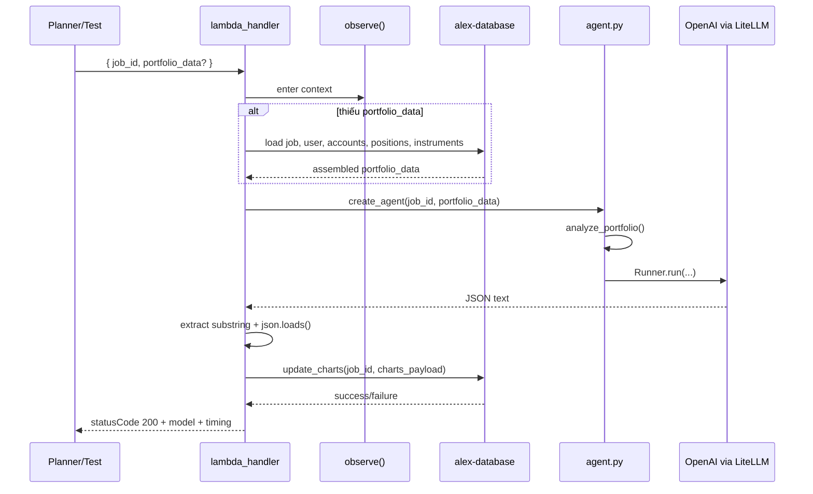
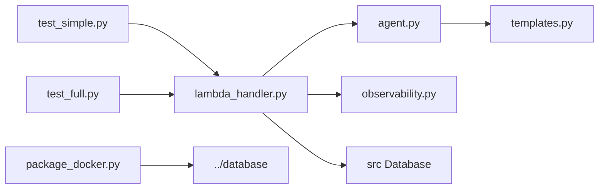

# `backend/charter` — agent tạo chart payload cho portfolio analysis

## Nhiệm vụ chính

`backend/charter` chứa Lambda agent sinh dữ liệu biểu đồ cho frontend sau khi portfolio đã có instrument metadata tương đối đầy đủ:

- dùng OpenAI Agents SDK với `LitellmModel(model=MODEL_ID)` — đã migrate từ Bedrock sang OpenAI
- env var: `MODEL_ID_CHARTER` (default `openai/gpt-5.4-nano`)
- không dùng tools và không khai báo structured output type
- yêu cầu model trả về JSON thô đúng format
- parse JSON từ `result.final_output`
- chuyển mảng `charts` thành `charts_payload` keyed object
- lưu payload vào job qua `db.jobs.update_charts(job_id, charts_data)`
- có `[TIMING]` log đầy đủ: create, agent, db, lambda_total

Agent này tập trung vào visualization data, không phải narrative report.

## Cấu trúc thư mục

```text
backend/charter/
|-- agent.py
|-- lambda_handler.py
|-- observability.py
|-- package_docker.py
|-- pyproject.toml
|-- templates.py
|-- test_full.py
|-- test_simple.py
`-- uv.lock
```

## Sơ đồ tổng quan kiến trúc


## Chi tiết từng file

| File | Vai trò |
| --- | --- |
| `agent.py` | Tiền xử lý portfolio thành text analysis, tổng hợp asset classes/regions/sectors, tạo `LitellmModel(model=MODEL_ID)` với `MODEL_ID_CHARTER` từ env, build task prompt. Có `[TIMING]` log. |
| `lambda_handler.py` | Entry point của Lambda `alex-charter`. Có retry cho `RateLimitError`, gọi agent, parse JSON, lưu `charts_payload`, và có nhánh tự load `portfolio_data` từ DB nếu event không gửi sẵn. Có `[TIMING]` log đầy đủ qua các phase: create, agent, db, lambda_total. Response body chứa `model` + `timing` breakdown. |
| `templates.py` | Prompt yêu cầu model chỉ được output JSON, mô tả schema chart và ví dụ chart types `pie`, `bar`, `donut`, `horizontalBar`. |
| `observability.py` | Context manager cho LangFuse/logfire, flush trace ở cuối Lambda. Log sạch, không emoji. |
| `package_docker.py` | Package `charter_lambda.zip` bằng Docker Lambda Python 3.12 image, cài shared database package rồi zip source cần thiết. |
| `test_simple.py` | Tạo test job trong DB, gửi `portfolio_data` mẫu qua `lambda_handler`, in model + timing, rồi đọc ngược `charts_payload` để in chart summary. |
| `test_full.py` | Invoke Lambda `alex-charter` thật bằng boto3, lấy portfolio từ DB test user, in model + timing, rồi kiểm tra charts đã được lưu chưa. |
| `pyproject.toml` | UV project cục bộ với dependency tương tự các agent Part 6 khác. |
| `uv.lock` | File lock cho local run và package. |

Điểm implementation quan trọng:

- `analyze_portfolio()` chủ động tổng hợp dữ liệu số thay vì ném raw JSON đầy đủ cho model.
- Khi thiếu `current_price`, code dùng giá mặc định `1.0` và ghi warning.
- Lambda parse JSON bằng cách tìm ký tự `{` đầu tiên và `}` cuối cùng trong output.
- Dữ liệu chart lưu vào DB không giữ trường `key` bên trong mỗi chart; `key` trở thành key của dict top-level.

## Workflow chính



## Mối liên kết giữa các file

- `lambda_handler.py` gọi `create_agent()` từ `agent.py`, còn `create_agent()` lại dùng `analyze_portfolio()` và `create_charter_task()` từ `templates.py`.
- `lambda_handler.py` là nơi ghép AI output với persistence logic qua `db.jobs.update_charts(...)`.
- `test_simple.py` và `test_full.py` đều xác minh gián tiếp bằng cách đọc `jobs.charts_payload`.
- `observability.py` là lớp bao quanh Lambda runtime, không phải business logic của chart generation.
- `package_docker.py` tạo artifact mà `terraform/6_agents/main.tf` sẽ upload/deploy thành Lambda `alex-charter`.

Sơ đồ import/call tối giản:



## Mối liên hệ với folder khác

- `backend/planner`: planner gọi charter để sinh chart sau khi orchestration đã chọn workflow phù hợp.
- `backend/tagger`: chất lượng chart phụ thuộc vào allocation metadata mà tagger đã điền vào instrument.
- `backend/database`: cung cấp `Database`, repository `jobs/users/accounts/positions/instruments` và schema lưu `charts_payload`.
- `frontend`: payload tạo ra ở đây được thiết kế cho frontend chart components kiểu Recharts-compatible JSON.
- `terraform/6_agents`: tạo Lambda `alex-charter` và inject `MODEL_ID_CHARTER`, DB, observability env vars.

## Cách sử dụng nhanh

```bash
cd backend/charter

# Test local (dùng MODEL_ID_CHARTER từ env, default openai/gpt-5.4-nano)
uv run test_simple.py

# Test với model khác
MODEL_ID_CHARTER=openai/gpt-4.1-nano uv run test_simple.py

# Test Lambda đã deploy
uv run test_full.py

# Package và deploy
uv run package_docker.py
uv run package_docker.py --deploy
```

## Environment variables

| Biến | Dùng ở đâu | Mặc định |
| --- | --- | --- |
| `MODEL_ID_CHARTER` | `agent.py` — model string cho `LitellmModel` | `openai/gpt-5.4-nano` |
| `OPENAI_API_KEY` | LiteLLM — credential cho OpenAI API | bắt buộc |
| `AURORA_CLUSTER_ARN` | shared database package — Data API endpoint | bắt buộc |
| `AURORA_SECRET_ARN` | shared database package — credential | bắt buộc |
| `DATABASE_NAME` | shared database package | `alex` |
| `DEFAULT_AWS_REGION` | boto3 clients (DB, Lambda invoke) | `us-east-1` |
| `LANGFUSE_PUBLIC_KEY` | `observability.py` | optional |
| `LANGFUSE_SECRET_KEY` | `observability.py` | optional |
| `LANGFUSE_HOST` | `observability.py` | `https://us.cloud.langfuse.com` |

## Log output

Mỗi lần chạy đều in `[TIMING]` log kèm model name:

```
[TIMING] create_agent: 0.00s | model=openai/gpt-5.4-nano
[TIMING] Agent creation phase: 0.00s
[TIMING] Agent run phase: 6.30s | model=openai/gpt-5.4-nano
[TIMING] run_charter_agent TOTAL: 6.72s (create=0.00s, agent=6.30s, db=0.41s) | model=openai/gpt-5.4-nano
[TIMING] lambda_handler TOTAL: 6.72s | job=... | model=openai/gpt-5.4-nano
```

Response body cũng chứa `model` và `timing` breakdown:

```json
{
  "success": true,
  "message": "Generated 5 charts",
  "charts_generated": 5,
  "model": "openai/gpt-5.4-nano",
  "timing": {
    "create_s": 0.0,
    "agent_s": 6.3,
    "db_s": 0.41,
    "total_s": 6.72,
    "lambda_total_s": 6.72
  }
}
```

## Tóm tắt

`backend/charter` là agent biến portfolio đã được enrich thành chart payload dùng cho UI. Đã migrate hoàn toàn từ Bedrock sang OpenAI (`openai/gpt-5.4-nano` qua `MODEL_ID_CHARTER`). Có `[TIMING]` log đầy đủ, response body chứa model + timing. Phần rủi ro lớn nhất không phải DB hay packaging mà là độ ổn định của JSON output từ model.
