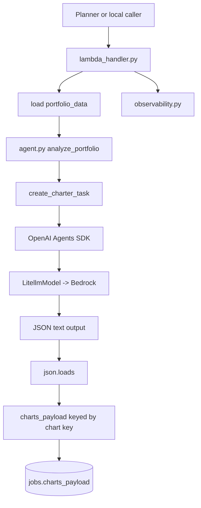
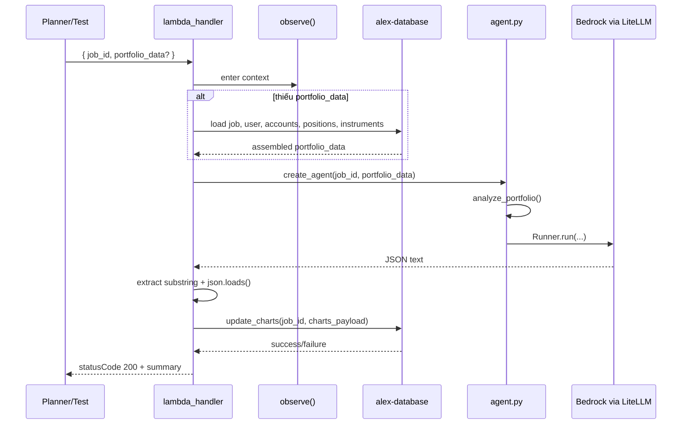
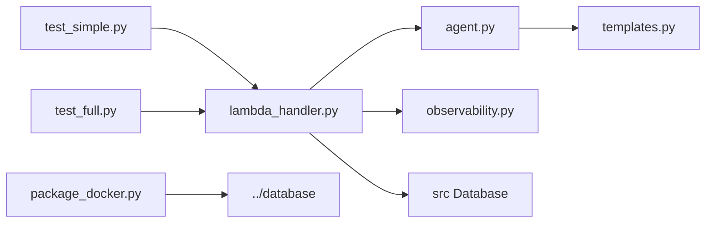

# `backend/charter` — agent tạo chart payload cho portfolio analysis

## Nhiệm vụ chính

`backend/charter` chứa Lambda agent sinh dữ liệu biểu đồ cho frontend sau khi portfolio đã có instrument metadata tương đối đầy đủ. Trạng thái hiện tại của repo là:

- dùng OpenAI Agents SDK với `LitellmModel(model=f"bedrock/{model_id}")`
- không dùng tools và không khai báo structured output type
- yêu cầu model trả về JSON thô đúng format
- parse JSON từ `result.final_output`
- chuyển mảng `charts` thành `charts_payload` keyed object
- lưu payload vào job qua `db.jobs.update_charts(job_id, charts_data)`

Agent này tập trung vào visualization data, không phải narrative report.

## Cấu trúc thư mục

```text
backend/charter/
|-- agent.py
|-- lambda_handler.py
|-- observability.py
|-- package_docker.py
|-- pyproject.toml
|-- templates.py
|-- test_full.py
|-- test_simple.py
`-- uv.lock
```

## Sơ đồ tổng quan kiến trúc



## Chi tiết từng file

| File | Vai trò |
| --- | --- |
| `agent.py` | Tiền xử lý portfolio thành text analysis, tổng hợp asset classes/regions/sectors, set `AWS_REGION_NAME`, tạo `LitellmModel` và task prompt. |
| `lambda_handler.py` | Entry point của Lambda `alex-charter`. Có retry cho `RateLimitError`, gọi agent, parse JSON, lưu `charts_payload`, và có nhánh tự load `portfolio_data` từ DB nếu event không gửi sẵn. |
| `templates.py` | Prompt yêu cầu model chỉ được output JSON, mô tả schema chart và ví dụ chart types `pie`, `bar`, `donut`, `horizontalBar`. |
| `observability.py` | Giống tagger: wrapper cho LangFuse/logfire, flush trace ở cuối Lambda. |
| `package_docker.py` | Package `charter_lambda.zip` bằng Docker Lambda Python 3.12 image, cài shared database package rồi zip source cần thiết. |
| `test_simple.py` | Tạo test job trong DB, gửi `portfolio_data` mẫu qua `lambda_handler`, rồi đọc ngược `charts_payload` để in chart summary. |
| `test_full.py` | Invoke Lambda `alex-charter` thật bằng boto3, lấy portfolio từ DB test user, rồi kiểm tra charts đã được lưu chưa. |
| `pyproject.toml` | UV project cục bộ với dependency tương tự các agent Part 6 khác. |
| `uv.lock` | File lock cho local run và package. |

Điểm implementation quan trọng:

- `analyze_portfolio()` chủ động tổng hợp dữ liệu số thay vì ném raw JSON đầy đủ cho model.
- Khi thiếu `current_price`, code dùng giá mặc định `1.0` và ghi warning.
- Lambda parse JSON bằng cách tìm ký tự `{` đầu tiên và `}` cuối cùng trong output.
- Dữ liệu chart lưu vào DB không giữ trường `key` bên trong mỗi chart; `key` trở thành key của dict top-level.

## Workflow chính



Các command thường dùng:

```bash
cd backend/charter
uv run test_simple.py
uv run test_full.py
uv run package_docker.py
uv run package_docker.py --deploy
```

## Mối liên kết giữa các file

- `lambda_handler.py` gọi `create_agent()` từ `agent.py`, còn `create_agent()` lại dùng `analyze_portfolio()` và `create_charter_task()` từ `templates.py`.
- `lambda_handler.py` là nơi ghép AI output với persistence logic qua `db.jobs.update_charts(...)`.
- `test_simple.py` và `test_full.py` đều xác minh gián tiếp bằng cách đọc `jobs.charts_payload`.
- `observability.py` là lớp bao quanh Lambda runtime, không phải business logic của chart generation.
- `package_docker.py` tạo artifact mà `terraform/6_agents/main.tf` sẽ upload/deploy thành Lambda `alex-charter`.

Sơ đồ import/call tối giản:



## Mối liên hệ với folder khác

- `backend/planner`: planner gọi charter để sinh chart sau khi orchestration đã chọn workflow phù hợp.
- `backend/tagger`: chất lượng chart phụ thuộc vào allocation metadata mà tagger đã điền vào instrument.
- `backend/database`: cung cấp `Database`, repository `jobs/users/accounts/positions/instruments` và schema lưu `charts_payload`.
- `frontend`: payload tạo ra ở đây được thiết kế cho frontend chart components kiểu Recharts-compatible JSON.
- `terraform/6_agents`: tạo Lambda `alex-charter` và inject env vars Bedrock/DB/observability.

## Cách sử dụng nhanh

Điều kiện tối thiểu:

- đã có `.env`
- DB Part 5 hoạt động nếu muốn test luồng lưu chart
- Docker đang chạy nếu cần package

Chạy local handler test:

```bash
cd backend/charter
uv run test_simple.py
```

Chạy Lambda đã deploy:

```bash
cd backend/charter
uv run test_full.py
```

Package/deploy:

```bash
cd backend/charter
uv run package_docker.py
uv run package_docker.py --deploy
```

Env vars current state thường gặp:

| Biến | Dùng ở đâu |
| --- | --- |
| `BEDROCK_MODEL_ID` | `agent.py` chọn model cho `LitellmModel`. |
| `BEDROCK_REGION` | `agent.py` gán vào `AWS_REGION_NAME` cho LiteLLM Bedrock. |
| `AURORA_CLUSTER_ARN` / `AURORA_SECRET_ARN` / `DATABASE_NAME` | package database dùng để đọc portfolio và ghi `charts_payload`. |
| `LANGFUSE_PUBLIC_KEY` / `LANGFUSE_SECRET_KEY` / `LANGFUSE_HOST` | `observability.py`. |
| `OPENAI_API_KEY` | trạng thái hiện tại chủ yếu phục vụ tracing/export, không phải luồng model chính. |

## Cách chuyển sang OpenAI models

Trạng thái hiện tại: vẫn dùng cách đặt tên env theo Bedrock và `AWS_REGION_NAME`

Model đề xuất cho agent này: `openai/gpt-5.4-nano`

Vì charter không dùng structured output type mà parse JSON text thủ công, migration cần tập trung vào độ ổn định của output hơn là chỉ thay model string.

Các điểm nên đổi khi migrate:

1. `backend/charter/agent.py`
   - thay `LitellmModel(model=f"bedrock/{model_id}")`
   - cân nhắc chuyển sang `LitellmModel(model="openai/gpt-5.4-nano")`
   - bỏ hoặc điều kiện hóa logic `AWS_REGION_NAME` nếu không còn Bedrock
2. `terraform/6_agents/main.tf`
   - current state vẫn inject `BEDROCK_MODEL_ID` và `BEDROCK_REGION`
   - có thể giữ tên biến cũ để giảm churn, nhưng giá trị env và docs phải nói rõ provider mới
3. `terraform/6_agents/variables.tf` và `terraform/6_agents/terraform.tfvars.example`
   - đổi narrative từ Bedrock-centric sang OpenAI-centric khi bạn thực hiện migration thật

Điểm bắt buộc phải kiểm tra lại sau migrate:

- kiểm tra lại độ ổn định của JSON output sau migration vì agent này phát sinh chart payload
- model mới có còn tuân thủ yêu cầu "output ONLY valid JSON" không
- logic bóc JSON substring bằng `{...}` có còn đủ an toàn không
- số chart sinh ra có còn nằm trong khoảng 4-6 chart như prompt yêu cầu không
- frontend có còn đọc được chart keys và `data` arrays như hiện tại không

Khuyến nghị thực tế:

- giữ nguyên prompt trước, chỉ đổi provider/model trước
- chạy `uv run test_simple.py` và `uv run test_full.py`
- nếu output lẫn prose ngoài JSON, hãy siết prompt hoặc chuyển sang structured output/parser mạnh hơn trước khi deploy production

## Tóm tắt

`backend/charter` là agent biến portfolio đã được enrich thành chart payload dùng cho UI. Trạng thái hiện tại vẫn là Bedrock qua LiteLLM, có parsing JSON thủ công và lưu kết quả vào `jobs.charts_payload`. Khi chuyển sang `openai/gpt-5.4-nano`, phần rủi ro lớn nhất không phải DB hay packaging mà là độ ổn định của JSON output.
