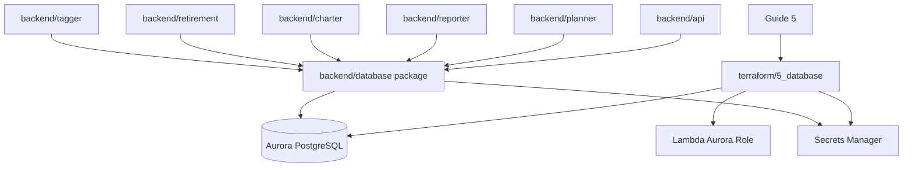
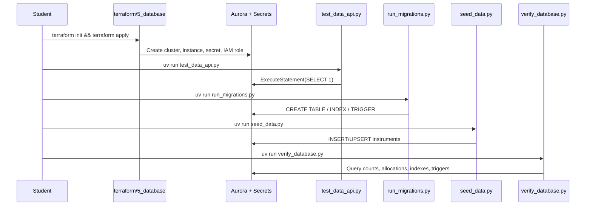
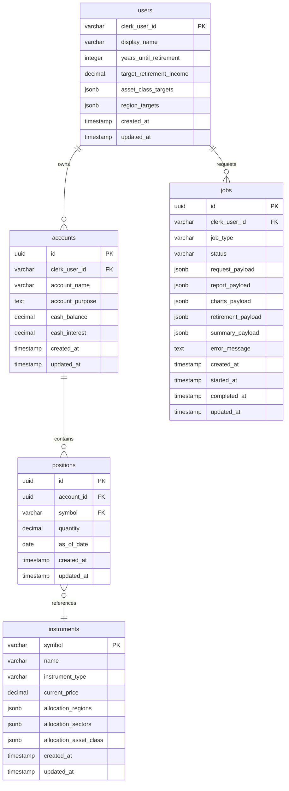
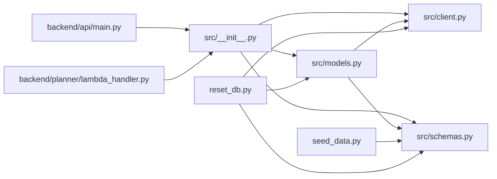
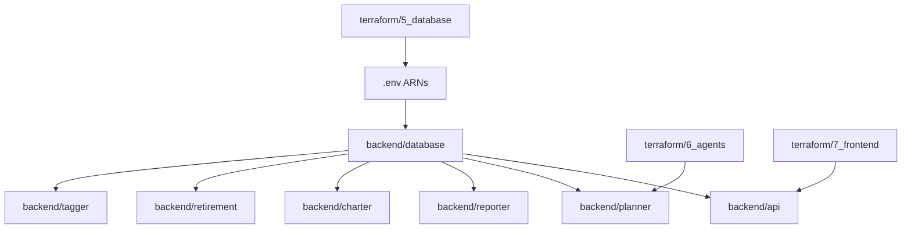

# Backend Database

`backend/database` là lớp dữ liệu chung của Alex từ Part 5 trở đi. Đây là nơi course chuyển hệ thống từ một research pipeline sang một SaaS tài chính nhiều người dùng, có portfolio, account, position và job state rõ ràng. Nếu `guides/5_database.md` giải thích vì sao cần Aurora Serverless v2 với Data API, thì folder này là implementation thật của quyết định đó trong Python và SQL.

README này theo hai mục tiêu cùng lúc:

- giúp đọc hiểu Guide 5 nhanh hơn
- đóng vai trò maintainer reference khi bạn quay lại debug, mở rộng schema, hoặc nối sang Part 6+

Lưu ý: code hiện tại trong repo là source of truth. README này cố tình giữ ở mức repo-portable, nên chỉ nhắc state cục bộ khi nó giúp làm rõ hành vi kỹ thuật.

## 1. Guide 5 đang dạy gì ở phần này

Part 5 giải quyết ba vấn đề kiến trúc:

1. Alex không thể chỉ sống bằng vector store nữa; nó cần dữ liệu quan hệ cho user, account, position và job lifecycle.
2. Hệ thống phía sau là Lambda-heavy, nên connection pooling kiểu PostgreSQL truyền thống sẽ làm tăng độ phức tạp VPC/networking.
3. Sinh viên cần một database đủ “production-like”, nhưng không bị cuốn vào thiết kế mạng quá sớm.

Vì vậy repo chọn:

- **Aurora PostgreSQL Serverless v2**: có SQL thật, JSONB, FK, trigger, index.
- **Data API**: truy cập database qua HTTPS từ boto3, không cần TCP connection pool trong code ứng dụng.
- **Pydantic validation**: ép dữ liệu đầu vào đi qua schema rõ ràng trước khi ghi DB.

Kết quả là Alex có một relational core đủ mạnh để:

- lưu portfolio riêng cho từng user
- chia output của nhiều agent vào các trường JSONB độc lập
- dùng chung cho `backend/api` và các agent Lambda ở Part 6

## 2. Guide 5 map sang code thật

| Bước trong guide | File/folder thực thi | Vai trò |
|---|---|---|
| Deploy Aurora + secret + Data API | [`terraform/5_database`](../../terraform/5_database/README.md) | Tạo hạ tầng AWS |
| Kiểm tra Data API | `test_data_api.py` | Xác minh cluster, secret, Data API và query cơ bản |
| Tạo schema | `migrations/001_schema.sql`, `run_migrations.py` | Khai báo bảng, index, trigger và chạy migration |
| Load seed instruments | `seed_data.py` | Nạp 22 instrument mẫu với allocation data |
| Reset + test data | `reset_db.py` | Drop schema, migrate lại, seed lại, thêm test user/portfolio |
| Verify integrity | `verify_database.py` | Kiểm tra record count, allocation sum, index, trigger |

Điểm quan trọng: folder này không chỉ chứa migration SQL, mà còn chứa luôn **database access layer** dùng bởi API và agents.

## 3. Cấu trúc thư mục

```text
backend/database/
├── .python-version          # Python version cho uv project con
├── pyproject.toml           # Dependencies của package database
├── uv.lock                  # Lock file của uv
├── migrations/
│   └── 001_schema.sql       # Schema khởi tạo cho users/instruments/accounts/positions/jobs
├── src/
│   ├── __init__.py          # Export public API của package
│   ├── client.py            # DataAPIClient: wrapper boto3 RDS Data API
│   ├── models.py            # Database facade + model helpers theo từng bảng
│   └── schemas.py           # Pydantic schemas + Literal types cho validation
├── test_data_api.py         # Kiểm tra Aurora/Data API trước khi migrate
├── run_migrations.py        # Chạy schema creation qua Data API
├── seed_data.py             # Seed instrument reference data
├── reset_db.py              # Reset schema và tạo test portfolio
└── verify_database.py       # Báo cáo verify tổng hợp sau setup
```

## 4. Vị trí của folder này trong hệ thống



## 5. Setup workflow của Part 5



## 6. Database schema deep dive

### 6.1 ER overview



**Bảng diễn giải ER overview bằng tiếng Việt**

| Bảng | Vai trò chính | Quan hệ chính |
|---|---|---|
| `users` | Lưu hồ sơ tối thiểu của người dùng ngoài hệ thống Clerk | 1 user có nhiều `accounts` và nhiều `jobs` |
| `instruments` | Lưu dữ liệu tham chiếu chung cho ETF, cổ phiếu, quỹ và trái phiếu | 1 `instrument` có thể được nhiều `positions` tham chiếu |
| `accounts` | Lưu các tài khoản đầu tư của từng người dùng như 401k, Roth IRA, Taxable | mỗi `account` thuộc 1 `user` và có nhiều `positions` |
| `positions` | Lưu các khoản nắm giữ thực tế trong từng tài khoản | mỗi `position` thuộc 1 `account` và tham chiếu 1 `instrument` |
| `jobs` | Lưu trạng thái và kết quả của các tác vụ phân tích bất đồng bộ | mỗi `job` thuộc 1 `user`; các agent ghi kết quả vào các cột payload riêng |

### 6.2 Bảng `users`

**Mục đích:** lưu user profile tối thiểu cho ứng dụng. Auth thật do Clerk giữ; bảng này chỉ giữ các trường phục vụ financial planning.

| Cột | Kiểu | Ý nghĩa |
|---|---|---|
| `clerk_user_id` | `VARCHAR(255)` PK | Khóa chính map trực tiếp từ Clerk |
| `display_name` | `VARCHAR(255)` | Tên hiển thị |
| `years_until_retirement` | `INTEGER` | Số năm còn lại tới retirement |
| `target_retirement_income` | `DECIMAL(12,2)` | Mục tiêu thu nhập hằng năm khi nghỉ hưu |
| `asset_class_targets` | `JSONB` | Allocation target cho rebalance |
| `region_targets` | `JSONB` | Geographic target cho rebalance |

**Thiết kế đáng chú ý**

- không có password/email nội bộ; auth nằm ngoài database
- dùng JSONB cho target allocation để tránh normalize sớm
- `ON DELETE CASCADE` ở bảng con giúp xóa sạch account/job nếu user bị xóa

### 6.3 Bảng `instruments`

**Mục đích:** reference data dùng chung cho mọi user.

| Cột | Kiểu | Ý nghĩa |
|---|---|---|
| `symbol` | `VARCHAR(20)` PK | Ticker symbol |
| `name` | `VARCHAR(255)` | Tên instrument |
| `instrument_type` | `VARCHAR(50)` | ETF, stock, bond_fund... |
| `current_price` | `DECIMAL(12,4)` | Giá hiện tại cho valuation |
| `allocation_regions` | `JSONB` | Tỷ trọng địa lý |
| `allocation_sectors` | `JSONB` | Tỷ trọng sector |
| `allocation_asset_class` | `JSONB` | Tỷ trọng asset class |

**Thiết kế đáng chú ý**

- bảng này là “financial metadata backbone” cho planner, chart, retirement
- allocation được lưu ở dạng JSONB vì course ưu tiên dễ đọc/dễ seed hơn schema chuẩn hóa nhiều bảng
- `seed_data.py` cung cấp 22 instrument mẫu để Part 6 có dữ liệu chạy ngay

### 6.4 Bảng `accounts`

**Mục đích:** gom portfolio theo bucket nghiệp vụ như `401k`, `Roth IRA`, `Taxable`.

| Cột | Kiểu | Ý nghĩa |
|---|---|---|
| `id` | `UUID` PK | Định danh account |
| `clerk_user_id` | `VARCHAR(255)` FK | Chủ sở hữu |
| `account_name` | `VARCHAR(255)` | Tên account |
| `account_purpose` | `TEXT` | Mục đích dùng account |
| `cash_balance` | `DECIMAL(12,2)` | Tiền mặt chưa đầu tư |
| `cash_interest` | `DECIMAL(5,4)` | Lãi suất cash |

**Thiết kế đáng chú ý**

- account tách khỏi user để hỗ trợ multi-account portfolio
- `cash_balance` và `cash_interest` cho phép retirement/planner xử lý phần cash như một thành phần thực

### 6.5 Bảng `positions`

**Mục đích:** holdings thực tế trong từng account.

| Cột | Kiểu | Ý nghĩa |
|---|---|---|
| `id` | `UUID` PK | Định danh position |
| `account_id` | `UUID` FK | Account sở hữu |
| `symbol` | `VARCHAR(20)` FK | Instrument tham chiếu |
| `quantity` | `DECIMAL(20,8)` | Hỗ trợ fractional shares |
| `as_of_date` | `DATE` | Snapshot date |

**Ràng buộc quan trọng**

- `UNIQUE(account_id, symbol)` đảm bảo 1 account chỉ có 1 dòng cho mỗi symbol
- `Positions.add_position()` dùng `ON CONFLICT ... DO UPDATE` nên API/agent có thể upsert thay vì tự viết merge logic

### 6.6 Bảng `jobs`

**Mục đích:** async contract giữa API, planner và các specialist agents.

| Cột | Kiểu | Ý nghĩa |
|---|---|---|
| `id` | `UUID` PK | Job id |
| `clerk_user_id` | `VARCHAR(255)` FK | User yêu cầu phân tích |
| `job_type` | `VARCHAR(50)` | Loại phân tích |
| `status` | `VARCHAR(20)` | `pending/running/completed/failed` |
| `request_payload` | `JSONB` | Input cho job |
| `report_payload` | `JSONB` | Output của Reporter |
| `charts_payload` | `JSONB` | Output của Charter |
| `retirement_payload` | `JSONB` | Output của Retirement |
| `summary_payload` | `JSONB` | Kết luận/final summary của Planner |
| `error_message` | `TEXT` | Lỗi cuối cùng nếu fail |
| `started_at` / `completed_at` | `TIMESTAMP` | Theo dõi lifecycle |

**Vì sao tách nhiều payload JSONB thay vì một payload lớn?**

- mỗi agent có “vùng ghi” riêng, tránh merge JSON phức tạp
- planner chỉ cần kiểm soát orchestration và status
- frontend/API dễ fetch kết quả theo block
- scale tốt cho multi-agent workflow của Part 6

Đây là một trong những quyết định thiết kế quan trọng nhất của Guide 5 vì nó làm Part 6 đơn giản hơn rất nhiều.

### 6.7 Indexes và trigger

`001_schema.sql` tạo 5 index custom:

| Index | Mục tiêu |
|---|---|
| `idx_accounts_user` | list account theo user |
| `idx_positions_account` | lấy position theo account |
| `idx_positions_symbol` | tra position theo symbol |
| `idx_jobs_user` | list job theo user |
| `idx_jobs_status` | lọc job theo status |

Trigger `update_updated_at_column()` được gắn cho cả 5 bảng để tự động refresh `updated_at` mỗi lần `UPDATE`.

## 7. Python database layer

### 7.1 Import graph



### 7.2 `src/client.py` — DataAPIClient

**Vai trò:** bọc `boto3.client("rds-data")` thành interface đơn giản hơn cho phần còn lại của repo.

**Những gì class này làm**

- nạp config từ env (`AURORA_CLUSTER_ARN`, `AURORA_SECRET_ARN`, `AURORA_DATABASE`, `DEFAULT_AWS_REGION`)
- chạy `execute_statement`
- biến `records + columnMetadata` thành `List[Dict]`
- serialize Python types sang Data API parameter format
- parse JSON strings quay ngược về dict/list khi đọc
- hỗ trợ transaction primitives (`begin/commit/rollback`)

**Các method chính**

| Method | Vai trò |
|---|---|
| `execute()` | chạy SQL bất kỳ, trả raw AWS response |
| `query()` | SELECT -> list of dict |
| `query_one()` | SELECT -> row đầu tiên hoặc `None` |
| `insert()` | build `INSERT ... RETURNING` |
| `update()` | build `UPDATE ... WHERE ...` |
| `delete()` | build `DELETE ... WHERE ...` |

**Serialization rules đáng chú ý**

- `dict` / `list` -> JSON string, rồi cast `::jsonb` ở câu SQL
- `Decimal` -> string, cast `::numeric`
- `date` / `datetime` -> ISO string, cast `::date` hoặc `::timestamp`

**Maintainer note**

- `__init__()` có tham số `region`, nhưng implementation hiện tại luôn dùng `DEFAULT_AWS_REGION` từ env để tạo boto3 client. Nếu sau này cần inject region thật sự, chỗ này là nơi phải sửa đầu tiên.

### 7.3 `src/models.py` — model helpers

**Vai trò:** tạo một lớp domain-ish mỏng trên `DataAPIClient`, để API/agents dùng thao tác có tên nghĩa thay vì ghép SQL lặp lại.

**Cấu trúc**

| Class | Vai trò |
|---|---|
| `BaseModel` | CRUD cơ bản theo `table_name` |
| `Users` | tìm/create user theo Clerk id |
| `Instruments` | search, filter, create instrument |
| `Accounts` | list/create account cho user |
| `Positions` | join instruments, tính portfolio value, upsert position |
| `Jobs` | tạo job, đổi status, ghi payload của từng agent |
| `Database` | facade gom tất cả model classes vào một object |

**Điểm hay của file này**

- code ở tầng trên chỉ cần `db.users`, `db.accounts`, `db.positions`, `db.jobs`
- `Positions.add_position()` encode sẵn UPSERT semantics
- `Jobs.update_report()`, `update_charts()`, `update_retirement()`, `update_summary()` phản ánh trực tiếp multi-agent design của Alex

### 7.4 `src/schemas.py` — validation + LLM-friendly schema

**Vai trò:** chuẩn hóa dữ liệu đầu vào và output có cấu trúc.

File này không chỉ dành cho database. Nó còn được thiết kế sao cho:

- hợp với Pydantic validation
- tương thích với structured input/output khi agent/tooling cần
- giữ allowed values rõ ràng bằng `Literal`

**Các nhóm schema**

| Nhóm | Ví dụ |
|---|---|
| Literal types | `RegionType`, `AssetClassType`, `SectorType`, `InstrumentType`, `JobType`, `JobStatus` |
| Create schemas | `InstrumentCreate`, `UserCreate`, `AccountCreate`, `PositionCreate`, `JobCreate` |
| Response / analysis schemas | `InstrumentResponse`, `PortfolioAnalysis`, `RebalanceRecommendation` |

**Điểm đáng nhớ**

- allocation fields được validate tổng gần 100%
- cùng một schema có thể phục vụ DB input và agent structured output
- đây là lý do Guide 5 có thể nối mượt sang Part 6 mà không cần tạo thêm một model layer khác

## 8. Từng file làm gì

### 8.1 `migrations/001_schema.sql` — schema nguồn

**Vai trò:** định nghĩa schema khởi tạo của Part 5.

**Bao gồm**

- extension `uuid-ossp`
- 5 bảng lõi
- 5 index custom
- 1 trigger function + 5 trigger instances

**Khi sửa file này**

- bạn đang thay đổi schema source of truth ở mức SQL
- nhưng chưa đủ để migration runner phản ánh thay đổi nếu không sửa tiếp `run_migrations.py`

### 8.2 `run_migrations.py` — migration runner đơn giản

**Vai trò:** chạy schema creation qua Data API.

**Điểm đặc biệt**

- script có đọc `migrations/001_schema.sql`
- nhưng thực tế **không parse file SQL**; nó chạy một danh sách `statements` hard-code trong Python

**Hệ quả maintainer**

- nếu thay đổi schema, thường phải cập nhật **cả** `001_schema.sql` và `statements` trong script này
- nếu chỉ sửa SQL file, README và code sẽ bị “đúng ở file nhưng sai ở runner”

Đây là điểm dễ drift nhất của folder.

### 8.3 `seed_data.py` — seed instrument reference data

**Vai trò:** nạp 22 instrument mẫu với allocation data thực dụng cho course.

**Nhiệm vụ chính**

- validate toàn bộ instrument bằng `InstrumentCreate`
- dùng UPSERT để insert/update vào `instruments`
- verify record count sau khi seed

**Vì sao quan trọng**

- Part 6 phụ thuộc mạnh vào bảng `instruments`
- planner, chart và retirement đều dùng allocation data từ đây

### 8.4 `reset_db.py` — reset phát triển

**Vai trò:** drop schema, migrate lại, seed lại, và tùy chọn thêm test portfolio.

**Flags**

| Flag | Tác dụng |
|---|---|
| `--with-test-data` | tạo `test_user_001`, 3 account, 5 position |
| `--skip-drop` | bỏ bước drop table, chỉ reload data |

### 8.5 `test_data_api.py` — smoke test hạ tầng

**Vai trò:** xác minh cluster/secret/Data API trước khi đụng tới schema application.

**Script này kiểm tra**

- có lấy được ARN từ env hay phải auto-discover
- Data API có bật không
- query cơ bản có chạy không
- bảng đã tồn tại chưa

### 8.6 `verify_database.py` — report integrity

**Vai trò:** kiểm chứng rằng setup Part 5 đã thật sự usable cho Part 6.

**Nó report**

- số bảng
- số record mỗi bảng
- sample instruments
- allocation sum
- asset class distribution
- index và trigger

### 8.7 `src/__init__.py` — public API package

**Vai trò:** export `Database`, `DataAPIClient`, và các schema/type cần dùng ở folder khác.

Điều này cho phép code tầng trên dùng:

```python
from src import Database
```

thay vì import sâu vào từng file con.

## 9. Quan hệ với các folder khác

### 9.1 Graph tổng quan



### 9.2 Bảng liên hệ

| Folder | Cần gì từ `backend/database` | Dùng vào đâu |
|---|---|---|
| `backend/api` | `Database`, schemas | CRUD user/account/position, tạo job |
| `backend/planner` | `Database` | đổi job status, load portfolio, orchestration |
| `backend/reporter` | `Database` | đọc portfolio, ghi `report_payload` |
| `backend/charter` | `Database` | đọc portfolio, ghi `charts_payload` |
| `backend/retirement` | `Database` | đọc preference/portfolio, ghi `retirement_payload` |
| `backend/tagger` | `Database` | enrich `instruments` |
| `terraform/5_database` | cluster ARN + secret ARN | cấp hạ tầng cho package này |
| `terraform/6_agents` | ARNs từ Part 5 | inject env cho agent Lambdas |
| `terraform/7_frontend` | remote state outputs | inject env/IAM cho API Lambda |

## 10. Environment variables

| Biến | Dùng ở đâu | Ý nghĩa | Mặc định |
|---|---|---|---|
| `AURORA_CLUSTER_ARN` | toàn bộ scripts + `DataAPIClient` | ARN cluster Aurora | bắt buộc |
| `AURORA_SECRET_ARN` | toàn bộ scripts + `DataAPIClient` | ARN secret credentials | bắt buộc |
| `AURORA_DATABASE` | scripts + `DataAPIClient` | tên database | `alex` |
| `DEFAULT_AWS_REGION` | scripts + `DataAPIClient` | region cho boto3 | `us-east-1` |

Lưu ý:

- package này hiện **không** dùng `AWS_REGION_NAME` như LiteLLM ở Part 4/6
- Data API layer bám vào `DEFAULT_AWS_REGION`
- ở các phần sau, nhiều Lambda chỉ inject `AURORA_CLUSTER_ARN` và `AURORA_SECRET_ARN`; database name thường được ngầm dùng qua default `alex` của `DataAPIClient`

## 11. Dependencies

| Package | Vai trò |
|---|---|
| `boto3` | gọi RDS Data API |
| `pydantic` | validation và typed schemas |
| `python-dotenv` | nạp `.env` cho local/dev scripts |

Python yêu cầu: `>=3.12`

## 12. Quick commands

```bash
cd backend/database

# 1. Kiểm tra Data API
uv run test_data_api.py

# 2. Tạo schema
uv run run_migrations.py

# 3. Seed instruments
uv run seed_data.py

# 4. Reset toàn bộ và thêm test portfolio
uv run reset_db.py --with-test-data

# 5. Verify integrity
uv run verify_database.py
```

## 13. Troubleshooting và maintainer notes

### 13.1 `Missing AURORA_CLUSTER_ARN` / `AURORA_SECRET_ARN`

Nguyên nhân thường gặp:

- chưa apply Terraform Part 5
- chưa copy outputs vào `.env`
- đang chạy script ở shell chưa nạp env

### 13.2 `Data API is not enabled`

Source of truth nằm ở Terraform Part 5: `aws_rds_cluster.aurora.enable_http_endpoint = true`. Nếu cluster được tạo ngoài luồng hoặc bị drift, `test_data_api.py` sẽ phát hiện rất sớm.

### 13.3 Migrate xong nhưng schema vẫn sai

Kiểm tra đồng bộ giữa:

- `migrations/001_schema.sql`
- danh sách `statements` trong `run_migrations.py`

Đây là rủi ro lớn nhất khi thay đổi schema.

### 13.4 Seed fail vì allocation validation

`InstrumentCreate` buộc allocation sum gần bằng 100. Nếu sửa dataset mà quên cân bằng tỷ trọng, `seed_data.py` sẽ fail trước khi ghi DB.

### 13.5 `jobs` payload khó query bằng SQL

Đúng. Thiết kế hiện tại tối ưu cho:

- agent isolation
- application retrieval
- course simplicity

Nó không tối ưu cho analytics SQL phức tạp trên payload JSONB. Nếu tương lai cần reporting warehouse-style, đó là một hướng mở rộng khác.

### 13.6 Một số console hint trong script đã cũ

Một vài message tham chiếu tới helper script không còn tồn tại (`test_db.py`, `create_test_data.py`). Đây là drift nhỏ ở lớp UX của script, không làm hỏng logic chính, nhưng nên nhớ khi đọc output terminal.

## 14. Nếu bạn cần sửa schema, nên nghĩ theo thứ tự nào

1. Sửa `src/schemas.py` nếu contract dữ liệu thay đổi
2. Sửa `migrations/001_schema.sql`
3. Sửa `run_migrations.py` để migration runner phản ánh schema mới
4. Sửa `src/models.py` nếu query helper bị ảnh hưởng
5. Sửa `seed_data.py` / `reset_db.py` / `verify_database.py` nếu cần
6. Kiểm tra impact lên `backend/api` và các agent Part 6

Đây là thứ tự an toàn nhất để tránh “schema đổi một nửa”.

## 15. Tóm tắt nhanh

- `backend/database` là relational core của Alex từ Part 5 trở đi.
- `001_schema.sql` định nghĩa 5 bảng chính: `users`, `instruments`, `accounts`, `positions`, `jobs`.
- `DataAPIClient` giúp toàn hệ thống dùng Aurora qua HTTPS thay vì TCP connections.
- `models.py` biến database access thành facade dễ dùng cho API và agents.
- `schemas.py` là lớp validation quan trọng, đồng thời chuẩn bị cho structured AI workflows.
- `run_migrations.py`, `seed_data.py`, `reset_db.py`, `verify_database.py` tạo thành vòng đời setup hoàn chỉnh.
- Quyết định tách `jobs` thành nhiều payload JSONB là chìa khóa để Part 6 multi-agent orchestration đơn giản hơn.

Đọc tiếp: [`terraform/5_database/README.md`](../../terraform/5_database/README.md)
