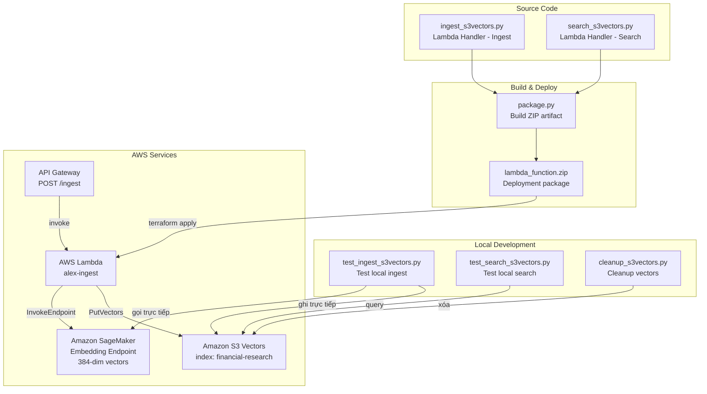
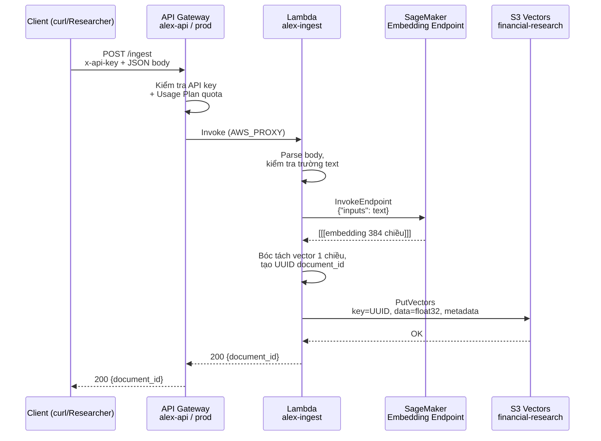
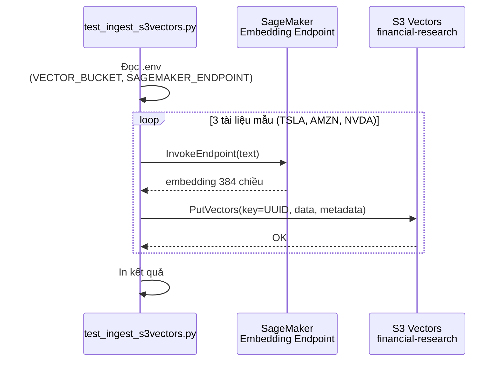
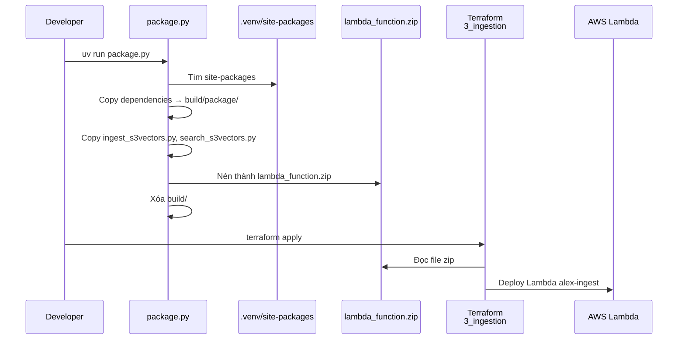
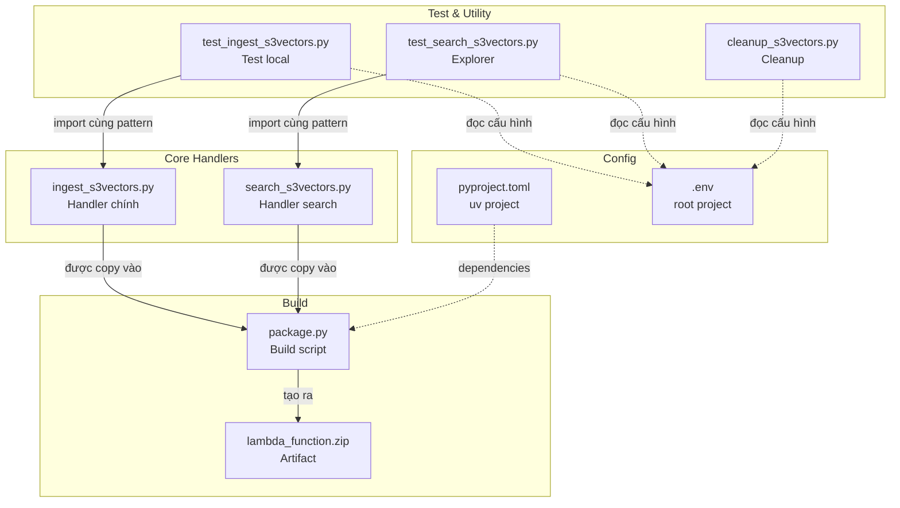
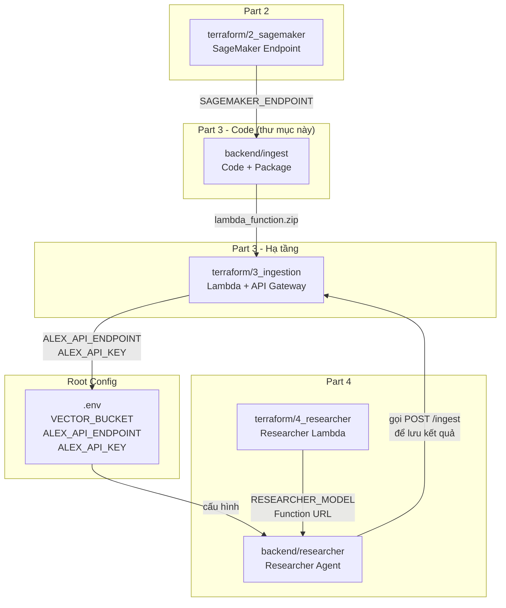

# `backend/ingest` — Mã nguồn Ingestion Pipeline cho Part 3

Thư mục này chứa toàn bộ mã Python cho **Part 3 - Ingestion Pipeline** của dự án Alex. Đây là phần **application code** — nơi logic nghiệp vụ thực sự chạy. Hạ tầng AWS chạy code này được định nghĩa trong `terraform/3_ingestion`.

---

## Nhiệm vụ chính

Biến văn bản đầu vào thành vector embedding và lưu vào S3 Vectors để phục vụ semantic search / RAG cho toàn bộ hệ thống Alex.

Cụ thể:
- Nhận văn bản nghiên cứu hoặc tài liệu đầu vào
- Gọi **SageMaker Endpoint** (từ Part 2) để tạo **embedding vector 384 chiều**
- Ghi vector cùng metadata vào **S3 Vectors** index `financial-research`
- Hỗ trợ test local, semantic search, cleanup dữ liệu
- Đóng gói mã nguồn thành `lambda_function.zip` để deploy lên **AWS Lambda**

---

## Cấu trúc thư mục

```
backend/ingest/
├── ingest_s3vectors.py       # Lambda handler chính — ingest document
├── search_s3vectors.py       # Lambda handler — semantic search
├── package.py                # Build lambda_function.zip
├── test_ingest_s3vectors.py  # Test local ingest (3 tài liệu mẫu)
├── test_search_s3vectors.py  # Test local semantic search
├── cleanup_s3vectors.py      # Xóa toàn bộ vectors trong index
├── pyproject.toml            # uv project configuration
├── uv.lock                   # Dependency lock file
├── .python-version           # Python version hint
└── lambda_function.zip       # Artifact deploy (generated)
```

---

## Sơ đồ tổng quan



---

## Chi tiết từng file

### 1. `ingest_s3vectors.py` — Lambda Handler Ingest

**Vai trò:** Đây là file quan trọng nhất trong thư mục — Lambda handler chính cho endpoint ingest.

**Nhiệm vụ chi tiết:**
- Đóng vai trò entry point `ingest_s3vectors.lambda_handler` cho Lambda `alex-ingest`
- Đọc payload JSON từ event (hỗ trợ cả body dạng string và object)
- Kiểm tra trường `text` bắt buộc — thiếu thì trả 400
- Gọi SageMaker endpoint để sinh embedding 384 chiều
- Xử lý response từ HuggingFace container (bóc tách cấu trúc `[[[embedding]]]` lồng 3 lớp)
- Tạo `document_id` duy nhất bằng `uuid.uuid4()`
- Ghi vector + metadata vào S3 Vectors qua `put_vectors()`
- Trả về JSON response với `document_id`

**Cấu trúc request mong đợi:**

```json
{
    "text": "Văn bản cần vector hóa",
    "metadata": {
        "source": "nguồn tùy chọn",
        "category": "danh mục tùy chọn"
    }
}
```

**Cấu trúc response:**

```json
{
    "message": "Document indexed successfully",
    "document_id": "<uuid>"
}
```

**Biến môi trường sử dụng:**

| Biến | Mặc định | Mô tả |
|------|----------|-------|
| `VECTOR_BUCKET` | `alex-vectors` | Tên bucket S3 Vectors |
| `SAGEMAKER_ENDPOINT` | *(bắt buộc)* | Tên endpoint embedding |
| `INDEX_NAME` | `financial-research` | Tên index semantic search |

**Hàm then chốt:**

| Hàm | Chức năng |
|-----|-----------|
| `get_embedding(text)` | Gọi SageMaker `invoke_endpoint()`, parse response, trả về list float |
| `lambda_handler(event, context)` | Entry point Lambda — đọc event, kiểm tra text, sinh embedding, ghi S3 Vectors, trả response |

**Client AWS (module-level, tái sử dụng):**
- `boto3.client('sagemaker-runtime')` — gọi model embedding
- `boto3.client('s3vectors')` — ghi/truy vấn vector

---

### 2. `search_s3vectors.py` — Lambda Handler Search

**Vai trò:** Lambda handler cho chức năng semantic search.

**Nhiệm vụ chi tiết:**
- Nhận query text từ event
- Vector hóa query bằng SageMaker
- Gọi `query_vectors()` trên S3 Vectors với `topK` và `returnMetadata=True`
- Format kết quả thành JSON thân thiện (id, score, text, metadata)

**Cấu trúc request mong đợi:**

```json
{
    "query": "Câu truy vấn semantic search",
    "k": 5
}
```

**Cấu trúc response:**

```json
{
    "results": [
        {
            "id": "<vector-key>",
            "score": 0.85,
            "text": "Nội dung văn bản gốc...",
            "metadata": { ... }
        }
    ],
    "count": 3
}
```

**Lưu ý:** `score` hiện là `distance` gốc từ AWS. File này chưa được public qua Terraform trong Part 3 nhưng rất hữu ích để hiểu semantic retrieval hoạt động thế nào.

---

### 3. `package.py` — Build Lambda Deployment Package

**Vai trò:** Script cross-platform (Windows/Mac/Linux) đóng gói source code + dependencies thành file `lambda_function.zip`.

**Quy trình:**
1. Xóa `build/` và `lambda_function.zip` cũ
2. Tìm `site-packages` trong `.venv/lib/` (dùng `rglob` để tương thích đa nền tảng)
3. Copy toàn bộ dependencies vào `build/package/` (bỏ qua `.dist-info`, `__pycache__`, `.pyc`)
4. Copy `ingest_s3vectors.py` và `search_s3vectors.py` vào package
5. Nén thành `lambda_function.zip` (thuật toán ZIP_DEFLATED)
6. Xóa thư mục `build/` tạm
7. Cảnh báo nếu file > 50MB

**Sử dụng:**
```bash
cd backend/ingest
uv run package.py
```

**Output:** `lambda_function.zip` — file này được `terraform/3_ingestion/main.tf` tham chiếu tại:
```hcl
filename = "${path.module}/../../backend/ingest/lambda_function.zip"
```

---

### 4. `test_ingest_s3vectors.py` — Test Local Ingest

**Vai trò:** Script test local kiểm tra toàn bộ luồng ingest mà không cần qua API Gateway.

**Cách hoạt động:**
- Đọc `.env` từ root project (`Path(__file__).parent.parent.parent / '.env'`)
- Tạo client AWS (`s3vectors`, `sagemaker-runtime`)
- `get_embedding(text)`: gọi SageMaker lấy embedding
- `ingest_document(text, metadata)`: sinh embedding → tạo UUID → gọi `put_vectors()`
- `main()`: nạp 3 tài liệu mẫu về **TSLA**, **AMZN**, **NVDA** kèm ticker/sector/source

**Giá trị debug:** Nếu script này chạy được → SageMaker endpoint, IAM permissions, và S3 Vectors cơ bản đều đang hoạt động đúng. Nếu script này OK nhưng API Gateway lỗi → vấn đề nằm ở Lambda deploy hoặc API Gateway.

---

### 5. `test_search_s3vectors.py` — Test Local Semantic Search

**Vai trò:** Script explorer minh họa semantic search sau khi dữ liệu đã được ingest.

**Các hàm chính:**
- `list_all_vectors()`: dùng embedding của từ "company" để query top 10, in danh sách vectors đang có
- `search_vectors(query_text, k)`: vector hóa query → query S3 Vectors → in similarity score (`1 - distance`)
- `main()`: liệt kê vectors + chạy 3 truy vấn mẫu:
  - "electric vehicles and sustainable transportation"
  - "cloud computing and AWS services"
  - "artificial intelligence and GPU computing"

**Minh họa:** Script cho thấy semantic search tìm theo ý nghĩa chứ không chỉ khớp từ khóa chính xác.

---

### 6. `cleanup_s3vectors.py` — Xóa Dữ Liệu Test

**Vai trò:** Script tiện ích xóa toàn bộ vectors trong index `financial-research`.

**Cách hoạt động:**
1. Yêu cầu người dùng xác nhận `yes/no`
2. Tạo embedding dummy từ từ "document"
3. Query S3 Vectors theo batch 30 (`topK` giới hạn)
4. Xóa từng vector bằng `delete_vectors()`
5. Lặp đến khi không còn vector
6. In số lượng đã xóa

**Lưu ý:** Không chạy file này như một phần của benchmark trừ khi người dùng yêu cầu rõ ràng. Cleanup xóa **tất cả** vectors trong index.

---

### 7. `pyproject.toml` — Cấu hình uv Project

| Thuộc tính | Giá trị |
|-----------|---------|
| Python | `>=3.12` |
| Package manager | `uv` |

**Dependencies:**

| Package | Version | Mục đích |
|---------|---------|----------|
| `boto3` | `>=1.40.1` | SDK AWS — SageMaker, S3 Vectors |
| `python-dotenv` | `>=1.0.0` | Đọc `.env` cho local test |
| `tenacity` | `>=9.1.2` | Retry/backoff (tăng độ bền) |
| `requests` | `>=2.31.0` | HTTP client |
| `opensearch-py` | `>=3.0.0` | (legacy) |
| `requests-aws4auth` | `>=1.3.1` | AWS SigV4 signing |

---

## Workflow chi tiết

### Workflow 1: Production Ingest (qua API Gateway)



### Workflow 2: Test Local (bỏ qua API Gateway)



### Workflow 3: Build & Deploy



---

## Mối liên kết giữa các file trong thư mục



**Giải thích liên kết:**
- `ingest_s3vectors.py` và `search_s3vectors.py` là 2 handler độc lập — không import lẫn nhau
- `package.py` đọc `.venv` và copy cả 2 handler vào zip
- Các script test (`test_*.py`) mô phỏng logic handler nhưng gọi thẳng SDK, không qua Lambda
- Tất cả script test đều đọc `.env` từ root project

---

## Mối liên hệ với các folder khác



### Chi tiết các mối phụ thuộc

**Phụ thuộc vào:**
| Folder | Cần gì | Dùng ở đâu |
|--------|--------|------------|
| `terraform/2_sagemaker` | `SAGEMAKER_ENDPOINT` = `alex-embedding-endpoint` | `ingest_s3vectors.py`, tất cả script test |
| `.env` (root) | `VECTOR_BUCKET`, `SAGEMAKER_ENDPOINT` | Tất cả script test local |

**Được sử dụng bởi:**
| Folder | Dùng gì | Mục đích |
|--------|---------|----------|
| `terraform/3_ingestion` | `lambda_function.zip` | Deploy Lambda `alex-ingest` |
| `backend/researcher` | API Gateway endpoint + API key | Gọi `POST /ingest` để lưu kết quả research |
| `terraform/4_researcher` | `ALEX_API_ENDPOINT`, `ALEX_API_KEY` | Cấu hình researcher Lambda |

---

## Môi trường thực thi

### Local Development

Script test chạy trực tiếp bằng `uv run`, gọi thẳng AWS SDK:
- Đọc cấu hình từ `.env`
- Cần AWS credentials đã config (`aws configure`)
- Không qua API Gateway, không cần API key

### Production (AWS Lambda)

Lambda function `alex-ingest` chạy code từ `lambda_function.zip`:
- Runtime: **python3.12**
- Memory: **512 MB**
- Timeout: **60 giây**
- Biến môi trường được Terraform inject: `VECTOR_BUCKET`, `SAGEMAKER_ENDPOINT`
- Gọi qua API Gateway với API key authentication

---

## Cách sử dụng nhanh

### Cài môi trường

```bash
cd backend/ingest
uv sync
```

### Build package Lambda

```bash
uv run package.py
```

### Test ingest local (3 tài liệu mẫu)

```bash
uv run test_ingest_s3vectors.py
```

### Khám phá dữ liệu

```bash
uv run test_search_s3vectors.py
```

### Cleanup dữ liệu test

```bash
uv run cleanup_s3vectors.py
```

---

## Tóm tắt

`backend/ingest` là phần **application code** của Part 3. Nó chịu trách nhiệm:

- **Ingest** văn bản → embedding → S3 Vectors (`ingest_s3vectors.py`)
- **Search** ngữ nghĩa trên vector database (`search_s3vectors.py`)
- **Đóng gói** thành Lambda artifact (`package.py` → `lambda_function.zip`)
- **Test local** để xác minh từng thành phần mà không cần deploy (`test_*.py`)
- **Cleanup** để reset dữ liệu test (`cleanup_s3vectors.py`)

Nếu `terraform/3_ingestion` là phần **hạ tầng AWS**, thì `backend/ingest` là phần **logic ứng dụng** mà hạ tầng đó chạy.
