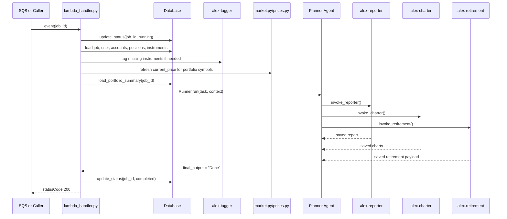
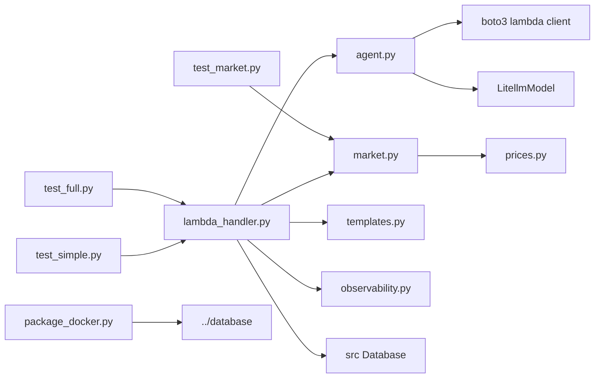

# `backend/planner` — orchestrator Lambda cho Part 6

## Nhiệm vụ chính

`backend/planner` là entry point orchestration của Part 6. Folder này không tự sinh report, chart hay retirement analysis; nó điều phối các specialist agents sau khi chuẩn bị dữ liệu tối thiểu cho job:

- đọc `job_id` từ SQS hoặc direct invocation
- tự động gọi tagger nếu portfolio còn instrument thiếu allocation metadata
- cập nhật `current_price` cho instrument bằng Polygon trước khi phân tích
- tính `portfolio_summary` gọn để giảm context đưa vào model
- chạy OpenAI Agents SDK với 3 tools nội bộ để gọi `reporter`, `charter`, `retirement`
- cập nhật trạng thái job trong Aurora từ `pending` sang `running`, `completed`, hoặc `failed`

Current state của repo vẫn Bedrock-centric: planner khởi tạo model qua `LitellmModel(model=f"bedrock/{model_id}")` và set `AWS_REGION_NAME` từ `BEDROCK_REGION`.

## Cấu trúc thư mục

```text
backend/planner/
|-- agent.py
|-- aurora_config.json
|-- lambda_handler.py
|-- market.py
|-- observability.py
|-- package_docker.py
|-- prices.py
|-- pyproject.toml
|-- templates.py
|-- test_full.py
|-- test_market.py
|-- test_simple.py
`-- uv.lock
```

## Sơ đồ tổng quan kiến trúc

```mermaid
flowchart TD
    SQS[SQS alex-analysis-jobs] --> LH[lambda_handler.py]
    Direct[Direct invocation] --> LH
    LH --> OBS[observe()]
    LH --> HM[handle_missing_instruments]
    HM --> TAG[alex-tagger Lambda]
    LH --> MKT[update_instrument_prices]
    MKT --> POLY[Polygon via prices.py]
    LH --> SUM[load_portfolio_summary]
    LH --> AG[create_agent]
    AG --> OA[OpenAI Agents SDK Agent]
    OA --> REP[invoke_reporter]
    OA --> CHA[invoke_charter]
    OA --> RET[invoke_retirement]
    REP --> RL[alex-reporter Lambda]
    CHA --> CL[alex-charter Lambda]
    RET --> RTL[alex-retirement Lambda]
    LH --> DB[(Aurora via alex-database)]
```

## Chi tiết từng file

| File | Vai trò |
| --- | --- |
| `lambda_handler.py` | Entry point của Lambda `alex-planner`. Parse event từ SQS hoặc direct call, bao handler bằng `observe()`, retry `RateLimitError`, cập nhật trạng thái job và chạy orchestrator async. |
| `agent.py` | Khai báo `PlannerContext`, 3 `@function_tool` gọi specialist Lambdas, helper `invoke_lambda_agent()`, `handle_missing_instruments()`, `load_portfolio_summary()`, và `create_agent()`. |
| `templates.py` | Prompt orchestration cực ngắn: chỉ được dùng 3 tools, quy tắc gọi reporter/charter/retirement, và cuối cùng trả `"Done"`. |
| `market.py` | Tìm symbol trong portfolio của user theo `job_id`, gọi `get_share_price()` cho từng symbol, rồi update `instruments.current_price` trong DB. |
| `prices.py` | Bọc Polygon API. Nếu có `POLYGON_API_KEY` thì dùng EOD hoặc minute snapshot tùy `POLYGON_PLAN`; nếu lỗi hoặc không có key thì fallback sang số ngẫu nhiên. |
| `observability.py` | Context manager cho Logfire + LangFuse. Chỉ setup khi có `LANGFUSE_SECRET_KEY`; warning nếu thiếu `OPENAI_API_KEY`; flush và sleep 15 giây khi thoát. |
| `package_docker.py` | Build `planner_lambda.zip` bằng Docker image Lambda Python 3.12, export deps từ `uv.lock`, cài package `../database`, copy các module planner, và có tùy chọn `--deploy`. |
| `test_simple.py` | Local smoke test. Set `MOCK_LAMBDAS=true`, gọi `../database/reset_db.py --with-test-data --skip-drop`, tạo job mới rồi chạy `lambda_handler()` trực tiếp. |
| `test_full.py` | End-to-end test cho planner qua SQS thật. In AWS account/region, Bedrock region/model, tạo job, gửi message lên queue, poll DB đến khi hoàn thành, rồi in report/charts/retirement/summary. |
| `test_market.py` | Test riêng flow cập nhật giá bằng market data cho một user cụ thể trong DB. |
| `pyproject.toml` | UV project của planner. Dependency chính: `openai-agents[litellm]`, `boto3`, `polygon-api-client`, `langfuse`, `tenacity`, `alex-database`. |
| `aurora_config.json` | File cấu hình cục bộ tồn tại trong folder, không nằm trên execution path của planner code hiện tại. |
| `uv.lock` | Lock file dùng cho packaging và local execution nhất quán. |

Điểm implementation đáng chú ý:

- `MOCK_LAMBDAS=true` chỉ làm mock các specialist Lambda trong `invoke_lambda_agent()`. Planner vẫn chạm DB thật trong `test_simple.py`.
- `handle_missing_instruments()` gọi `alex-tagger` trực tiếp qua boto3 trước khi model orchestration bắt đầu.
- `load_portfolio_summary()` chỉ trả thống kê tổng hợp, không nạp full portfolio vào prompt.
- `create_agent()` default model hiện tại là `us.anthropic.claude-3-7-sonnet-20250219-v1:0`, dù Terraform Part 6 sample đang khuyến nghị `us.amazon.nova-pro-v1:0`.
- Planner không inject tên Lambda specialist từ Terraform; nếu không set env, code dùng default `alex-tagger`, `alex-reporter`, `alex-charter`, `alex-retirement`.

## Workflow chính



Luồng lỗi:

- nếu model hoặc specialist Lambda ném exception, `run_orchestrator()` sẽ update job thành `failed`
- `update_instrument_prices()` tự swallow lỗi vì market data là bước non-critical
- `invoke_lambda_agent()` unwrap response kiểu `{statusCode, body}` để planner không cần biết chi tiết từng Lambda handler

## Mối liên kết giữa các file

- `lambda_handler.py` là orchestrator nội bộ của folder; mọi business step đều đi qua các helper từ `agent.py` và `market.py`.
- `agent.py` vừa chứa model init, vừa chứa tool bridge sang các Lambda khác. Planner không gọi specialist agents trực tiếp trong `lambda_handler.py`.
- `templates.py` giữ prompt tĩnh, còn task động được `create_agent()` build từ `portfolio_summary`.
- `market.py` tách riêng khỏi `agent.py` để bước refresh market data chạy trước AI orchestration.
- `prices.py` là adapter duy nhất sang Polygon, nên mọi thay đổi về plan `free/paid` hoặc fallback behavior đều dồn về đây.
- `observability.py` không đổi kết quả business, nhưng có ảnh hưởng thực tế tới startup/shutdown time vì setup tracing và flush chờ 15 giây.

Sơ đồ import/call tối giản:



## Mối liên hệ với folder khác

- `backend/tagger`: planner gọi trước để bù metadata allocation cho instrument còn thiếu.
- `backend/reporter`: planner dùng tool `invoke_reporter` để tạo narrative report và lưu vào `jobs.report_payload`.
- `backend/charter`: planner dùng tool `invoke_charter` để sinh chart payload cho frontend.
- `backend/retirement`: planner dùng tool `invoke_retirement` để tính projection retirement.
- `backend/database`: source of truth cho `Database`, repositories `jobs/users/accounts/positions/instruments`, và Aurora Data API integration.
- `backend/researcher` và `backend/ingest`: planner không gọi trực tiếp, nhưng reporter phụ thuộc data đã được ingest vào S3 Vectors từ các part trước.
- `terraform/5_database`: cung cấp `AURORA_CLUSTER_ARN` và `AURORA_SECRET_ARN`.
- `terraform/6_agents`: deploy queue `alex-analysis-jobs`, Lambda `alex-planner`, IAM, S3 package bucket, và inject env cho planner.

## Cross-cutting scripts trong `backend/`

`backend/planner/README.md` là nơi canonical để giải thích các script dùng chung cho toàn Part 6:

| File | Mục đích | Khi nào dùng |
| --- | --- | --- |
| `backend/package_docker.py` | Chạy `uv run package_docker.py` cho từng agent folder và tóm tắt zip output. | Khi cần build toàn bộ Lambda packages trước deploy. |
| `backend/deploy_all_lambdas.py` | Kiểm tra zip hiện có, tùy chọn package lại, `terraform taint` 5 Lambda, rồi `terraform apply -auto-approve`. | Khi muốn đẩy toàn bộ code Part 6 lên AWS theo một lệnh. |
| `backend/test_simple.py` | Lần lượt chạy `test_simple.py` của từng agent trong chính thư mục của agent đó. | Smoke test local sau khi đổi code ở nhiều agent. |
| `backend/test_full.py` | Tạo test user/account/positions, gửi job lên SQS, poll DB đến completion, rồi in report/charts/retirement toàn hệ thống. | Integration test end-to-end cấp backend. |
| `backend/test_multiple_accounts.py` | Dựng user có 3 accounts khác nhau, chạy analysis thật, rồi kiểm tra report có chạm đủ các account hay không. | Regression test cho logic gộp multi-account. |
| `backend/test_scale.py` | Tạo 5 test users với portfolio khác nhau, gửi job concurrent lên SQS, monitor kết quả và dọn dữ liệu. | Kiểm tra khả năng xử lý đồng thời của toàn hệ agent orchestra. |
| `backend/watch_agents.py` | Poll CloudWatch Logs của cả 5 Lambda theo thời gian thực, tô màu theo agent và highlight lỗi/LangFuse logs. | Khi debug runtime trên AWS sau deploy. |

Workflow thực tế thường là:

1. package từng agent hoặc chạy `cd backend && uv run package_docker.py`
2. deploy bằng `cd backend && uv run deploy_all_lambdas.py --package`
3. kiểm tra local bằng `backend/test_simple.py` hoặc agent-specific `test_simple.py`
4. chạy `backend/test_full.py` hoặc `backend/test_multiple_accounts.py`
5. mở `backend/watch_agents.py` nếu cần soi log CloudWatch liên tục

Lưu ý về current implementation:

- `deploy_all_lambdas.py` force recreate Lambda qua `terraform taint`, nên đây không phải deploy incremental nhẹ.
- `backend/test_full.py` và `backend/planner/test_full.py` đều in thông tin Bedrock region/model ra console; khi migrate provider phải review narrative và output của các script này.
- `watch_agents.py` chỉ xem log group CloudWatch; nó không tự biết provider model nào đang chạy, nhưng log text liên quan Bedrock/LangFuse có thể cần đổi sau migration.

## Cách sử dụng nhanh

Điều kiện tối thiểu:

- đã hoàn thành Part 5 database và Part 6 infrastructure nếu muốn chạy AWS flow thật
- có `.env` hoặc env tương đương cho DB, model, Polygon, và observability
- Docker đang chạy nếu cần build package

Các lệnh thường dùng:

```bash
cd backend/planner
uv run test_simple.py
uv run test_full.py
uv run test_market.py
uv run package_docker.py
uv run package_docker.py --deploy
```

Chạy từ `backend/`:

```bash
cd backend
uv run package_docker.py
uv run deploy_all_lambdas.py --package
uv run test_simple.py
uv run test_full.py
uv run test_multiple_accounts.py
uv run test_scale.py
uv run watch_agents.py --region us-east-1 --lookback 5 --interval 2
```

Env vars current state quan trọng với planner:

| Biến | Dùng ở đâu |
| --- | --- |
| `AURORA_CLUSTER_ARN` / `AURORA_SECRET_ARN` / `DATABASE_NAME` | Shared database package dùng để đọc job, account, position, instrument và update status. |
| `BEDROCK_MODEL_ID` | `agent.py` chọn model cho planner. |
| `BEDROCK_REGION` | `agent.py` set `AWS_REGION_NAME` cho LiteLLM Bedrock. |
| `DEFAULT_AWS_REGION` | Terraform inject theo `aws_region`; các script test boto3 thường dùng region mặc định của session. |
| `POLYGON_API_KEY` / `POLYGON_PLAN` | `prices.py` và `market.py` dùng để refresh market prices. |
| `LANGFUSE_PUBLIC_KEY` / `LANGFUSE_SECRET_KEY` / `LANGFUSE_HOST` | `observability.py`. |
| `OPENAI_API_KEY` | Current state chủ yếu phục vụ tracing/export cho OpenAI Agents SDK và LangFuse, không phải provider model chính của planner. |
| `TAGGER_FUNCTION` / `REPORTER_FUNCTION` / `CHARTER_FUNCTION` / `RETIREMENT_FUNCTION` | Tùy chọn override; nếu không set thì planner dùng default `alex-*`. |
| `MOCK_LAMBDAS` | Chỉ dùng cho local test để mock specialist Lambda calls. |

## Cách chuyển sang OpenAI models

Current state cần giữ rõ ràng:

- planner hiện dùng `LitellmModel(model=f"bedrock/{model_id}")`
- Terraform Part 6 vẫn inject `BEDROCK_MODEL_ID` và `BEDROCK_REGION`
- các test và log scripts hiện vẫn nói ngôn ngữ Bedrock ở một số chỗ

Migration guidance cho folder này:

- Suggested model: `openai/gpt-5.4-mini`
- Planner should remain the strongest model in Part 6 because it owns orchestration decisions
- Test and log scripts that print Bedrock details should be reviewed when migrating

Vì planner ra quyết định gọi agent nào và theo thứ tự nào, đây là folder duy nhất trong nhóm backend Part 6 mà mapping được chốt ở mức `mini` thay vì `nano`.

Các file cần rà soát nếu migrate thật:

- `backend/planner/agent.py`
- `backend/planner/lambda_handler.py`
- `backend/planner/test_full.py`
- `backend/package_docker.py`
- `backend/deploy_all_lambdas.py`
- `backend/test_full.py`
- `backend/watch_agents.py`
- `terraform/6_agents/main.tf`
- `terraform/6_agents/variables.tf`
- `terraform/6_agents/terraform.tfvars.example`

Cách đổi ở mức code:

1. Trong `backend/planner/agent.py`, thay model init từ:
   - `LitellmModel(model=f"bedrock/{model_id}")`
   - sang dạng OpenAI tương ứng, ví dụ `LitellmModel(model="openai/gpt-5.4-mini")`
2. Xem lại logic chỉ còn ý nghĩa với Bedrock:
   - `bedrock_region = os.getenv("BEDROCK_REGION", "us-west-2")`
   - `os.environ["AWS_REGION_NAME"] = bedrock_region`
3. Giữ nguyên tool boundary hiện có giữa planner và specialist Lambdas; migration provider không nên kéo theo refactor orchestration nếu chưa cần.

Cách đổi ở mức Terraform/env:

- Có thể tạm giữ tên biến `BEDROCK_MODEL_ID` và `BEDROCK_REGION` để giảm churn, rồi chỉ đổi giá trị và narrative trong docs.
- Khi planner thực sự không còn dùng Bedrock, IAM policy `bedrock:InvokeModel*` trong `terraform/6_agents/main.tf` có thể được bỏ hoặc giữ tạm trong giai đoạn chuyển tiếp.
- `OPENAI_API_KEY` sẽ đổi vai trò từ observability-centric sang model credential thực sự; tài liệu phải nói rõ điều này để tránh hiểu nhầm.

Checklist test lại sau migration:

- `backend/planner/test_simple.py` còn chạy ổn với mock specialist Lambdas không
- `backend/planner/test_full.py` và `backend/test_full.py` có còn in thông tin provider đúng narrative không
- `backend/watch_agents.py` có còn hiển thị log dễ hiểu khi message text đổi từ Bedrock sang OpenAI không
- planner có còn gọi đủ reporter, charter, retirement theo policy trong `templates.py` không

## Tóm tắt

`backend/planner` là canonical backend README của Part 6 vì nó vừa là orchestrator thật của hệ agent, vừa là nơi hợp lý nhất để giải thích các script dùng chung trong `backend/`. Current state của repo vẫn Bedrock-centric, có thêm bước tagging và market-price refresh trước khi vào model orchestration, và dùng SQS `alex-analysis-jobs` làm trigger chuẩn. Nếu migrate sang OpenAI, planner nên được giữ ở `openai/gpt-5.4-mini` để bảo toàn chất lượng quyết định orchestration.
