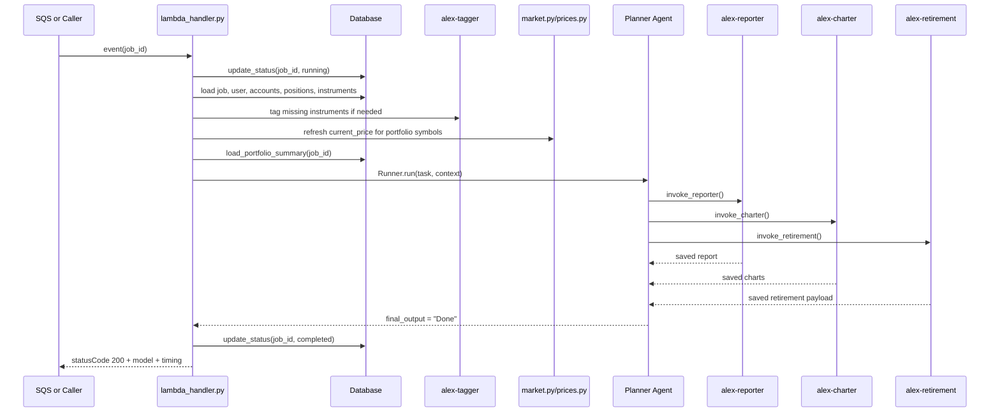
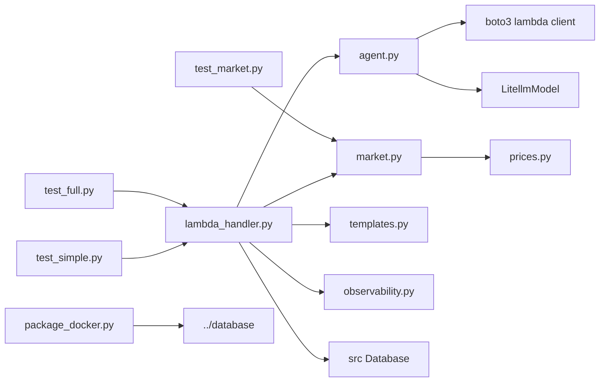

# `backend/planner` — orchestrator Lambda cho Part 6

## Nhiệm vụ chính

`backend/planner` là entry point orchestration của Part 6. Folder này không tự sinh report, chart hay retirement analysis; nó điều phối các specialist agents sau khi chuẩn bị dữ liệu tối thiểu cho job:

- đọc `job_id` từ SQS hoặc direct invocation
- tự động gọi tagger nếu portfolio còn instrument thiếu allocation metadata
- cập nhật `current_price` cho instrument bằng Polygon trước khi phân tích
- tính `portfolio_summary` gọn để giảm context đưa vào model
- chạy OpenAI Agents SDK với 3 tools nội bộ để gọi `reporter`, `charter`, `retirement`
- cập nhật trạng thái job trong Aurora từ `pending` sang `running`, `completed`, hoặc `failed`

Đã migrate từ Bedrock sang OpenAI: dùng `LitellmModel(model=MODEL_ID)` với env var `MODEL_ID_PLANNER` (default `openai/gpt-5.4-mini`). Planner dùng model mạnh nhất trong các agent Part 6 vì nó giữ quyết định orchestration.

## Cấu trúc thư mục

```text
backend/planner/
|-- agent.py
|-- aurora_config.json
|-- lambda_handler.py
|-- market.py
|-- observability.py
|-- package_docker.py
|-- prices.py
|-- pyproject.toml
|-- templates.py
|-- test_full.py
|-- test_market.py
|-- test_simple.py
`-- uv.lock
```

## Sơ đồ tổng quan kiến trúc

```mermaid
flowchart TD
    SQS[SQS alex-analysis-jobs] --> LH[lambda_handler.py]
    Direct[Direct invocation] --> LH
    LH --> OBS[observe()]
    LH --> HM[handle_missing_instruments]
    HM --> TAG[alex-tagger Lambda]
    LH --> MKT[update_instrument_prices]
    MKT --> POLY[Polygon via prices.py]
    LH --> SUM[load_portfolio_summary]
    LH --> AG[create_agent]
    AG --> OA[OpenAI Agents SDK Agent]
    OA --> REP[invoke_reporter]
    OA --> CHA[invoke_charter]
    OA --> RET[invoke_retirement]
    REP --> RL[alex-reporter Lambda]
    CHA --> CL[alex-charter Lambda]
    RET --> RTL[alex-retirement Lambda]
    LH --> DB[(Aurora via alex-database)]
```

## Chi tiết từng file

| File | Vai trò |
| --- | --- |
| `lambda_handler.py` | Entry point của Lambda `alex-planner`. Parse event từ SQS hoặc direct call, bao handler bằng `observe()`, retry `RateLimitError`, cập nhật trạng thái job và chạy orchestrator async. Có `[TIMING]` log: pre-processing, agent orchestration, lambda_total. Response body chứa `model` + `timing`. |
| `agent.py` | Khai báo `PlannerContext`, 3 `@function_tool` gọi specialist Lambdas, helper `invoke_lambda_agent()`, `handle_missing_instruments()`, `load_portfolio_summary()`, và `create_agent()`. Khởi tạo `LitellmModel(model=MODEL_ID)` với `MODEL_ID_PLANNER` từ env. Có `[TIMING]` log. |
| `templates.py` | Prompt orchestration cực ngắn: chỉ được dùng 3 tools, quy tắc gọi reporter/charter/retirement, và cuối cùng trả `"Done"`. |
| `market.py` | Tìm symbol trong portfolio của user theo `job_id`, gọi `get_share_price()` cho từng symbol, rồi update `instruments.current_price` trong DB. |
| `prices.py` | Bọc Polygon API. Nếu có `POLYGON_API_KEY` thì dùng EOD hoặc minute snapshot tùy `POLYGON_PLAN`; nếu lỗi hoặc không có key thì fallback sang số ngẫu nhiên. |
| `observability.py` | Context manager cho Logfire + LangFuse. Chỉ setup khi có `LANGFUSE_SECRET_KEY`; flush và sleep 15 giây khi thoát. Log sạch, không emoji. |
| `package_docker.py` | Build `planner_lambda.zip` bằng Docker image Lambda Python 3.12, export deps từ `uv.lock`, cài package `../database`, copy các module planner, và có tùy chọn `--deploy`. |
| `test_simple.py` | Local smoke test. Set `MOCK_LAMBDAS=true`, gọi `../database/reset_db.py --with-test-data --skip-drop`, tạo job mới rồi chạy `lambda_handler()` trực tiếp. In model + timing. |
| `test_full.py` | End-to-end test cho planner qua SQS thật. In AWS account/region, model config, tạo job, gửi message lên queue, poll DB đến khi hoàn thành, rồi in report/charts/retirement/summary. |
| `test_market.py` | Test riêng flow cập nhật giá bằng market data cho một user cụ thể trong DB. |
| `pyproject.toml` | UV project của planner. Dependency chính: `openai-agents[litellm]`, `boto3`, `polygon-api-client`, `langfuse`, `tenacity`, `alex-database`. |
| `aurora_config.json` | File cấu hình cục bộ tồn tại trong folder, không nằm trên execution path của planner code hiện tại. |
| `uv.lock` | Lock file dùng cho packaging và local execution nhất quán. |

Điểm implementation đáng chú ý:

- `MODEL_ID_PLANNER` default là `openai/gpt-5.4-mini` — model mạnh nhất trong Part 6 vì giữ quyết định orchestration.
- `MOCK_LAMBDAS=true` chỉ làm mock các specialist Lambda trong `invoke_lambda_agent()`. Planner vẫn chạm DB thật trong `test_simple.py`.
- `handle_missing_instruments()` gọi `alex-tagger` trực tiếp qua boto3 trước khi model orchestration bắt đầu.
- `load_portfolio_summary()` chỉ trả thống kê tổng hợp, không nạp full portfolio vào prompt.
- Planner không inject tên Lambda specialist từ Terraform; nếu không set env, code dùng default `alex-tagger`, `alex-reporter`, `alex-charter`, `alex-retirement`.

## Workflow chính



Luồng lỗi:

- nếu model hoặc specialist Lambda ném exception, `run_orchestrator()` sẽ update job thành `failed`
- `update_instrument_prices()` tự swallow lỗi vì market data là bước non-critical
- `invoke_lambda_agent()` unwrap response kiểu `{statusCode, body}` để planner không cần biết chi tiết từng Lambda handler

## Mối liên kết giữa các file

- `lambda_handler.py` là orchestrator nội bộ của folder; mọi business step đều đi qua các helper từ `agent.py` và `market.py`.
- `agent.py` vừa chứa model init, vừa chứa tool bridge sang các Lambda khác. Planner không gọi specialist agents trực tiếp trong `lambda_handler.py`.
- `templates.py` giữ prompt tĩnh, còn task động được `create_agent()` build từ `portfolio_summary`.
- `market.py` tách riêng khỏi `agent.py` để bước refresh market data chạy trước AI orchestration.
- `prices.py` là adapter duy nhất sang Polygon, nên mọi thay đổi về plan `free/paid` hoặc fallback behavior đều dồn về đây.
- `observability.py` không đổi kết quả business, nhưng có ảnh hưởng thực tế tới startup/shutdown time vì setup tracing và flush chờ 15 giây.

Sơ đồ import/call tối giản:



## Mối liên hệ với folder khác

- `backend/tagger`: planner gọi trước để bù metadata allocation cho instrument còn thiếu.
- `backend/reporter`: planner dùng tool `invoke_reporter` để tạo narrative report và lưu vào `jobs.report_payload`.
- `backend/charter`: planner dùng tool `invoke_charter` để sinh chart payload cho frontend.
- `backend/retirement`: planner dùng tool `invoke_retirement` để tính projection retirement.
- `backend/database`: source of truth cho `Database`, repositories `jobs/users/accounts/positions/instruments`, và Aurora Data API integration.
- `backend/researcher` và `backend/ingest`: planner không gọi trực tiếp, nhưng reporter phụ thuộc data đã được ingest vào S3 Vectors từ các part trước.
- `terraform/5_database`: cung cấp `AURORA_CLUSTER_ARN` và `AURORA_SECRET_ARN`.
- `terraform/6_agents`: deploy queue `alex-analysis-jobs`, Lambda `alex-planner`, IAM, S3 package bucket, và inject `MODEL_ID_PLANNER` + env vars cho planner.

## Cross-cutting scripts trong `backend/`

`backend/planner/README.md` là nơi canonical để giải thích các script dùng chung cho toàn Part 6:

| File | Mục đích | Khi nào dùng |
| --- | --- | --- |
| `backend/package_docker.py` | Chạy `uv run package_docker.py` cho từng agent folder và tóm tắt zip output. | Khi cần build toàn bộ Lambda packages trước deploy. |
| `backend/deploy_all_lambdas.py` | Kiểm tra zip hiện có, tùy chọn package lại, `terraform taint` 5 Lambda, rồi `terraform apply -auto-approve`. | Khi muốn đẩy toàn bộ code Part 6 lên AWS theo một lệnh. |
| `backend/test_simple.py` | Lần lượt chạy `test_simple.py` của từng agent trong chính thư mục của agent đó. | Smoke test local sau khi đổi code ở nhiều agent. |
| `backend/test_full.py` | Tạo test user/account/positions, gửi job lên SQS, poll DB đến completion, rồi in report/charts/retirement toàn hệ thống. | Integration test end-to-end cấp backend. |
| `backend/test_multiple_accounts.py` | Dựng user có 3 accounts khác nhau, chạy analysis thật, rồi kiểm tra report có chạm đủ các account hay không. | Regression test cho logic gộp multi-account. |
| `backend/test_scale.py` | Tạo 5 test users với portfolio khác nhau, gửi job concurrent lên SQS, monitor kết quả và dọn dữ liệu. | Kiểm tra khả năng xử lý đồng thời của toàn hệ agent orchestra. |
| `backend/watch_agents.py` | Poll CloudWatch Logs của cả 5 Lambda theo thời gian thực, tô màu theo agent và highlight lỗi/LangFuse logs. | Khi debug runtime trên AWS sau deploy. |

Workflow thực tế thường là:

1. package từng agent hoặc chạy `cd backend && uv run package_docker.py`
2. deploy bằng `cd backend && uv run deploy_all_lambdas.py --package`
3. kiểm tra local bằng `backend/test_simple.py` hoặc agent-specific `test_simple.py`
4. chạy `backend/test_full.py` hoặc `backend/test_multiple_accounts.py`
5. mở `backend/watch_agents.py` nếu cần soi log CloudWatch liên tục

## Cách sử dụng nhanh

```bash
cd backend/planner

# Test local (dùng MODEL_ID_PLANNER từ env, default openai/gpt-5.4-mini)
uv run test_simple.py

# Test với model khác
MODEL_ID_PLANNER=openai/gpt-5.4-nano uv run test_simple.py

# Test Lambda đã deploy
uv run test_full.py
uv run test_market.py

# Package và deploy
uv run package_docker.py
uv run package_docker.py --deploy
```

Chạy từ `backend/`:

```bash
cd backend
uv run package_docker.py
uv run deploy_all_lambdas.py --package
uv run test_simple.py
uv run test_full.py
uv run test_multiple_accounts.py
uv run test_scale.py
uv run watch_agents.py --region us-east-1 --lookback 5 --interval 2
```

## Environment variables

| Biến | Dùng ở đâu | Mặc định |
| --- | --- | --- |
| `MODEL_ID_PLANNER` | `agent.py` — model string cho `LitellmModel` | `openai/gpt-5.4-mini` |
| `OPENAI_API_KEY` | LiteLLM — credential cho OpenAI API | bắt buộc |
| `AURORA_CLUSTER_ARN` / `AURORA_SECRET_ARN` / `DATABASE_NAME` | Shared database package dùng để đọc job, account, position, instrument và update status. | bắt buộc |
| `DEFAULT_AWS_REGION` | boto3 clients | `us-east-1` |
| `POLYGON_API_KEY` / `POLYGON_PLAN` | `prices.py` và `market.py` dùng để refresh market prices. | optional |
| `LANGFUSE_PUBLIC_KEY` / `LANGFUSE_SECRET_KEY` / `LANGFUSE_HOST` | `observability.py`. | optional |
| `TAGGER_FUNCTION` / `REPORTER_FUNCTION` / `CHARTER_FUNCTION` / `RETIREMENT_FUNCTION` | Tùy chọn override; nếu không set thì planner dùng default `alex-*`. | optional |
| `MOCK_LAMBDAS` | Chỉ dùng cho local test để mock specialist Lambda calls. | optional |

## Log output

```
[TIMING] create_agent: 0.00s | model=openai/gpt-5.4-mini
[TIMING] Pre-processing phase: 1.23s
[TIMING] Agent orchestration phase: 8.07s | model=openai/gpt-5.4-mini
[TIMING] run_orchestrator TOTAL: 9.30s (pre=1.23s, agent=8.07s) | model=openai/gpt-5.4-mini
[TIMING] lambda_handler TOTAL: 9.30s | job=... | model=openai/gpt-5.4-mini
```

Response body:

```json
{
  "success": true,
  "message": "Analysis completed for job ...",
  "model": "openai/gpt-5.4-mini",
  "timing": {
    "lambda_total_s": 9.30
  }
}
```

## Tóm tắt

`backend/planner` là orchestrator của Part 6, điều phối tagger (pre-processing) và 3 specialist agents (reporter, charter, retirement) qua 3 `@function_tool`. Đã migrate hoàn toàn từ Bedrock sang OpenAI (`openai/gpt-5.4-mini` qua `MODEL_ID_PLANNER`). Dùng SQS `alex-analysis-jobs` làm trigger chuẩn. Có `[TIMING]` log đầy đủ, response body chứa model + timing.
