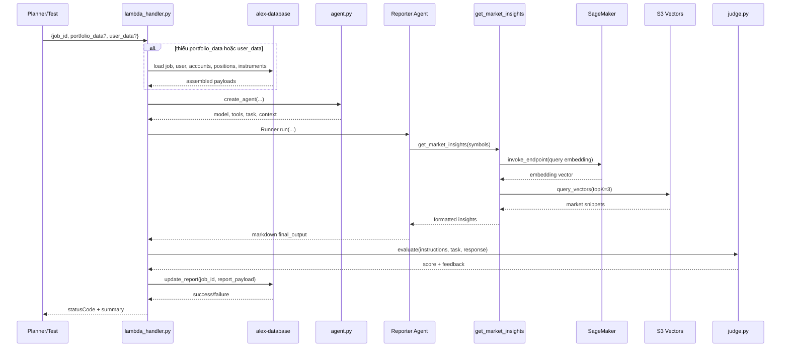
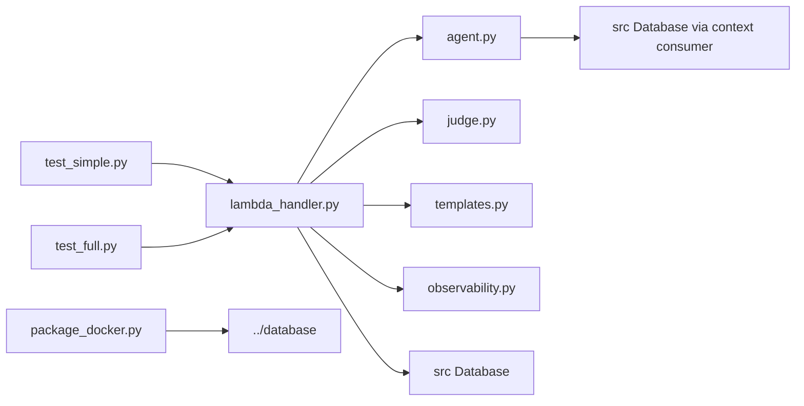

# `backend/reporter` — agent viết portfolio report cho Part 6

## Nhiệm vụ chính

`backend/reporter` là specialist agent chịu trách nhiệm biến portfolio data thành báo cáo markdown để lưu vào `jobs.report_payload`. Source of truth của README này là current state trong code hiện tại:

- dùng OpenAI Agents SDK với `LitellmModel(model=f"bedrock/{model_id}")`
- có 1 tool duy nhất là `get_market_insights()` để query S3 Vectors qua embedding từ SageMaker
- chạy thêm `judge.py` như một lớp guardrail sau khi agent trả kết quả
- lưu report xuống database trong `lambda_handler.py`, không còn tool ghi DB riêng
- có local test và full Lambda test riêng

Agent này là nơi narrative quality quan trọng nhất trong nhóm specialist agents vì output của nó là phần người dùng đọc trực tiếp.

## Cấu trúc thư mục

```text
backend/reporter/
|-- agent.py
|-- judge.py
|-- lambda_handler.py
|-- observability.py
|-- package_docker.py
|-- pyproject.toml
|-- templates.py
|-- test_full.py
|-- test_simple.py
`-- uv.lock
```

## Sơ đồ tổng quan kiến trúc


## Chi tiết từng file

| File | Vai trò |
| --- | --- |
| `agent.py` | Tạo `ReporterContext`, format portfolio thành text, định nghĩa tool `get_market_insights()`, set `AWS_REGION_NAME` từ `BEDROCK_REGION`, rồi trả về `model`, `tools`, `task`, `context`. |
| `lambda_handler.py` | Entry point của Lambda `alex-reporter`. Tải portfolio/user data từ DB nếu event chưa có, chạy agent với retry cho `RateLimitError`, gọi `judge.py`, guard kết quả nếu score thấp, rồi lưu `report_payload`. |
| `judge.py` | Agent evaluator riêng, cũng khởi tạo Bedrock model qua LiteLLM và trả structured output `Evaluation(score, feedback)`. |
| `templates.py` | Chứa `REPORTER_INSTRUCTIONS` cho report markdown, yêu cầu có executive summary, diversification, risk, retirement readiness, recommendations. |
| `observability.py` | Context manager `observe()` để setup Logfire + LangFuse nếu env đầy đủ, rồi flush traces ở cuối Lambda. |
| `package_docker.py` | Build `reporter_lambda.zip` bằng Docker Lambda Python 3.12 image, export dependencies từ `uv.lock`, cài package `../database`, và có thể `--deploy` lên `alex-reporter`. |
| `test_simple.py` | Tạo job thật trong DB, gọi `lambda_handler()` local với portfolio mẫu, đọc lại `report_payload`, kiểm tra dấu hiệu reasoning text và xóa test job. |
| `test_full.py` | Invoke Lambda `alex-reporter` thật bằng boto3 chỉ với `job_id`, đợi rồi kiểm tra `report_payload` trong DB. |
| `pyproject.toml` | UV project cục bộ. Dependency chính: `openai-agents[litellm]`, `boto3`, `langfuse`, `tenacity`, `alex-database`. |
| `uv.lock` | File lock để package và test nhất quán. |

Các điểm implementation đáng chú ý trong current state:

- `BEDROCK_MODEL_ID` default là `us.anthropic.claude-3-7-sonnet-20250219-v1:0`.
- `BEDROCK_REGION` default là `us-west-2`.
- `get_market_insights()` tự tìm AWS account ID để dựng vector bucket `alex-vectors-{account_id}`.
- Embedding query dùng `DEFAULT_AWS_REGION` và `SAGEMAKER_ENDPOINT`, không dùng `BEDROCK_REGION`.
- `judge.py` chấm điểm từ `0` đến `100`, sau đó `lambda_handler.py` quy đổi sang `0.0` đến `1.0`.
- Nếu điểm judge < `0.3`, handler thay report bằng thông báo lỗi mềm thay vì lưu output gốc.

## Workflow chính



Luồng dữ liệu quan trọng:

- input tối thiểu bắt buộc là `job_id`
- nếu event có sẵn `portfolio_data` và `user_data` thì handler dùng luôn
- nếu không có, handler tự reconstruct portfolio từ `users`, `accounts`, `positions`, `instruments`
- output cuối cùng được lưu vào `jobs.report_payload` với các key `content`, `generated_at`, `agent`

## Mối liên kết giữa các file

- `lambda_handler.py` là orchestrator nội bộ của folder, ghép data loading, agent run, judge, và persistence.
- `agent.py` chứa toàn bộ tool flow thực tế; `lambda_handler.py` chỉ gọi `create_agent()`.
- `judge.py` là dependency quan trọng nhưng tách riêng với agent chính để tránh trộn prompt/report logic với evaluation logic.
- `templates.py` chỉ cung cấp instructions; task động được build trong `agent.py`.
- `observability.py` không ảnh hưởng business logic, nhưng ảnh hưởng trace export và thời gian shutdown vì có `sleep(10)` khi flush.

Sơ đồ import/call tối giản:



## Mối liên hệ với folder khác

- `backend/planner`: planner gọi reporter khi job cần narrative analysis cho portfolio.
- `backend/database`: source of truth cho `Database`, `jobs.update_report`, và các repository đọc portfolio data.
- `backend/ingest`: indirectly liên quan vì tool `get_market_insights()` query S3 Vectors index được xây từ ingestion pipeline.
- `backend/researcher`: tạo research documents đi vào `financial-research`, là nguồn context mà reporter query lại.
- `terraform/3_ingestion`: cung cấp S3 Vectors bucket/index và API ingest phía trước.
- `terraform/5_database`: cung cấp Aurora/Data API.
- `terraform/6_agents`: deploy Lambda `alex-reporter` và inject env vars cho model, DB, LangFuse, SageMaker.

## Cách sử dụng nhanh

Điều kiện tối thiểu:

- có `.env` hoặc env vars tương ứng cho DB
- nếu muốn tool hoạt động đầy đủ thì cần `DEFAULT_AWS_REGION`, `SAGEMAKER_ENDPOINT`, quyền `sagemaker-runtime`, `s3vectors`
- nếu muốn full observability thì cần `LANGFUSE_SECRET_KEY`, `LANGFUSE_PUBLIC_KEY`, `LANGFUSE_HOST`, `OPENAI_API_KEY`
- Docker Desktop đang chạy nếu cần package

Chạy test local:

```bash
cd backend/reporter
uv run test_simple.py
```

Chạy test Lambda thật:

```bash
cd backend/reporter
uv run test_full.py
```

Package hoặc deploy nhanh:

```bash
cd backend/reporter
uv run package_docker.py
uv run package_docker.py --deploy
```

Env vars current state thường gặp:

| Biến | Dùng ở đâu |
| --- | --- |
| `BEDROCK_MODEL_ID` | `agent.py` và `judge.py` dùng để khởi tạo `LitellmModel(model=f"bedrock/{model_id}")`. |
| `BEDROCK_REGION` | `agent.py` và `judge.py` set vào `AWS_REGION_NAME` cho LiteLLM Bedrock. |
| `DEFAULT_AWS_REGION` | `get_market_insights()` dùng cho SageMaker runtime và S3 Vectors client. |
| `SAGEMAKER_ENDPOINT` | `get_market_insights()` gọi embedding endpoint. |
| `AURORA_CLUSTER_ARN` / `AURORA_SECRET_ARN` / `DATABASE_NAME` | shared database package dùng để đọc portfolio và lưu report. |
| `LANGFUSE_SECRET_KEY` / `LANGFUSE_PUBLIC_KEY` / `LANGFUSE_HOST` | `observability.py`. |
| `OPENAI_API_KEY` | current state chủ yếu phục vụ observability/LangFuse export, không phải luồng model chính. |

## Cách chuyển sang OpenAI models

Current state của repo vẫn Bedrock-centric:

- naming env là `BEDROCK_MODEL_ID` và `BEDROCK_REGION`
- model init path là `LitellmModel(model=f"bedrock/{model_id}")`
- `judge.py` cũng tự khởi tạo Bedrock model riêng

Model đề xuất cho folder này: `openai/gpt-5.4-nano`

Lý do:

- reporter có tool usage và viết report, nhưng user ưu tiên cost và latency cho đợt migrate đầu
- nếu report quality giảm, hãy nâng cấp `reporter` trước các specialist agent khác

Các file cần rà soát khi migrate thật:

- `backend/reporter/agent.py`
- `backend/reporter/judge.py`
- `backend/reporter/lambda_handler.py`
- `terraform/6_agents/main.tf`
- `terraform/6_agents/variables.tf`
- `terraform/6_agents/terraform.tfvars.example`

Các bước migrate ở mức document:

1. Đổi provider/model trong `agent.py`
   - từ `LitellmModel(model=f"bedrock/{model_id}")`
   - sang `LitellmModel(model="openai/gpt-5.4-nano")` hoặc cơ chế tương đương mà team chọn
2. Rà soát `judge.py` vì file này cũng cần review during migration if it still instantiates a Bedrock model
3. Giữ tên biến cũ `BEDROCK_MODEL_ID` và `BEDROCK_REGION` ở giai đoạn đầu nếu muốn giảm churn trong Terraform và Lambda env
4. Khi không còn dùng Bedrock, xem lại logic:
   - `os.environ["AWS_REGION_NAME"] = bedrock_region`
   - narrative trong docs để tránh hiểu nhầm rằng model vẫn chạy qua AWS
5. Phân biệt rõ hai nhóm credential:
   - `OPENAI_API_KEY` cho observability hiện tại
   - `OPENAI_API_KEY` cho model calls sau migration thật

Điểm phải test kỹ sau migrate:

- tool calling còn ổn định không với `get_market_insights()`
- report markdown có còn giữ cấu trúc dễ đọc và actionable không
- judge score có tụt đáng kể không nếu judge và reporter cùng đổi model
- output bị guard fallback quá thường xuyên không

Khuyến nghị thực tế:

- bắt đầu bằng `openai/gpt-5.4-nano`
- nếu report quality drops, upgrade `reporter` before other specialist agents
- chạy lại `uv run test_simple.py` và `uv run test_full.py` sau khi đổi provider/model

## Tóm tắt

`backend/reporter` là agent narrative quan trọng nhất trong Part 6. Current state của nó dùng Bedrock qua LiteLLM, có tool query S3 Vectors, có `judge.py` để chấm chất lượng, và lưu markdown report vào `jobs.report_payload`. README này mô tả đúng source of truth hiện tại, đồng thời chỉ rõ đường migrate sang `openai/gpt-5.4-nano` mà không giả vờ repo đã chuyển xong.
