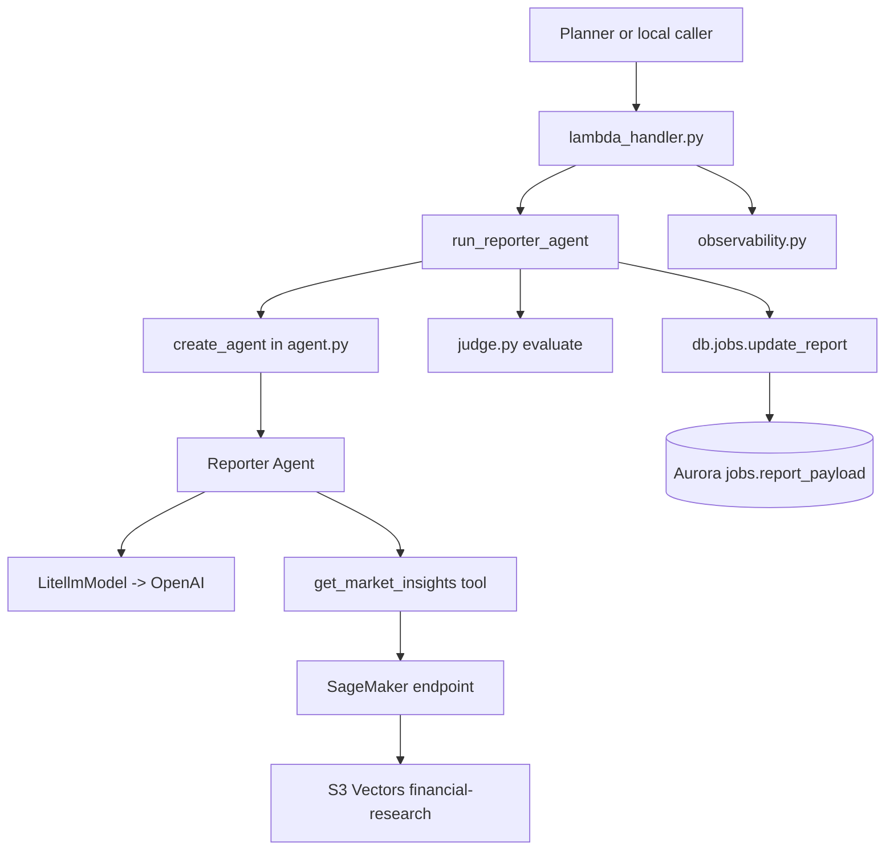
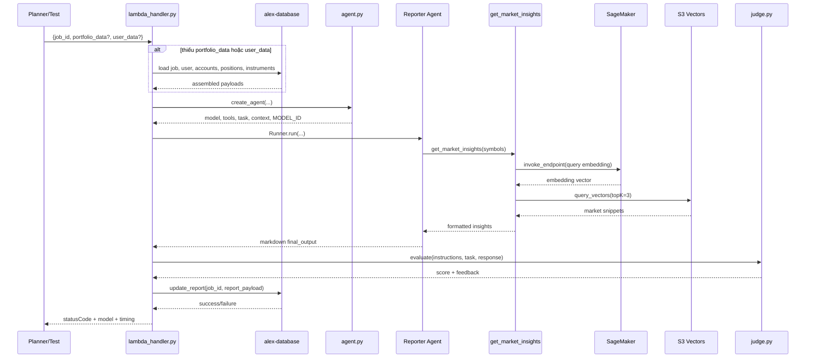
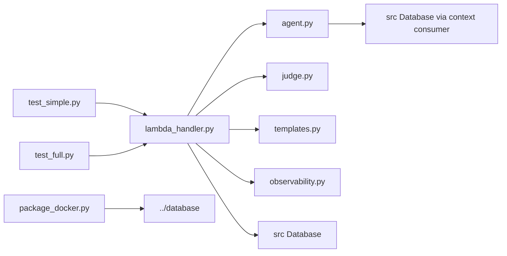

# `backend/reporter` — agent viết portfolio report cho Part 6

## Nhiệm vụ chính

`backend/reporter` là specialist agent chịu trách nhiệm biến portfolio data thành báo cáo markdown để lưu vào `jobs.report_payload`:

- dùng OpenAI Agents SDK với `LitellmModel(model=MODEL_ID)` — đã migrate từ Bedrock sang OpenAI
- env var: `MODEL_ID_REPORTER` (default `openai/gpt-5.4-nano`)
- có 1 tool duy nhất là `get_market_insights()` để query S3 Vectors qua embedding từ SageMaker
- dùng `ReporterContext` typed context để truyền job_id, portfolio_data, user_data, db vào tool
- chạy thêm `judge.py` như một lớp guardrail sau khi agent trả kết quả
- lưu report xuống database trong `lambda_handler.py`
- có `[TIMING]` log đầy đủ: create, agent, db, lambda_total

Agent này là nơi narrative quality quan trọng nhất trong nhóm specialist agents vì output của nó là phần người dùng đọc trực tiếp.

## Cấu trúc thư mục

```text
backend/reporter/
|-- agent.py
|-- judge.py
|-- lambda_handler.py
|-- observability.py
|-- package_docker.py
|-- pyproject.toml
|-- templates.py
|-- test_full.py
|-- test_simple.py
`-- uv.lock
```

## Sơ đồ tổng quan kiến trúc



## Chi tiết từng file

| File | Vai trò |
| --- | --- |
| `agent.py` | Tạo `ReporterContext`, format portfolio thành text, định nghĩa tool `get_market_insights()`, khởi tạo `LitellmModel(model=MODEL_ID)` với `MODEL_ID_REPORTER` từ env, rồi trả về `model`, `tools`, `task`, `context`, `MODEL_ID`. Có `[TIMING]` log. |
| `lambda_handler.py` | Entry point của Lambda `alex-reporter`. Tải portfolio/user data từ DB nếu event chưa có, chạy agent với retry cho `RateLimitError`, gọi `judge.py`, guard kết quả nếu score thấp, rồi lưu `report_payload`. Có `[TIMING]` log đầy đủ qua các phase: create, agent, db, lambda_total. Response body chứa `model` + `timing` breakdown. |
| `judge.py` | Agent evaluator riêng, cũng khởi tạo OpenAI model qua LiteLLM và trả structured output `Evaluation(score, feedback)`. |
| `templates.py` | Chứa `REPORTER_INSTRUCTIONS` cho report markdown, yêu cầu có executive summary, diversification, risk, retirement readiness, recommendations. |
| `observability.py` | Context manager `observe()` để setup Logfire + LangFuse nếu env đầy đủ, rồi flush traces ở cuối Lambda. Log sạch, không emoji. |
| `package_docker.py` | Build `reporter_lambda.zip` bằng Docker Lambda Python 3.12 image, export dependencies từ `uv.lock`, cài package `../database`, và có thể `--deploy` lên `alex-reporter`. |
| `test_simple.py` | Tạo job thật trong DB, gọi `lambda_handler()` local với portfolio mẫu, in model + timing, đọc lại `report_payload`, và xóa test job. |
| `test_full.py` | Invoke Lambda `alex-reporter` thật bằng boto3 chỉ với `job_id`, in model + timing, đợi rồi kiểm tra `report_payload` trong DB. |
| `pyproject.toml` | UV project cục bộ. Dependency chính: `openai-agents[litellm]`, `boto3`, `langfuse`, `tenacity`, `alex-database`. |
| `uv.lock` | File lock để package và test nhất quán. |

Các điểm implementation đáng chú ý:

- `MODEL_ID_REPORTER` default là `openai/gpt-5.4-nano`.
- `get_market_insights()` tự tìm AWS account ID để dựng vector bucket `alex-vectors-{account_id}`.
- Embedding query dùng `DEFAULT_AWS_REGION` và `SAGEMAKER_ENDPOINT`.
- `judge.py` chấm điểm từ `0` đến `100`, sau đó `lambda_handler.py` quy đổi sang `0.0` đến `1.0`.
- Nếu điểm judge < `0.3`, handler thay report bằng thông báo lỗi mềm thay vì lưu output gốc.

## Workflow chính



## Mối liên kết giữa các file

- `lambda_handler.py` là orchestrator nội bộ của folder, ghép data loading, agent run, judge, và persistence.
- `agent.py` chứa toàn bộ tool flow thực tế; `lambda_handler.py` chỉ gọi `create_agent()`.
- `judge.py` là dependency quan trọng nhưng tách riêng với agent chính để tránh trộn prompt/report logic với evaluation logic.
- `templates.py` chỉ cung cấp instructions; task động được build trong `agent.py`.
- `observability.py` không ảnh hưởng business logic, nhưng ảnh hưởng trace export và thời gian shutdown vì có `sleep(10)` khi flush.

Sơ đồ import/call tối giản:



## Mối liên hệ với folder khác

- `backend/planner`: planner gọi reporter khi job cần narrative analysis cho portfolio.
- `backend/database`: source of truth cho `Database`, `jobs.update_report`, và các repository đọc portfolio data.
- `backend/ingest`: indirectly liên quan vì tool `get_market_insights()` query S3 Vectors index được xây từ ingestion pipeline.
- `backend/researcher`: tạo research documents đi vào `financial-research`, là nguồn context mà reporter query lại.
- `terraform/3_ingestion`: cung cấp S3 Vectors bucket/index và API ingest phía trước.
- `terraform/5_database`: cung cấp Aurora/Data API.
- `terraform/6_agents`: deploy Lambda `alex-reporter` và inject `MODEL_ID_REPORTER`, DB, SageMaker, LangFuse env vars.

## Cách sử dụng nhanh

```bash
cd backend/reporter

# Test local (dùng MODEL_ID_REPORTER từ env, default openai/gpt-5.4-nano)
uv run test_simple.py

# Test với model khác
MODEL_ID_REPORTER=openai/gpt-5.4-mini uv run test_simple.py

# Test Lambda đã deploy
uv run test_full.py

# Package và deploy
uv run package_docker.py
uv run package_docker.py --deploy
```

## Environment variables

| Biến | Dùng ở đâu | Mặc định |
| --- | --- | --- |
| `MODEL_ID_REPORTER` | `agent.py` — model string cho `LitellmModel` | `openai/gpt-5.4-nano` |
| `OPENAI_API_KEY` | LiteLLM — credential cho OpenAI API | bắt buộc |
| `AURORA_CLUSTER_ARN` | shared database package — Data API endpoint | bắt buộc |
| `AURORA_SECRET_ARN` | shared database package — credential | bắt buộc |
| `DATABASE_NAME` | shared database package | `alex` |
| `DEFAULT_AWS_REGION` | `get_market_insights()` — SageMaker runtime + S3 Vectors client | `us-east-1` |
| `SAGEMAKER_ENDPOINT` | `get_market_insights()` — embedding endpoint | bắt buộc |
| `LANGFUSE_PUBLIC_KEY` | `observability.py` | optional |
| `LANGFUSE_SECRET_KEY` | `observability.py` | optional |
| `LANGFUSE_HOST` | `observability.py` | `https://us.cloud.langfuse.com` |

## Log output

Mỗi lần chạy đều in `[TIMING]` log kèm model name:

```
[TIMING] create_agent: 0.00s | model=openai/gpt-5.4-nano
[TIMING] Agent creation phase: 0.00s
[TIMING] Agent run phase: 30.71s | model=openai/gpt-5.4-nano
[TIMING] run_reporter_agent TOTAL: 31.12s (create=0.00s, agent=30.71s, db=0.39s) | model=openai/gpt-5.4-nano
[TIMING] lambda_handler TOTAL: 31.12s | job=... | model=openai/gpt-5.4-nano
```

Response body cũng chứa `model` và `timing` breakdown:

```json
{
  "success": 1,
  "message": "Report generated and stored",
  "model": "openai/gpt-5.4-nano",
  "timing": {
    "create_s": 0.0,
    "agent_s": 30.71,
    "db_s": 0.39,
    "total_s": 31.12,
    "lambda_total_s": 31.12
  }
}
```

## Tóm tắt

`backend/reporter` là agent narrative quan trọng nhất trong Part 6. Đã migrate hoàn toàn từ Bedrock sang OpenAI (`openai/gpt-5.4-nano` qua `MODEL_ID_REPORTER`). Có tool `get_market_insights()` query S3 Vectors, có `judge.py` để chấm chất lượng, và lưu markdown report vào `jobs.report_payload`. Có `[TIMING]` log đầy đủ, response body chứa model + timing.
