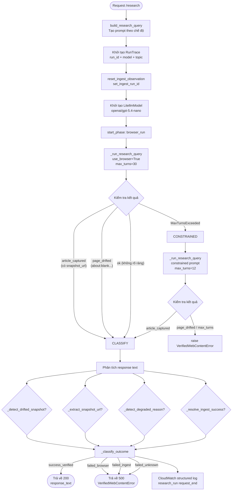
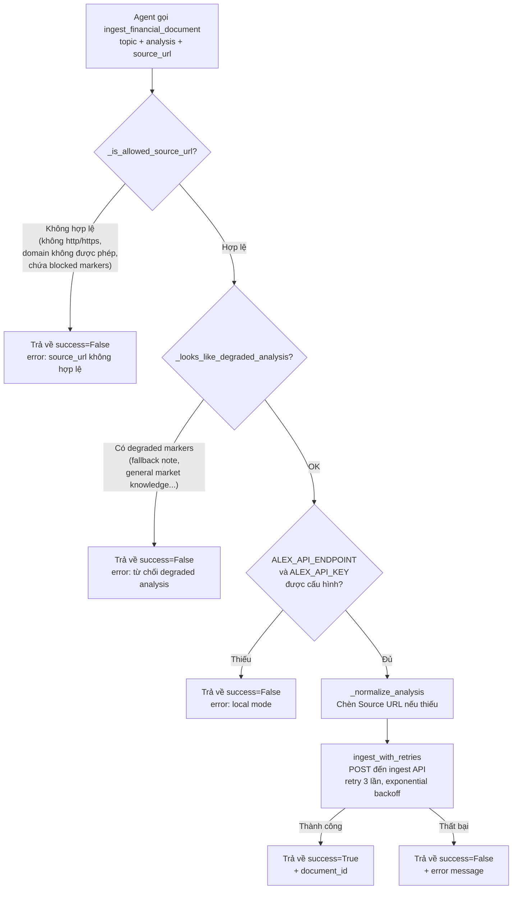
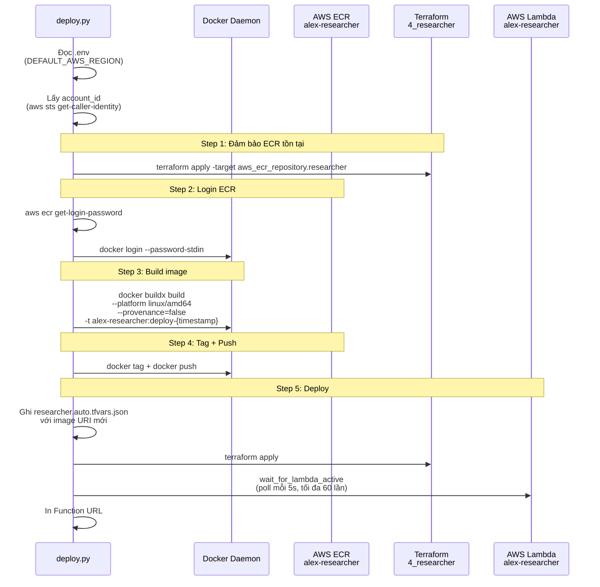
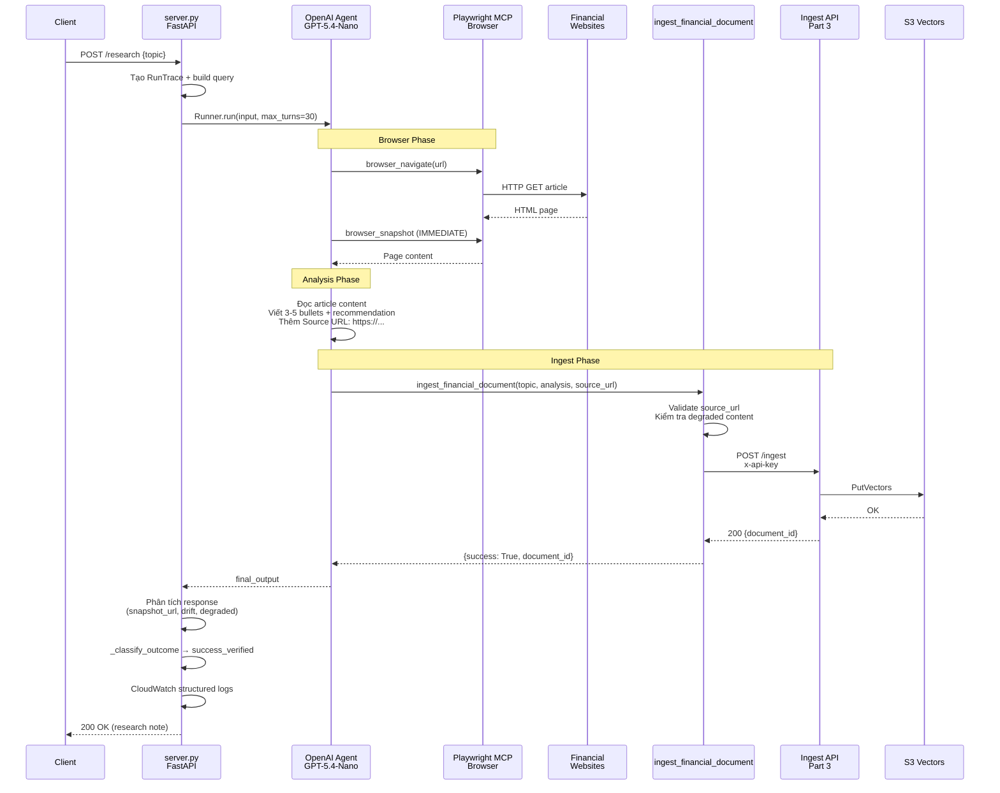
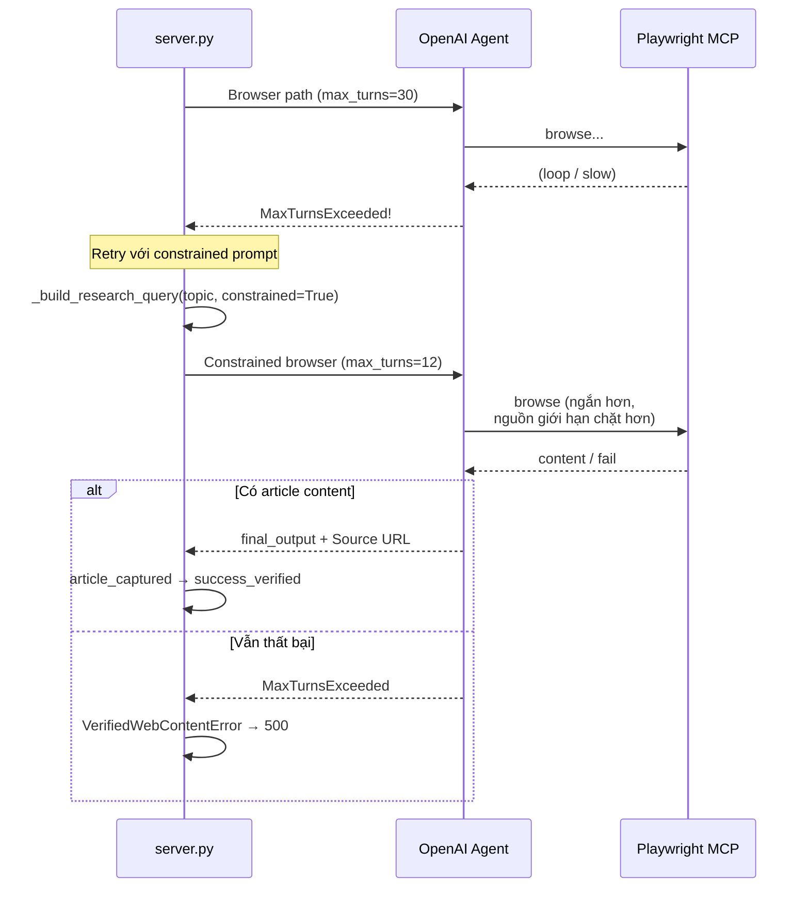
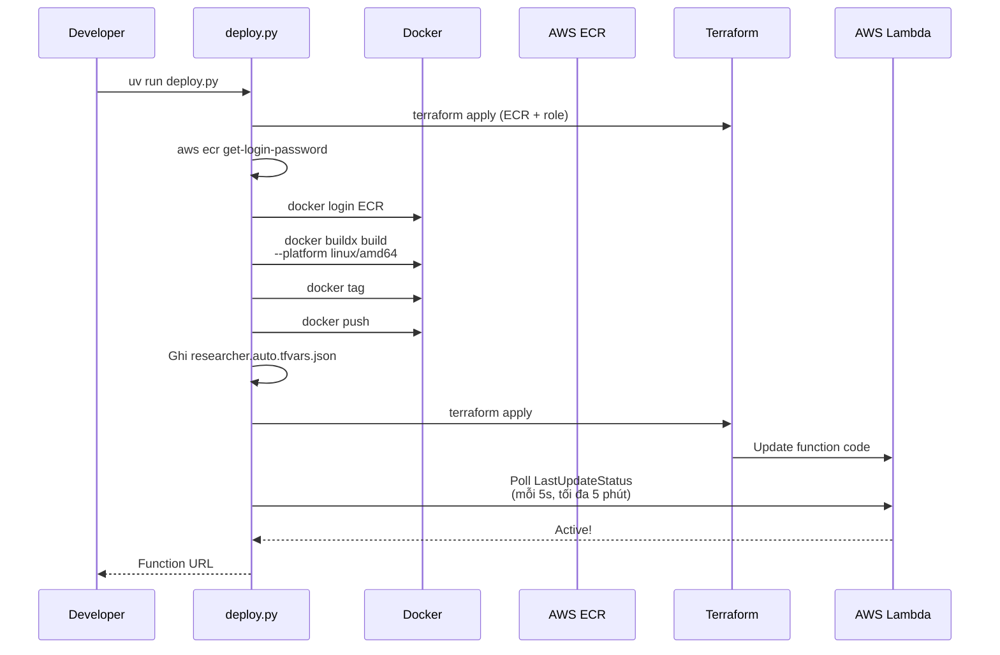
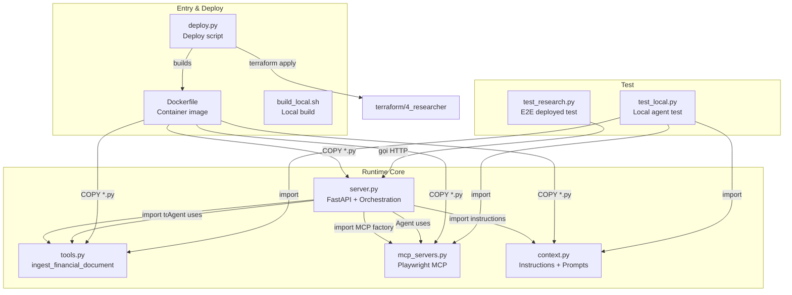
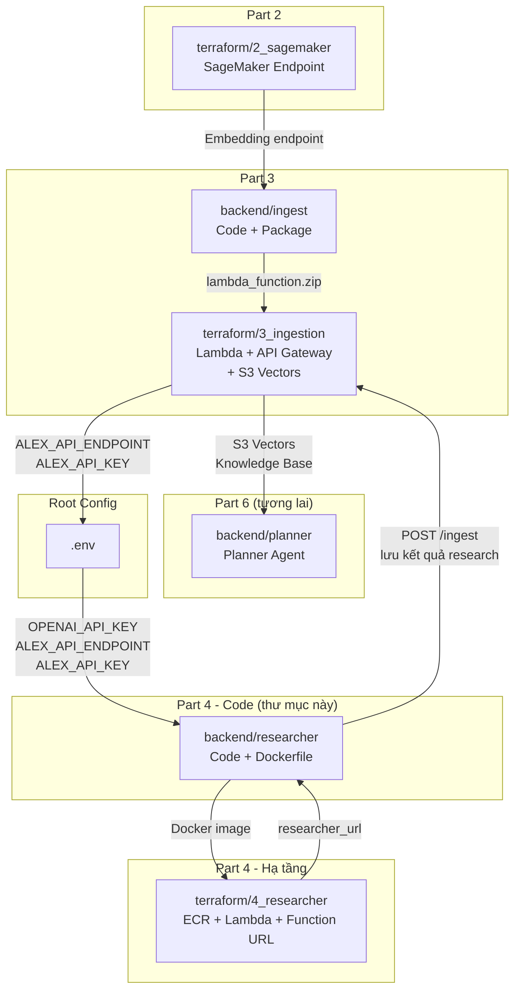

# `backend/researcher` — Mã nguồn Researcher Agent cho Part 4

Thư mục này chứa toàn bộ mã nguồn cho **Part 4 - Researcher Agent** của dự án Alex. Đây là phần **application code** của một AI agent độc lập có khả năng tự động nghiên cứu thị trường tài chính qua web browser, viết ghi chú đầu tư, và lưu kết quả vào S3 Vectors knowledge base.

Hạ tầng AWS chạy code này được định nghĩa trong `terraform/4_researcher`.

---

## Nhiệm vụ chính

Researcher là một **autonomous market-research agent** chạy trên AWS Lambda (container image). Nó:

1. Nhận chủ đề đầu tư (hoặc tự chọn chủ đề trending)
2. Sử dụng **LLM** (mặc định: `openai/gpt-5.4-nano` qua LiteLLM) để điều khiển trình duyệt
3. Dùng **Playwright MCP** để mở trình duyệt, tìm kiếm, điều hướng đến trang bài viết tài chính
4. Áp dụng chiến lược **immediate-snapshot** — chụp nội dung trang ngay sau khi điều hướng
5. Viết ghi chú đầu tư ngắn gọn (3-5 bullet points + 1 recommendation)
6. Gọi **ingest API** (từ Part 3) để lưu kết quả vào S3 Vectors knowledge base
7. Thực thi **verified-web-only contract** — chỉ ingest khi có bằng chứng nội dung web thật

---

## Cấu trúc thư mục

```
backend/researcher/
├── server.py              # FastAPI app + orchestration chính
├── context.py             # Prompt và instructions cho agent
├── tools.py               # Function tool: ingest_financial_document
├── mcp_servers.py         # Playwright MCP server setup
├── test_research.py       # E2E test script (gọi researcher đã deploy)
├── test_local.py          # Test local agent với MCP
├── deploy.py              # Script deploy lên AWS Lambda
├── Dockerfile             # Container image cho Lambda
├── build_local.sh         # Build và chạy container local
├── pyproject.toml         # uv project configuration
├── uv.lock                # Dependency lock file
├── .dockerignore          # Docker build ignore rules
└── .python-version        # Python version hint
```

---

## Sơ đồ tổng quan kiến trúc

```mermaid
graph TB
    subgraph "Entry Points"
        HEALTH[/health<br/>Health check]
        RESEARCH[/research<br/>Research với topic]
        AUTO[/research/auto<br/>Scheduler research]
    end

    subgraph "Core Orchestration (server.py)"
        ORCH[run_research_agent<br/>Orchestration chính]
        TRACE[RunTrace<br/>Observability state]
        PHASE[PhaseRecord<br/>Per-phase timing]
    end

    subgraph "Agent Components"
        CTX[context.py<br/>Agent instructions<br/>Immediate-snapshot rule]
        MODEL[LitellmModel<br/>openai/gpt-5.4-nano]
    end

    subgraph "Tools & MCP"
        INGEST_TOOL[ingest_financial_document<br/>Validate + Ingest]
        MCP[Playwright MCP Server<br/>Browser automation]
    end

    subgraph "External Services"
        INGEST_API[Ingest API<br/>POST /ingest<br/>Part 3]
        S3V[S3 Vectors<br/>Knowledge Base]
    end

    subgraph "Deploy (deploy.py + Dockerfile)"
        DOCKER[Docker Image<br/>linux/amd64]
        ECR[ECR<br/>alex-researcher]
        LAMBDA[AWS Lambda<br/>alex-researcher]
        FUNC_URL[Lambda Function URL<br/>Public HTTPS]
    end

    RESEARCH --> ORCH
    AUTO --> ORCH
    ORCH --> CTX
    ORCH --> MODEL
    ORCH --> INGEST_TOOL
    ORCH --> MCP
    INGEST_TOOL -->|HTTP POST| INGEST_API
    INGEST_API --> S3V
    ORCH --> TRACE
    TRACE -->|CloudWatch Logs| CW[CloudWatch<br/>Structured logs]

    DOCKER --> ECR
    ECR --> LAMBDA
    LAMBDA --> FUNC_URL
```

---

## Chi tiết từng file

### 1. `server.py` — FastAPI App + Orchestration Chính

**Vai trò:** Entry point HTTP chính của toàn bộ Researcher service. File lớn nhất và phức tạp nhất trong thư mục (~790 dòng).

#### Endpoints

| Endpoint | Method | Mục đích |
|----------|--------|----------|
| `/` | GET | Health check tối giản |
| `/health` | GET | Health check chi tiết (model, region, container detection, ingest config) |
| `/research` | POST | Nghiên cứu theo topic (hoặc tự chọn) — trả về text |
| `/research/auto` | GET | Nghiên cứu tự động (cho scheduler) — trả về JSON |
| `/test-bedrock` | GET | Debug Bedrock connection (cho môi trường AWS cũ) |

#### Các dataclass quan trọng

| Class | Mục đích |
|-------|----------|
| `PhaseRecord` | Lưu mốc bắt đầu, thời lượng, trạng thái, error_type của một phase |
| `RunTrace` | Gom toàn bộ observability state của một request: `run_id`, `topic`, `model`, `phases`, `outcome`, `ingest_success`, `degraded_reason` |
| `VerifiedWebContentError` | Exception đặc biệt báo hiệu không thể chứng minh nội dung web thật |

#### Hàm orchestration chính: `run_research_agent(topic)`

Đây là trái tim của researcher. Luồng xử lý:



#### Các hàm phân tích response

| Hàm | Chức năng |
|-----|-----------|
| `_extract_snapshot_url(response_text)` | Trích xuất URL từ dòng `Source URL: https://...` |
| `_detect_drifted_snapshot(response_text)` | Phát hiện dấu hiệu trang bị drift: `about:blank`, `about:srcdoc`, `client-storage`, `optimizely`, `doubleclick`, `googlesyndication` |
| `_detect_degraded_reason(response_text)` | Dò 40+ marker fallback: "quick high-level note", "fallback note", "general market knowledge", "404", "just a moment"... |
| `_infer_ingest_success(response_text)` | Suy luận ingest thành công từ response text (heuristic) |
| `_resolve_ingest_success(run_id, response_text)` | Ưu tiên tool-level telemetry từ `get_last_ingest_observation()`, fallback về heuristic |
| `_classify_outcome(...)` | Phân loại kết quả cuối: `success_verified`, `failed_browser`, `failed_ingest`, `failed_unknown` |

#### Retry strategy

```
Browser path (max_turns=30)
  └─ Thất bại (MaxTurnsExceeded)
       └─ Constrained browser path (max_turns=12)
            └─ Prompt ngắn hơn, source giới hạn chặt hơn
            └─ Thất bại → VerifiedWebContentError → 500
```

#### Observability (CloudWatch Logs)

Mỗi request ghi structured logs với `run_id` chung:

```
research_run phase_start   run_id=... model=... topic=... phase=browser_run
research_run phase_end     run_id=... phase=browser_run status=article_captured duration_ms=...
research_run snapshot_page_url run_id=... url=https://...
research_run request_end   run_id=... outcome=success_verified ingest_success=True total_duration_ms=...
research_ingest            run_id=... success=True topic=... document_id=... source_url=...
```

#### Biến môi trường sử dụng

| Biến | Mặc định | Dùng ở |
|------|----------|--------|
| `RESEARCHER_MODEL` | `openai/gpt-5.4-nano` | `_get_researcher_model_name()` |
| `BEDROCK_REGION` | `ap-southeast-1` | `run_research_agent()` — set `AWS_REGION_NAME` |
| `ALEX_API_ENDPOINT` | *(bắt buộc)* | `tools.py` — gọi ingest API |
| `ALEX_API_KEY` | *(bắt buộc)* | `tools.py` — x-api-key header |
| `MCP_LOGGING` | `False` | Bật/tắt logging chi tiết MCP tool |
| `OPENAI_API_KEY` | *(bắt buộc)* | LiteLLM — model OpenAI |
| `OPENROUTER_API_KEY` | *(bắt buộc)* | LiteLLM — model OpenRouter |

---

### 2. `context.py` — Agent Instructions & Prompts

**Vai trò:** Gom toàn bộ prompt và chỉ dẫn hành vi cho Researcher agent.

#### Hàm `get_agent_instructions()`

Trả về instructions động có kèm ngày hiện tại (`datetime.now()`). Cấu trúc instructions:

```
You are Alex, a concise investment researcher. Today is {today}.

CRITICAL: Only return and save research if it is derived from real web content.

THREE steps:
1. WEB RESEARCH (1-2 pages MAX)
   - Prefer: Investopedia, AP News, CNN Business
   - Reuters: only if loads cleanly
   - CRITICAL SNAPSHOT RULE: browser_navigate → IMMEDIATE browser_snapshot
   - Max 3 source attempts: Investopedia → AP News → CNN Business
   - Detect failures: about:blank, about:srcdoc, client-storage...

2. BRIEF ANALYSIS
   - 3-5 bullet points maximum
   - One clear recommendation
   - Include: Source URL: https://...

3. SAVE TO DATABASE
   - Use ingest_financial_document
   - Pass clean article URL as source_url

FAILURE BEHAVIOR:
   - Fail clearly, no fallback from general knowledge
```

#### `DEFAULT_RESEARCH_PROMPT`

Prompt mặc định khi không có topic — agent tự chọn chủ đề trending trong large-cap US equities.

---

### 3. `tools.py` — Function Tool: Ingest Financial Document

**Vai trò:** Định nghĩa function tool mà agent gọi để lưu kết quả research. Đây là cầu nối giữa Researcher (Part 4) và Ingest Pipeline (Part 3).

#### Tool chính: `ingest_financial_document(topic, analysis, source_url)`

Được decorate với `@function_tool` của OpenAI Agents SDK.

**Quy trình xác thực trước khi ingest:**



#### Các hàm hỗ trợ

| Hàm | Chức năng |
|-----|-----------|
| `_is_allowed_source_url(url)` | Kiểm tra URL hợp lệ: scheme http/https, domain trong whitelist (`investopedia.com`, `apnews.com`, `cnn.com`, `reuters.com`), không chứa blocked markers (`about:blank`, `captcha`, `consent`, `error`...) |
| `_looks_like_degraded_analysis(text)` | Phát hiện nội dung degraded: "quick high-level note", "fallback note", "general market knowledge"... |
| `_normalize_analysis(text, url)` | Đảm bảo analysis có dòng `Source URL:` |
| `ingest_with_retries(document)` | Retry wrapper với `@retry(stop=3, wait=exponential)` |
| `_ingest(document)` | HTTP POST thực tế đến ingest API với `httpx` |

#### Telemetry

| Hàm | Chức năng |
|-----|-----------|
| `set_ingest_run_id(run_id)` | Gắn run_id vào context var |
| `reset_ingest_observation()` | Xóa observation cũ |
| `get_last_ingest_observation(run_id)` | Lấy observation mới nhất |
| `clear_ingest_observation(run_id)` | Dọn observation sau khi đã emit summary |
| `_record_ingest_observation(run_id, result)` | Ghi observation vào dict process-wide |

#### Cấu trúc log `research_ingest`

```python
logger.info(
    "research_ingest run_id=%s success=%s topic=%s document_id=%s source_url=%s error=%s",
    run_id, result["success"], topic, result["document_id"], source_url, error
)
```

---

### 4. `mcp_servers.py` — Playwright MCP Server Configuration

**Vai trò:** Cấu hình và tạo Playwright MCP server instance cho browser automation.

#### Hàm `create_playwright_mcp_server(timeout_seconds=120)`

Tạo MCP server với các tham số:

**Browser args:**
```
--headless
--isolated
--no-sandbox
--ignore-https-errors
--user-agent "Mozilla/5.0 (Windows NT 10.0; Win64; x64) Chrome/125.0"
--executable-path <chromium-path>
```

**Đường dẫn Chromium:**
- Primary: glob `/ms-playwright/chromium-*/chrome-linux*/chrome`
- Fallback: `/ms-playwright/chromium-1208/chrome-linux64/chrome`

**Config file:** Ghi vào `/tmp/playwright-mcp.config.json` (writable trong container/Lambda):
```json
{
  "browser": {
    "launchOptions": {
      "args": ["--no-zygote", "--disable-gpu"]
    }
  }
}
```

#### Lớp `LoggingMCPServerStdio`

Mở rộng `MCPServerStdio` để đọc stderr của subprocess Playwright và đẩy vào Python logger. Dùng thread riêng (`daemon=True`) để drain stderr.

#### Constants

| Constant | Giá trị |
|----------|--------|
| `PLAYWRIGHT_USER_AGENT` | Chrome 125.0 trên Windows NT 10.0 |
| `PLAYWRIGHT_BROWSER_GLOB` | `/ms-playwright/chromium-*/chrome-linux*/chrome` |
| `PLAYWRIGHT_BROWSER_FALLBACK` | `/ms-playwright/chromium-1208/chrome-linux64/chrome` |
| `PLAYWRIGHT_STDERR_MAX_LENGTH` | 4000 chars |

---

### 5. `test_research.py` — End-to-End Test Script

**Vai trò:** Script test researcher đã deploy từ local terminal.

**Quy trình:**
1. Lấy `researcher_url` từ `terraform output -raw researcher_url`
2. Gọi `GET /health` — xác nhận service alive + lấy model name
3. Gọi `POST /research` với topic (hoặc để agent tự chọn) — timeout 180s
4. Classify kết quả ở phía client bằng `classify_terminal_result()`
5. In RUN SUMMARY: model, topic, duration, outcome, degraded_signal, ingest_status
6. Gợi ý lệnh verify: `cd ../ingest && uv run test_search_s3vectors.py`

**Classifier client-side:** `classify_terminal_result(text)` dò 50+ fallback marker để phân loại nhanh thành `success_verified` hoặc `unexpected_200_nonverified`.

**Sử dụng:**
```bash
# Agent tự chọn topic
uv run test_research.py

# Research topic cụ thể
uv run test_research.py "NVIDIA AI datacenter demand"
```

---

### 6. `test_local.py` — Test Local Agent

**Vai trò:** Script test agent ở local trước khi deploy, dùng model `gpt-4.1-mini`.

**Quy trình:**
1. `load_dotenv(override=True)` — đọc .env
2. Tạo Playwright MCP server
3. Tạo Agent với `instructions=get_agent_instructions()`, model `gpt-4.1-mini`
4. Chạy `Runner.run()` với `DEFAULT_RESEARCH_PROMPT`
5. In `result.final_output`

**Khác biệt với production:**
- Dùng model `gpt-4.1-mini` (nhẹ hơn `gpt-5.4-nano`)
- Không dùng `LitellmModel` — trực tiếp string model
- Không có verified-web gate
- Phù hợp kiểm tra prompt/MCP/ingest tool có hoạt động không

---

### 7. `deploy.py` — Deployment Script

**Vai trò:** Script deploy toàn bộ researcher service lên AWS Lambda.

**Quy trình deploy:**



**Fallback khi Terraform crash:**
Nếu Terraform AWS provider crash (`Plugin did not respond`):
```bash
aws lambda update-function-code --function-name alex-researcher --image-uri <uri>
```

**Image tag format:** `deploy-<unix_timestamp>` (ví dụ: `deploy-1783346445`)

---

### 8. `Dockerfile` — Container Image cho Lambda

**Base image:** `python:3.12-slim` + Lambda Web Adapter

**Các layer chính:**

| Layer | Nội dung |
|-------|----------|
| Lambda Adapter | `public.ecr.aws/awsguru/aws-lambda-adapter:1.0.0` |
| System deps | Node.js 20.x, npm |
| Playwright MCP | `@playwright/mcp@0.0.75` (global) |
| Chromium | `npx playwright install --with-deps chromium` |
| Python | `uv` package manager |
| App deps | `uv sync --frozen --no-install-project` |
| App code | `COPY *.py ./` |
| Lambda Adapter binary | `/opt/extensions/lambda-adapter` |

**Environment variables trong container:**

| Biến | Giá trị | Mục đích |
|------|--------|----------|
| `PLAYWRIGHT_BROWSERS_PATH` | `/ms-playwright` | Nơi Playwright lưu browser |
| `HOME` | `/tmp` | Home directory an toàn cho container |
| `XDG_CACHE_HOME` | `/tmp/.cache` | Cache directory |
| `AWS_LWA_PORT` | `8000` | Port Lambda Web Adapter proxy đến |
| `PATH` | `/app/.venv/bin:$PATH` | UV virtual environment |

**CMD:**
```dockerfile
CMD ["uvicorn", "server:app", "--host", "0.0.0.0", "--port", "8000"]
```

Lambda Web Adapter chuyển request từ Lambda Function URL vào uvicorn process này.

**Build arg:**
- `INSTALL_BUILD_ESSENTIAL` (default: `false`) — bật để cài `build-essential` khi build local

---

### 9. `build_local.sh` — Build & Run Container Local

**Vai trò:** Shell script build và chạy researcher container ở local để test môi trường gần giống production.

**Quy trình:**
1. Đọc `.env` từ root repo
2. Export toàn bộ biến môi trường
3. Xóa container cũ nếu tồn tại
4. `docker build --build-arg INSTALL_BUILD_ESSENTIAL=true`
5. `docker run --env-file .env -p 8000:8000`

---

### 10. `pyproject.toml` — Cấu hình uv Project

| Thuộc tính | Giá trị |
|-----------|---------|
| Python | `>=3.12` |
| Package manager | `uv` |

**Dependencies:**

| Package | Version | Mục đích |
|---------|---------|----------|
| `fastapi` | `>=0.116.1` | Web framework |
| `uvicorn` | `>=0.35.0` | ASGI server |
| `openai-agents[litellm]` | `>=0.2.4` | OpenAI Agents SDK + LiteLLM |
| `playwright` | `>=1.54.0` | Browser automation |
| `httpx` | `>=0.28.1` | HTTP client (gọi ingest API) |
| `boto3` | `>=1.40.6` | AWS SDK (Bedrock, Lambda) |
| `pydantic` | `>=2.11.7` | Data validation |
| `python-dotenv` | `>=1.1.1` | Đọc `.env` |
| `requests` | `>=2.32.4` | HTTP client |
| `tenacity` | `>=9.1.2` | Retry/backoff |

---

## Workflow chi tiết

### Workflow 1: Research có browser (flow chính)



### Workflow 2: Retry với constrained prompt



### Workflow 3: Deploy toàn bộ



---

## Verified-Web-Only Contract

Service ưu tiên tính đúng đắn hơn là luôn trả về ghi chú.

### `/research` trả về 200 khi:

- Agent thu được nội dung từ trang bài viết thực
- Ghi chú cuối cùng có dòng `Source URL: https://...` sạch sẽ
- `ingest_financial_document()` ghi nhận ingest thành công với `source_url` sạch
- Nội dung không phải fallback/kiến thức chung

### `/research` trả về 500 khi:

- Không thu được nội dung web đã xác minh
- Trang không khả dụng, bị chặn, hoặc đã thay đổi
- Agent không thể ghi nhận source URL sạch sẽ
- Ghi chú trông giống kiến thức dự phòng
- Ingest từ chối tài liệu

**Điều này là có chủ đích.** Mã 500 có thể là kết quả đúng khi nó ngăn nội dung bị ô nhiễm xâm nhập vào S3 Vectors.

---

## Immediate-Snapshot Strategy

Chiến lược trình duyệt hiện tại:

1. Khám phá URL bài viết thực qua kết quả tìm kiếm/điều hướng hiển thị
2. Điều hướng đến URL bài viết
3. **Gọi ngay `browser_snapshot`** — không click, scroll, type giữa navigate và snapshot
4. Nếu trang là `about:blank`, `about:srcdoc`, client-storage, ad-tech → chuyển nguồn tiếp
5. Thử tối đa 3 loại nguồn: **Investopedia → AP News → CNN Business**
6. Dừng nếu cả 3 thất bại

**Lý do:** CloudWatch cho thấy trang có thể tải trong thời gian ngắn, sau đó JavaScript redirect sang `about:blank`, `about:srcdoc`, hoặc ad-tech paths. Immediate snapshot giảm cửa sổ drift đó.

---

## Browser Phase Statuses

| Status | Ý nghĩa | Ghi log |
|--------|---------|---------|
| `article_captured` | Response có Source URL sạch, browser phase thành công | `research_run snapshot_page_url` |
| `page_drifted` | Response chứa drift markers | `_detect_drifted_snapshot() = True` |
| `ok` | Browser phase hoàn thành nhưng không chứng minh được article capture | Không có snapshot_url |
| `max_turns` | OpenAI Agents SDK đạt giới hạn lượt | `error_type=MaxTurnsExceeded` |
| `error` | Ngoại lệ không mong đợi | `error_type=<ExceptionClass>` |

---

## Request Outcomes

| Outcome | Ý nghĩa | HTTP Status |
|---------|---------|-------------|
| `success_verified` | Nội dung web đã xác minh đã được ingest | 200 |
| `failed_browser` | Browser hoặc cổng xác minh thất bại | 500 |
| `failed_ingest` | Công cụ ingest trả về thất bại | 500 |
| `failed_unknown` | Không thể phân loại | 500 |

---

## Mối liên kết giữa các file trong thư mục



---

## Mối liên hệ với các folder khác



### Chi tiết các mối phụ thuộc

**Phụ thuộc vào:**
| Folder | Cần gì | Dùng ở đâu |
|--------|--------|------------|
| `terraform/3_ingestion` | `ALEX_API_ENDPOINT`, `ALEX_API_KEY` | `tools.py` — gọi ingest API |
| `.env` (root) | `OPENAI_API_KEY`, `OPENROUTER_API_KEY`, `ALEX_API_ENDPOINT`, `ALEX_API_KEY`, `DEFAULT_AWS_REGION` | `server.py`, `tools.py`, `deploy.py` |
| `terraform/4_researcher` | `ecr_repository_url` (để push image) | `deploy.py` |

**Được sử dụng bởi:**
| Folder | Dùng gì | Mục đích |
|--------|---------|----------|
| `terraform/4_researcher` | Docker image | Deploy Lambda `alex-researcher` |
| `backend/planner` (tương lai) | S3 Vectors knowledge base | Planner query kết quả research |
| EventBridge Scheduler | `GET /research/auto` | Tự động research mỗi 12 giờ |

---

## Trạng thái đã chứng minh và chưa chứng minh

### Đã chứng minh (có bằng chứng reproducible)

- Deploy path `uv run deploy.py` hoạt động
- Function URL, ECR, Lambda update flow hoạt động
- Service fail đúng verified-web-only contract (4/5 topic benchmark)
- **Browser-based `success_verified` đã reproducible**: NVIDIA AI datacenter demand, Investopedia, 2/2 lần pass (2026-07-06)
- Immediate-snapshot strategy capture được article content trước khi JavaScript redirects
- `browser_run` status `article_captured` + `snapshot_page_url` log hoạt động trong CloudWatch

### Chưa chứng minh

- `success_verified` ổn định trên toàn bộ 5-topic benchmark (chỉ 1/5: NVIDIA)
- Clean article extraction ổn định từ AP News hoặc CNN Business (chỉ Investopedia đã pass)
- Browser path ổn định cho các topic ngoài NVIDIA

---

## Benchmark Topic Set

Bộ 5 chủ đề cố định cho model benchmark:

1. `Tesla competitive advantages`
2. `Microsoft cloud revenue growth`
3. `NVIDIA AI datacenter demand`
4. `Amazon advertising growth`
5. `Apple services revenue growth`

Không thay thế chủ đề trong lần benchmark đầu tiên — mục đích là so sánh model trong cùng điều kiện browser/source.

### Kết quả benchmark (2026-07-06)

| Model | Median time | Topics verified | Timeout rate |
|-------|------------|-----------------|--------------|
| `openai/gpt-5.4-nano` (Model A) | **26.9s** | 2/5 | 0% |
| `openrouter/openai/gpt-oss-120b` (Model B) | 112.9s | 1/5 | 60% |

**Khuyến nghị:** `openai/gpt-5.4-nano` — nhanh hơn 4.2x, verified nhiều hơn, fail cleanly với 500 thay vì hard timeout.

---

## Cách sử dụng nhanh

### Test local

```bash
cd backend/researcher
uv run test_local.py
```

### Deploy lên AWS

```bash
uv run deploy.py
```

### Test researcher đã deploy

```bash
# Agent tự chọn topic
uv run test_research.py

# Research topic cụ thể
uv run test_research.py "NVIDIA AI datacenter demand"
```

### Kiểm tra health

```bash
curl <researcher_url>/health
```

### Kiểm tra log CloudWatch

```bash
aws logs tail /aws/lambda/alex-researcher --since 15m --region ap-southeast-1
```

### Lọc log benchmark

```bash
aws logs tail /aws/lambda/alex-researcher --since 15m --region ap-southeast-1 | rg "research_run|research_ingest|snapshot_page_url"
```

### Build và chạy container local

```bash
bash build_local.sh
```

---

## An toàn Secrets

**Không in hoặc tóm tắt giá trị từ:**
- `.env`
- `terraform.tfvars`
- `OPENAI_API_KEY`
- `OPENROUTER_API_KEY`
- `ALEX_API_KEY`

**Có thể kiểm tra an toàn:**

```bash
aws lambda get-function-configuration \
  --function-name alex-researcher \
  --region ap-southeast-1 \
  --query 'Environment.Variables.RESEARCHER_MODEL' \
  --output text
```

Tránh dump toàn bộ biến môi trường Lambda.

---

## Tóm tắt

`backend/researcher` là phần **application code** của Part 4. Nó chứa một AI agent hoàn chỉnh:

- **`server.py`** — FastAPI app + orchestration (5 endpoints, verified-web gate, CloudWatch observability)
- **`context.py`** — Agent instructions với immediate-snapshot rule
- **`tools.py`** — `ingest_financial_document` tool với validation + retry + telemetry
- **`mcp_servers.py`** — Playwright MCP server với Chromium headless trong container
- **`deploy.py`** — Deploy script end-to-end (Docker build → ECR push → Terraform apply → Lambda update)
- **`Dockerfile`** — Container image cho Lambda (python3.12-slim, Chromium, Playwright MCP, Lambda Web Adapter)
- **`test_research.py`** — E2E test script với client-side classifier
- **`test_local.py`** — Test agent local với `gpt-4.1-mini`

**Chiến lược chính:**
- **Verified-web-only** — chỉ ingest nội dung web đã xác minh
- **Immediate-snapshot** — chụp trang ngay sau navigate để tránh drift
- **3-source limit** — Investopedia → AP News → CNN Business
- **Retry với constrained prompt** — nếu browser path timeout, thử lại với prompt ngắn hơn
- **Structured CloudWatch logs** — mỗi request có `run_id`, phase tracking, outcome classification
