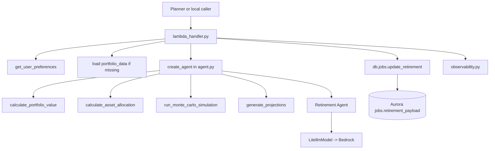
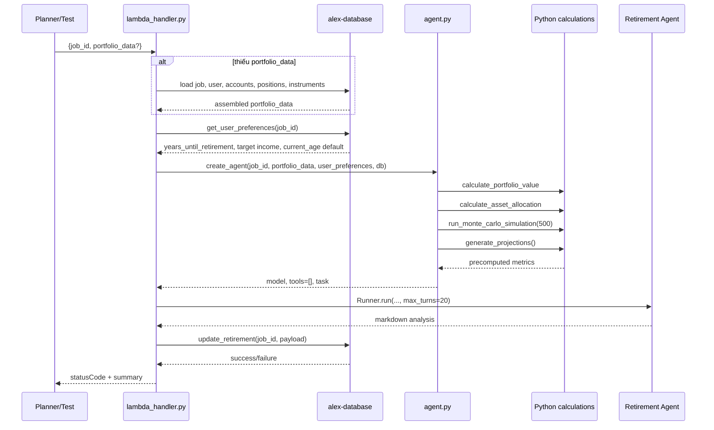
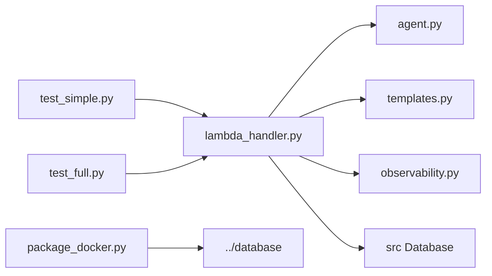

# `backend/retirement` — agent phân tích retirement readiness cho Part 6

## Nhiệm vụ chính

`backend/retirement` là specialist agent dùng dữ liệu portfolio hiện tại cộng với giả định retirement để sinh phân tích dài hạn và lưu vào `jobs.retirement_payload`. Source of truth của README này là current state trong code:

- vẫn khởi tạo model qua `LitellmModel(model=f"bedrock/{model_id}")`
- không dùng tools và không truyền typed context vào agent runtime
- phần tính toán định lượng chạy trước trong Python: portfolio value, asset allocation, Monte Carlo, milestone projections
- agent chỉ dùng kết quả đã tính sẵn để viết markdown analysis
- persistence diễn ra trong `lambda_handler.py` qua `db.jobs.update_retirement(...)`

Folder này là nơi reasoning domain-specific mạnh nhất trong các specialist agent, nhưng current state vẫn ưu tiên flow đơn giản và dễ deploy.

## Cấu trúc thư mục

```text
backend/retirement/
|-- agent.py
|-- lambda_handler.py
|-- observability.py
|-- package_docker.py
|-- pyproject.toml
|-- templates.py
|-- test_full.py
|-- test_simple.py
`-- uv.lock
```

## Sơ đồ tổng quan kiến trúc



## Chi tiết từng file

| File | Vai trò |
| --- | --- |
| `agent.py` | Chứa toàn bộ logic định lượng trước khi gọi LLM: tính portfolio value, allocation, Monte Carlo 500 scenario, projections theo milestone, set `AWS_REGION_NAME`, rồi build task markdown cho agent. |
| `lambda_handler.py` | Entry point của Lambda `alex-retirement`. Tự load portfolio từ DB nếu thiếu, load user preferences, retry khi rate limit/timeout/lỗi tạm thời, chạy agent và lưu `retirement_payload`. |
| `templates.py` | Chứa `RETIREMENT_INSTRUCTIONS` cho analysis và `RETIREMENT_ANALYSIS_TEMPLATE` cũ để tham khảo; current state thực tế dùng instructions + task do `agent.py` build. |
| `observability.py` | Context manager để setup Logfire + LangFuse và flush traces ở cuối runtime nếu env có cấu hình. |
| `package_docker.py` | Build `retirement_lambda.zip` bằng Docker Lambda Python 3.12 image, cài dependencies từ `uv.lock` + package database, rồi có thể `--deploy` lên `alex-retirement`. |
| `test_simple.py` | Tạo job test trong DB, gọi `lambda_handler()` local với portfolio mẫu, đọc `retirement_payload`, kiểm tra reasoning artifacts và xóa job. |
| `test_full.py` | Invoke Lambda `alex-retirement` thật bằng boto3 với `job_id`, rồi kiểm tra `retirement_payload` trong DB. |
| `pyproject.toml` | UV project cục bộ, dependency gần giống `reporter`: `openai-agents[litellm]`, `boto3`, `langfuse`, `tenacity`, `alex-database`. |
| `uv.lock` | File lock để local run và Docker package nhất quán. |

Các điểm implementation đáng chú ý trong current state:

- `BEDROCK_MODEL_ID` default là `us.anthropic.claude-3-7-sonnet-20250219-v1:0`.
- `BEDROCK_REGION` default là `us-west-2`.
- Monte Carlo dùng `500` simulations, không phải `1000` như text trong `RETIREMENT_ANALYSIS_TEMPLATE`.
- Annual contribution đang hardcode `10000` mỗi năm trong accumulation phase.
- Retirement phase giả định 30 năm, inflation 3%, cash return 2%.
- `generate_projections()` chỉ xuất milestone 5 năm một lần.
- `current_age` hiện lấy default `40` trong code, không load từ DB field riêng.

## Workflow chính



Luồng dữ liệu quan trọng:

- input bắt buộc là `job_id`
- `portfolio_data` là optional; nếu thiếu thì handler reconstruct từ DB
- `user_preferences` không đi từ event mà được đọc từ DB qua `get_user_preferences()`
- output cuối lưu vào `jobs.retirement_payload` với các key `analysis`, `generated_at`, `agent`

## Mối liên kết giữa các file

- `lambda_handler.py` chịu trách nhiệm retry, load data, gọi agent, và persistence.
- `agent.py` là source of truth cho toàn bộ financial math của folder này; prompt chỉ là lớp diễn giải kết quả.
- `templates.py` không trực tiếp tạo task runtime ngoài `RETIREMENT_INSTRUCTIONS`.
- `observability.py` bọc toàn bộ handler, nhưng current state không trả về client object cho caller sử dụng.
- `package_docker.py` tạo artifact cho Terraform/Lambda deployment.

Sơ đồ import/call tối giản:



## Mối liên hệ với folder khác

- `backend/planner`: planner gọi retirement khi user cần retirement analysis trong job Part 6.
- `backend/database`: source of truth cho `Database`, `jobs.update_retirement`, và dữ liệu users/accounts/positions/instruments.
- `backend/tagger`: metadata allocation của instrument ảnh hưởng trực tiếp tới `calculate_asset_allocation()`.
- `backend/reporter`: cùng đọc portfolio data tương tự, nhưng retirement bổ sung simulation/projection thay vì market tool flow.
- `terraform/5_database`: cung cấp Aurora/Data API cho load và save payload.
- `terraform/6_agents`: deploy Lambda `alex-retirement`, inject env vars model/DB/observability.

## Cách sử dụng nhanh

Điều kiện tối thiểu:

- có `.env` hoặc env vars cho DB và model
- DB Part 5 sẵn sàng nếu muốn test flow đọc/ghi thật
- Docker Desktop đang chạy nếu cần package

Chạy test local:

```bash
cd backend/retirement
uv run test_simple.py
```

Chạy test Lambda thật:

```bash
cd backend/retirement
uv run test_full.py
```

Package hoặc deploy nhanh:

```bash
cd backend/retirement
uv run package_docker.py
uv run package_docker.py --deploy
```

Env vars current state thường gặp:

| Biến | Dùng ở đâu |
| --- | --- |
| `BEDROCK_MODEL_ID` | `agent.py` dùng để khởi tạo model qua LiteLLM. |
| `BEDROCK_REGION` | `agent.py` set `AWS_REGION_NAME` cho LiteLLM Bedrock. |
| `AURORA_CLUSTER_ARN` / `AURORA_SECRET_ARN` / `DATABASE_NAME` | shared database package dùng để tải user/job/account/position/instrument và lưu retirement payload. |
| `LANGFUSE_SECRET_KEY` / `LANGFUSE_PUBLIC_KEY` / `LANGFUSE_HOST` | `observability.py`. |
| `OPENAI_API_KEY` | current state chủ yếu phục vụ observability/LangFuse export, không phải luồng model chính. |

## Cách chuyển sang OpenAI models

Repo hiện tại vẫn dùng naming và init path theo Bedrock:

- env naming vẫn là `BEDROCK_MODEL_ID` và `BEDROCK_REGION`
- code khởi tạo `LitellmModel(model=f"bedrock/{model_id}")`
- logic `AWS_REGION_NAME` hiện tồn tại chỉ để hỗ trợ Bedrock qua LiteLLM

Model đề xuất cho folder này: `openai/gpt-5.4-nano`

Lý do:

- user ưu tiên tốc độ và chi phí cho đợt migrate tài liệu này
- phần tính toán nặng đã nằm trong Python, nên LLM chủ yếu diễn giải kết quả
- dù vậy đây vẫn là agent làm retirement reasoning, nên cần kiểm chứng chất lượng output kỹ sau migration

Các file cần rà soát khi migrate thật:

- `backend/retirement/agent.py`
- `backend/retirement/lambda_handler.py`
- `terraform/6_agents/main.tf`
- `terraform/6_agents/variables.tf`
- `terraform/6_agents/terraform.tfvars.example`

Các bước migrate ở mức document:

1. Đổi provider/model trong `agent.py`
   - từ `LitellmModel(model=f"bedrock/{model_id}")`
   - sang `LitellmModel(model="openai/gpt-5.4-nano")` hoặc cách equivalent mà team dùng
2. Giữ tạm tên biến cũ `BEDROCK_MODEL_ID` và `BEDROCK_REGION` nếu muốn giảm churn ở Terraform/Lambda env
3. Khi không còn dùng Bedrock, xem lại:
   - `os.environ["AWS_REGION_NAME"] = bedrock_region`
   - narrative trong docs và log messages để tránh hiểu sai current state
4. Cập nhật tài liệu để nói rõ `OPENAI_API_KEY` không còn chỉ phục vụ observability mà còn có thể là credential cho model calls

Điểm phải test kỹ sau migrate:

- analysis markdown có còn hợp lý về retirement reasoning không
- recommendations có còn nhất quán với Monte Carlo numbers và projection numbers không
- model mới có bịa thêm assumption trái với dữ liệu Python precompute không
- vì agent này làm retirement reasoning, cần kiểm chứng kỹ chất lượng output sau migration dù cost/latency được ưu tiên

Khuyến nghị thực tế:

- bắt đầu với `openai/gpt-5.4-nano`
- chạy `uv run test_simple.py` và `uv run test_full.py`
- nếu chất lượng suy giảm ở recommendations hoặc risk framing, cân nhắc nâng model sau khi đã đo chi phí/latency

## Tóm tắt

`backend/retirement` là agent retirement-focused của Part 6, nhưng current state của nó không đẩy toán học cho model mà tính trước trong Python rồi mới nhờ LLM viết phân tích. Repo hiện vẫn Bedrock-centric ở naming và init path; README này ghi đúng trạng thái đó và thêm hướng dẫn thực tế để chuyển sang `openai/gpt-5.4-nano` khi cần.
