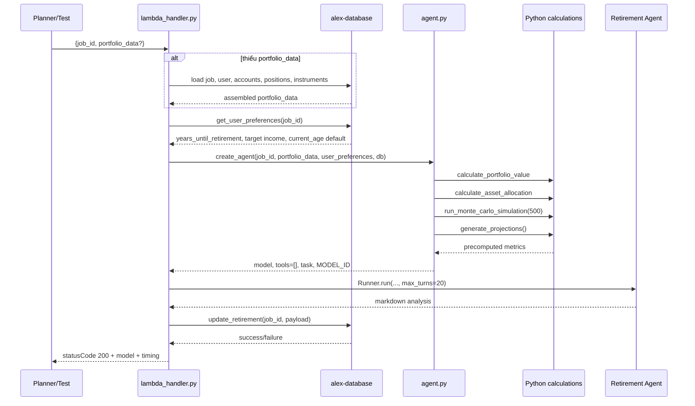
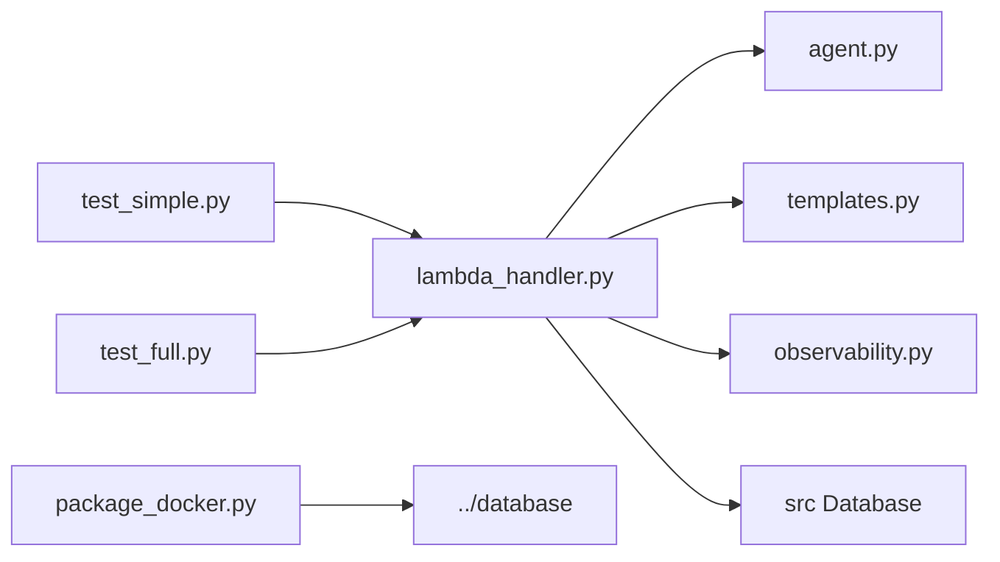

# `backend/retirement` — agent phân tích retirement readiness cho Part 6

## Nhiệm vụ chính

`backend/retirement` là specialist agent dùng dữ liệu portfolio hiện tại cộng với giả định retirement để sinh phân tích dài hạn và lưu vào `jobs.retirement_payload`:

- dùng OpenAI Agents SDK với `LitellmModel(model=MODEL_ID)` — đã migrate từ Bedrock sang OpenAI
- env var: `MODEL_ID_RETIREMENT` (default `openai/gpt-5.4-nano`)
- không dùng tools và không truyền typed context vào agent runtime
- phần tính toán định lượng chạy trước trong Python: portfolio value, asset allocation, Monte Carlo, milestone projections
- agent chỉ dùng kết quả đã tính sẵn để viết markdown analysis
- persistence diễn ra trong `lambda_handler.py` qua `db.jobs.update_retirement(...)`
- có `[TIMING]` log đầy đủ: create, agent, db, lambda_total

Folder này là nơi reasoning domain-specific mạnh nhất trong các specialist agent.

## Cấu trúc thư mục

```text
backend/retirement/
|-- agent.py
|-- lambda_handler.py
|-- observability.py
|-- package_docker.py
|-- pyproject.toml
|-- templates.py
|-- test_full.py
|-- test_simple.py
`-- uv.lock
```

## Sơ đồ tổng quan kiến trúc


## Chi tiết từng file

| File | Vai trò |
| --- | --- |
| `agent.py` | Chứa toàn bộ logic định lượng trước khi gọi LLM: tính portfolio value, allocation, Monte Carlo 500 scenario, projections theo milestone. Khởi tạo `LitellmModel(model=MODEL_ID)` với `MODEL_ID_RETIREMENT` từ env. Build task markdown cho agent. Có `[TIMING]` log. |
| `lambda_handler.py` | Entry point của Lambda `alex-retirement`. Tự load portfolio từ DB nếu thiếu, load user preferences, retry khi rate limit/timeout/lỗi tạm thời, chạy agent và lưu `retirement_payload`. Có `[TIMING]` log đầy đủ qua các phase: create, agent, db, lambda_total. Response body chứa `model` + `timing` breakdown. |
| `templates.py` | Chứa `RETIREMENT_INSTRUCTIONS` cho analysis và `RETIREMENT_ANALYSIS_TEMPLATE` cũ để tham khảo; current state thực tế dùng instructions + task do `agent.py` build. |
| `observability.py` | Context manager để setup Logfire + LangFuse và flush traces ở cuối runtime nếu env có cấu hình. Log sạch, không emoji. |
| `package_docker.py` | Build `retirement_lambda.zip` bằng Docker Lambda Python 3.12 image, cài dependencies từ `uv.lock` + package database, rồi có thể `--deploy` lên `alex-retirement`. |
| `test_simple.py` | Tạo job test trong DB, gọi `lambda_handler()` local với portfolio mẫu, in model + timing, đọc `retirement_payload`, và xóa job. |
| `test_full.py` | Invoke Lambda `alex-retirement` thật bằng boto3 với `job_id`, in model + timing, rồi kiểm tra `retirement_payload` trong DB. |
| `pyproject.toml` | UV project cục bộ, dependency: `openai-agents[litellm]`, `boto3`, `langfuse`, `tenacity`, `alex-database`. |
| `uv.lock` | File lock để local run và Docker package nhất quán. |

Các điểm implementation đáng chú ý:

- `MODEL_ID_RETIREMENT` default là `openai/gpt-5.4-nano`.
- Monte Carlo dùng `500` simulations, không phải `1000` như text trong `RETIREMENT_ANALYSIS_TEMPLATE`.
- Annual contribution đang hardcode `10000` mỗi năm trong accumulation phase.
- Retirement phase giả định 30 năm, inflation 3%, cash return 2%.
- `generate_projections()` chỉ xuất milestone 5 năm một lần.
- `current_age` hiện lấy default `40` trong code, không load từ DB field riêng.

## Workflow chính



## Mối liên kết giữa các file

- `lambda_handler.py` chịu trách nhiệm retry, load data, gọi agent, và persistence.
- `agent.py` là source of truth cho toàn bộ financial math của folder này; prompt chỉ là lớp diễn giải kết quả.
- `templates.py` không trực tiếp tạo task runtime ngoài `RETIREMENT_INSTRUCTIONS`.
- `observability.py` bọc toàn bộ handler.

Sơ đồ import/call tối giản:



## Mối liên hệ với folder khác

- `backend/planner`: planner gọi retirement khi user cần retirement analysis trong job Part 6.
- `backend/database`: source of truth cho `Database`, `jobs.update_retirement`, và dữ liệu users/accounts/positions/instruments.
- `backend/tagger`: metadata allocation của instrument ảnh hưởng trực tiếp tới `calculate_asset_allocation()`.
- `backend/reporter`: cùng đọc portfolio data tương tự, nhưng retirement bổ sung simulation/projection thay vì market tool flow.
- `terraform/5_database`: cung cấp Aurora/Data API cho load và save payload.
- `terraform/6_agents`: deploy Lambda `alex-retirement`, inject `MODEL_ID_RETIREMENT`, DB, observability env vars.

## Cách sử dụng nhanh

```bash
cd backend/retirement

# Test local (dùng MODEL_ID_RETIREMENT từ env, default openai/gpt-5.4-nano)
uv run test_simple.py

# Test với model khác
MODEL_ID_RETIREMENT=openai/gpt-4.1-nano uv run test_simple.py

# Test Lambda đã deploy
uv run test_full.py

# Package và deploy
uv run package_docker.py
uv run package_docker.py --deploy
```

## Environment variables

| Biến | Dùng ở đâu | Mặc định |
| --- | --- | --- |
| `MODEL_ID_RETIREMENT` | `agent.py` — model string cho `LitellmModel` | `openai/gpt-5.4-nano` |
| `OPENAI_API_KEY` | LiteLLM — credential cho OpenAI API | bắt buộc |
| `AURORA_CLUSTER_ARN` | shared database package — Data API endpoint | bắt buộc |
| `AURORA_SECRET_ARN` | shared database package — credential | bắt buộc |
| `DATABASE_NAME` | shared database package | `alex` |
| `DEFAULT_AWS_REGION` | boto3 clients (DB, Lambda invoke) | `us-east-1` |
| `LANGFUSE_PUBLIC_KEY` | `observability.py` | optional |
| `LANGFUSE_SECRET_KEY` | `observability.py` | optional |
| `LANGFUSE_HOST` | `observability.py` | `https://us.cloud.langfuse.com` |

## Log output

Mỗi lần chạy đều in `[TIMING]` log kèm model name:

```
[TIMING] create_agent: 0.48s | model=openai/gpt-5.4-nano
[TIMING] Agent creation phase: 0.48s
[TIMING] Agent run phase: 18.96s | model=openai/gpt-5.4-nano
[TIMING] run_retirement_agent TOTAL: 20.01s (create=0.48s, agent=18.96s, db=0.55s) | model=openai/gpt-5.4-nano
[TIMING] lambda_handler TOTAL: 20.01s | job=... | model=openai/gpt-5.4-nano
```

Response body cũng chứa `model` và `timing` breakdown:

```json
{
  "success": 1,
  "message": "Retirement analysis completed",
  "model": "openai/gpt-5.4-nano",
  "timing": {
    "create_s": 0.48,
    "agent_s": 18.96,
    "db_s": 0.55,
    "total_s": 20.01,
    "lambda_total_s": 20.01
  }
}
```

## Tóm tắt

`backend/retirement` là agent retirement-focused của Part 6, tính toán định lượng trong Python (Monte Carlo, projections) rồi nhờ LLM viết phân tích. Đã migrate hoàn toàn từ Bedrock sang OpenAI (`openai/gpt-5.4-nano` qua `MODEL_ID_RETIREMENT`). Có `[TIMING]` log đầy đủ, response body chứa model + timing.
