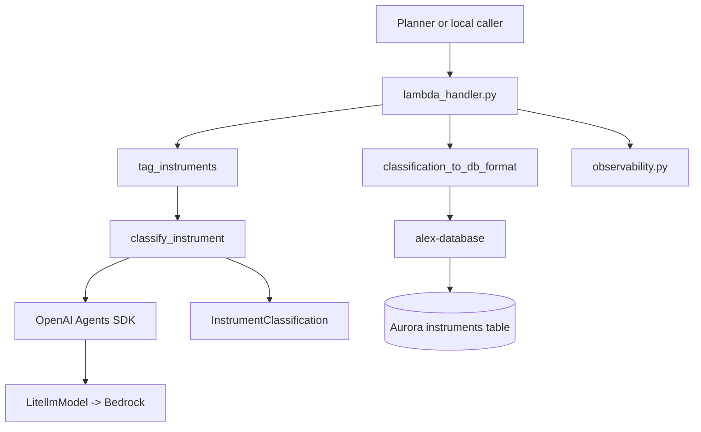
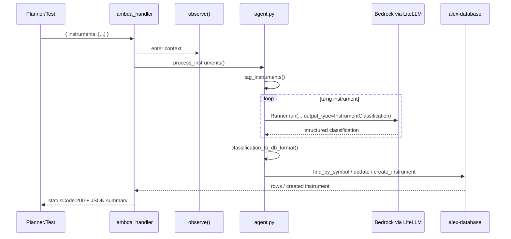
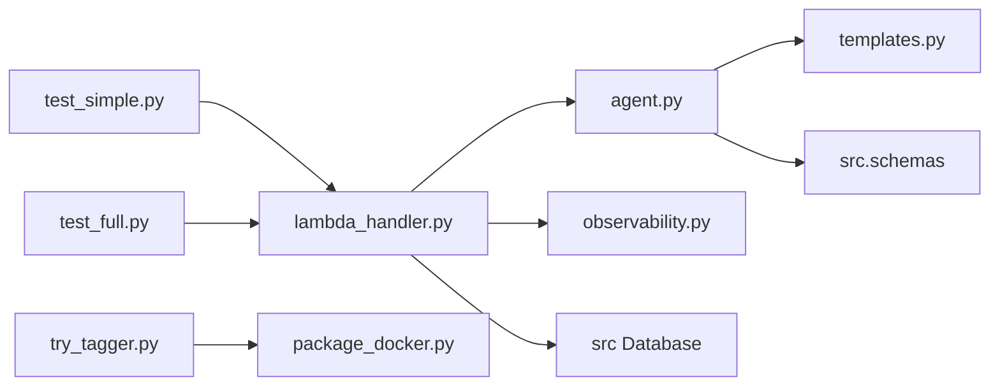

# `backend/tagger` — agent gắn nhãn instrument cho Part 6

## Nhiệm vụ chính

`backend/tagger` chứa Lambda agent chuyên phân loại financial instrument trước khi các agent khác phân tích portfolio. Current state của repo là:

- nhận danh sách instrument chưa đủ metadata
- gọi OpenAI Agents SDK với `LitellmModel(model=f"bedrock/{model_id}")`
- trả về structured output kiểu Pydantic
- chuyển kết quả sang `InstrumentCreate`
- tạo mới hoặc update bảng `instruments` trong Aurora qua shared package `alex-database`

Agent này không dùng tools. Đầu ra chính là allocation theo `asset_class`, `regions`, `sectors` và `current_price`.

## Cấu trúc thư mục

```text
backend/tagger/
|-- agent.py
|-- lambda_handler.py
|-- observability.py
|-- package_docker.py
|-- pyproject.toml
|-- templates.py
|-- test_full.py
|-- test_simple.py
|-- track_tagger.py
|-- try_tagger.py
`-- uv.lock
```

## Sơ đồ tổng quan kiến trúc



## Chi tiết từng file

| File | Vai trò |
| --- | --- |
| `agent.py` | Core logic. Khai báo schema `AllocationBreakdown`, `RegionAllocation`, `SectorAllocation`, `InstrumentClassification`; set `AWS_REGION_NAME`; tạo `Agent(..., output_type=InstrumentClassification)`; retry theo `RateLimitError`; map output AI sang `InstrumentCreate`. |
| `lambda_handler.py` | Entry point của Lambda `alex-tagger`. Nhận `event["instruments"]`, gọi `asyncio.run(process_instruments(...))`, rồi create/update instrument trong DB. |
| `templates.py` | Prompt nền và prompt task cho classification. Yêu cầu mọi allocation cộng về 100. |
| `observability.py` | Context manager `observe()` cho LangFuse/logfire. Chỉ setup khi có `LANGFUSE_SECRET_KEY`; cảnh báo nếu thiếu `OPENAI_API_KEY`. |
| `package_docker.py` | Đóng gói `tagger_lambda.zip` bằng Docker image `public.ecr.aws/lambda/python:3.12`, export dependency từ `uv.lock`, cài local package `../database`, rồi có thể `--deploy` thẳng lên Lambda. |
| `test_simple.py` | Test local qua `lambda_handler` với 1 instrument mẫu `VTI`. |
| `test_full.py` | Invoke Lambda `alex-tagger` thật bằng boto3 và kiểm tra dữ liệu đã được ghi vào DB. |
| `track_tagger.py` | Poll CloudWatch log group `/aws/lambda/alex-tagger` để theo dõi runtime logs theo thời gian thực. |
| `try_tagger.py` | Script end-to-end: package, upload ZIP lên S3 package bucket, update Lambda code, invoke test, rồi nhắc kiểm tra LangFuse. |
| `pyproject.toml` | UV project cục bộ; phụ thuộc chính là `openai-agents[litellm]`, `langfuse`, `tenacity`, `alex-database`. |
| `uv.lock` | Khoá dependency để package và chạy test nhất quán. |

Chi tiết implementation đáng chú ý trong `agent.py`:

- `BEDROCK_MODEL_ID` mặc định là `us.anthropic.claude-3-7-sonnet-20250219-v1:0`.
- `BEDROCK_REGION` mặc định là `us-west-2`.
- Structured output được validate hậu kỳ bằng `field_validator`; sai số cộng tổng được nới tới `3`.
- `tag_instruments()` chạy tuần tự, nghỉ `0.5s` giữa các request để giảm rate limit.

Chi tiết implementation đáng chú ý trong `lambda_handler.py`:

- DB được khởi tạo ở module scope bằng `Database()`.
- Nếu instrument đã tồn tại, code dùng `db.client.update(...)`; nếu chưa có thì gọi `db.instruments.create_instrument(...)`.
- HTTP-style response body chứa `tagged`, `updated`, `errors`, `classifications`.

## Workflow chính



Các command thường dùng:

```bash
cd backend/tagger
uv run test_simple.py
uv run test_full.py
uv run package_docker.py
uv run package_docker.py --deploy
uv run track_tagger.py
uv run try_tagger.py
```

## Mối liên kết giữa các file

- `lambda_handler.py` phụ thuộc trực tiếp vào `tag_instruments()` và `classification_to_db_format()` từ `agent.py`.
- `agent.py` phụ thuộc vào `templates.py` để tạo prompt và vào `src.schemas.InstrumentCreate` từ package database.
- `lambda_handler.py` và mọi test đều phụ thuộc vào shared package `src` của `backend/database`.
- `observability.py` không can thiệp luồng business; nó chỉ bao quanh handler để export trace nếu LangFuse được cấu hình.
- `package_docker.py` không đọc Terraform nhưng output ZIP của nó là input cho `terraform/6_agents/main.tf`.

Sơ đồ call/import tối giản:



## Mối liên hệ với folder khác

- `backend/planner`: planner gọi tagger khi portfolio có instrument thiếu classification.
- `backend/database`: source of truth cho `Database`, `InstrumentCreate`, repository methods và schema Aurora.
- `terraform/6_agents`: tạo Lambda `alex-tagger`, inject `BEDROCK_MODEL_ID`, `BEDROCK_REGION`, `AURORA_*`, `OPENAI_API_KEY`, `LANGFUSE_*`.
- `guides/5_database.md`: cung cấp bối cảnh Aurora Data API.
- `guides/6_agents.md`: giải thích vai trò Tagger trong agent orchestra, nhưng nếu guide và code lệch nhau thì code hiện tại là source of truth.

## Cách sử dụng nhanh

Điều kiện tối thiểu:

- đang đứng trong repo Alex và đã có `.env`
- DB Part 5 và Lambda Part 6 đã sẵn sàng nếu muốn chạy full test
- Docker Desktop đang chạy nếu cần package

Chạy local test:

```bash
cd backend/tagger
uv run test_simple.py
```

Chạy Lambda thật:

```bash
cd backend/tagger
uv run test_full.py
```

Package/deploy:

```bash
cd backend/tagger
uv run package_docker.py
uv run package_docker.py --deploy
```

Env vars current state thường gặp:

| Biến | Dùng ở đâu |
| --- | --- |
| `BEDROCK_MODEL_ID` | `agent.py` chọn model Bedrock cho LiteLLM. |
| `BEDROCK_REGION` | `agent.py` gán vào `AWS_REGION_NAME`. |
| `AURORA_CLUSTER_ARN` | package database dùng để nói chuyện với Data API. |
| `AURORA_SECRET_ARN` | package database lấy credential cho Data API. |
| `DATABASE_NAME` | hiện là `alex`. |
| `LANGFUSE_PUBLIC_KEY` / `LANGFUSE_SECRET_KEY` / `LANGFUSE_HOST` | `observability.py`. |
| `OPENAI_API_KEY` | current state chủ yếu phục vụ tracing/export, không phải luồng model chính. |

## Cách chuyển sang OpenAI models

Current state: `LitellmModel(model=f"bedrock/{model_id}")`

Model đề xuất cho agent này: `openai/gpt-5.4-nano`

Mục tiêu migrate của `tagger` là giữ structured classification ổn định, nhưng bỏ phụ thuộc Bedrock trong runtime model call. Các file cần rà soát khi migrate:

- `backend/tagger/agent.py`
- `terraform/6_agents/main.tf`
- `terraform/6_agents/variables.tf`
- `terraform/6_agents/terraform.tfvars.example`

Cách đổi ở mức code:

1. Trong `backend/tagger/agent.py`, thay phần tạo model từ:
   - `LitellmModel(model=f"bedrock/{model_id}")`
   - sang model string/provider tương ứng cho OpenAI, ví dụ `LitellmModel(model="openai/gpt-5.4-nano")`
2. Bỏ logic chỉ dành cho Bedrock nếu không còn cần:
   - `BEDROCK_REGION`
   - `os.environ["AWS_REGION_NAME"] = bedrock_region`
3. Giữ nguyên `output_type=InstrumentClassification` và chạy lại validation vì đây là phần quan trọng nhất của agent.

Cách đổi ở mức Terraform/env:

- Repo hiện vẫn inject biến kiểu Bedrock như `BEDROCK_MODEL_ID` và `BEDROCK_REGION`.
- Có thể giảm churn bằng cách giữ tên biến cũ nhưng đổi giá trị sang provider mới trong giai đoạn đầu của migration.
- Sau khi đổi provider thật, narrative trong docs nên nói rõ `OPENAI_API_KEY` không còn chỉ phục vụ observability mà còn là credential cho model calls.
- Khi đã chuyển hẳn sang OpenAI, IAM policy Bedrock trong `terraform/6_agents/main.tf` có thể được gỡ hoặc giữ tạm trong giai đoạn chuyển tiếp.

Điểm cần test lại sau migrate:

- model có còn trả structured output đúng schema không
- validator tổng 100% có làm agent fail nhiều hơn không
- retry với `RateLimitError` của litellm có còn phù hợp với provider mới không

## Tóm tắt

`backend/tagger` là agent phân loại instrument gọn nhất trong Part 6, nhưng nó là tiền đề cho chất lượng của planner, reporter, charter và retirement. Current state của repo là Bedrock-centric qua LiteLLM; README này mô tả đúng trạng thái đó và chỉ thêm hướng dẫn riêng để chuyển sang `openai/gpt-5.4-nano` khi bạn sẵn sàng migrate thật.
