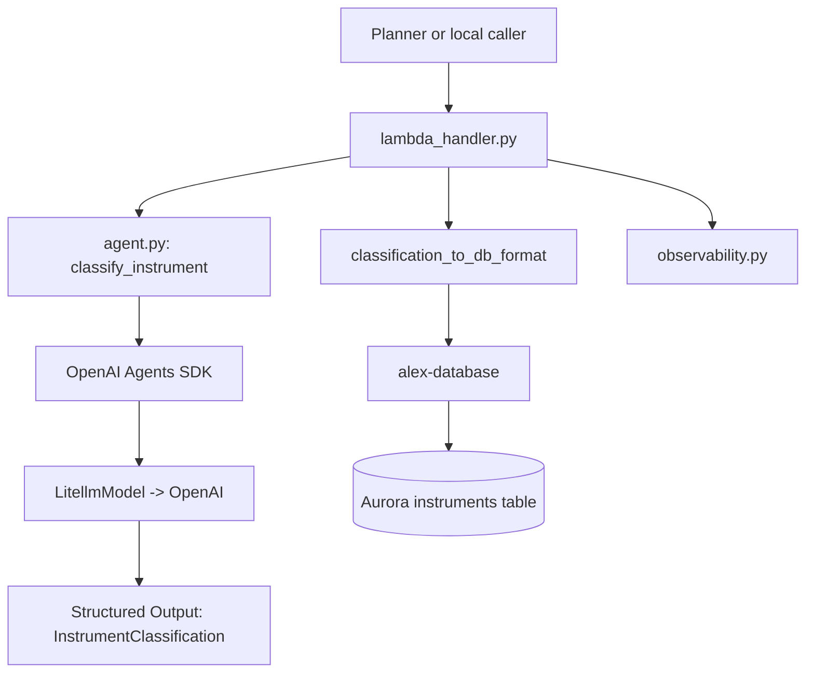
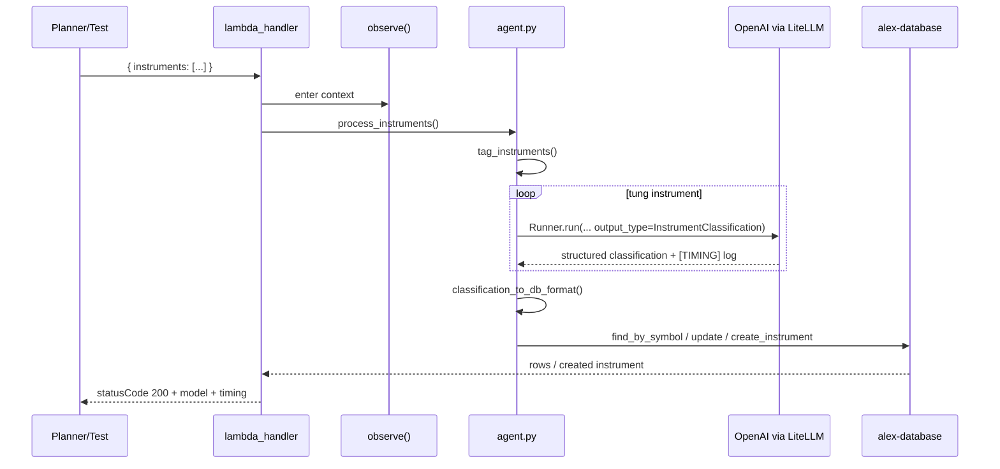
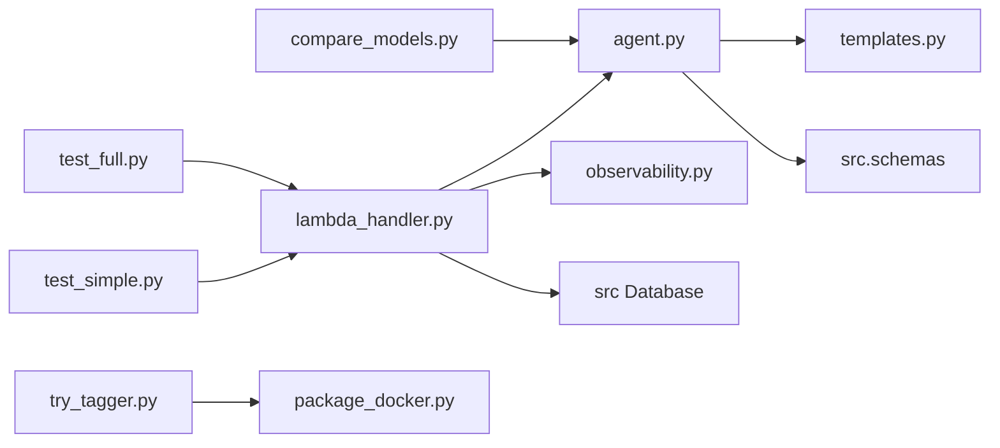

# `backend/tagger` — agent phan loai instrument cho Part 6

## Nhiem vu chinh

`backend/tagger` la Lambda agent chuyen phan loai financial instrument truoc khi cac agent khac phan tich portfolio:

- nhan danh sach instrument chua du metadata
- goi OpenAI Agents SDK voi `LitellmModel(model="openai/gpt-5.4-nano")`
- tra ve structured output kieu Pydantic (`InstrumentClassification`)
- chuyen ket qua sang `InstrumentCreate`
- tao moi hoac update bang `instruments` trong Aurora qua shared package `alex-database`

Agent nay **khong dung tools** — chi dung `output_type` de lay structured classification. Dau ra chinh la allocation theo `asset_class`, `regions`, `sectors` va `current_price`.

## Cau truc thu muc

```text
backend/tagger/
|-- agent.py              # Core logic: model init, classification, structured output
|-- lambda_handler.py     # Lambda entry point, DB persistence
|-- templates.py          # Prompt cho tagger
|-- observability.py      # LangFuse/logfire tracing wrapper
|-- package_docker.py     # Build tagger_lambda.zip bang Docker
|-- compare_models.py     # Script so sanh nhieu model cung 1 instrument
|-- test_simple.py        # Local smoke test (dung Lambda handler truc tiep)
|-- test_full.py          # Test Lambda da deploy qua boto3
|-- track_tagger.py       # Poll CloudWatch logs real-time
|-- try_tagger.py         # End-to-end: package, deploy, test
|-- MODEL_COMPARISON.md   # Ket qua benchmark cac model
|-- pyproject.toml
`-- uv.lock
```

## So do tong quan kien truc



## Chi tiet tung file

| File | Vai tro |
| --- | --- |
| `agent.py` | Core logic. Khai bao Pydantic schema (`InstrumentClassification`, `AllocationBreakdown`, `RegionAllocation`, `SectorAllocation`). `MODEL_ID` mac dinh la `openai/gpt-5.4-nano`. `classify_instrument()` nhan optional `model_id` de override. Co `[TIMING]` log cho moi lan classify. Retry voi `RateLimitError`. |
| `lambda_handler.py` | Entry point Lambda `alex-tagger`. Nhan `event["instruments"]`, goi `process_instruments()`, ghi DB. Response body co `model` va `timing` (classify_s, db_s, lambda_total_s). |
| `templates.py` | `TAGGER_INSTRUCTIONS` va `CLASSIFICATION_PROMPT`. Yeu cau allocation sum = 100%. |
| `observability.py` | Context manager `observe()` cho LangFuse/logfire. Chi setup khi co `LANGFUSE_SECRET_KEY`. |
| `package_docker.py` | Build `tagger_lambda.zip` bang Docker image Lambda Python 3.12, cai `../database`, co option `--deploy`. |
| `compare_models.py` | Chay `classify_instrument("VTI")` qua nhieu model, ghi ket qua vao `MODEL_COMPARISON.md`. Dung de benchmark model. |
| `test_simple.py` | Test local: goi `lambda_handler` voi 1 instrument `VTI`. In model, timing, classification. |
| `test_full.py` | Invoke Lambda `alex-tagger` that bang boto3. Kiem tra DB. In model + timing. |
| `track_tagger.py` | Poll CloudWatch log group `/aws/lambda/alex-tagger`. Nhan dien `[TIMING]` logs. |
| `try_tagger.py` | End-to-end: package, upload S3, update Lambda code, invoke test. |

## Workflow chinh



## Moi lien ket giua cac file

- `lambda_handler.py` import `tag_instruments` + `classification_to_db_format` + `MODEL_ID` tu `agent.py`
- `agent.py` import `TAGGER_INSTRUCTIONS` + `CLASSIFICATION_PROMPT` tu `templates.py`
- `agent.py` import `InstrumentCreate` tu `src.schemas` (shared package `alex-database`)
- `lambda_handler.py` dung `Database()` tu shared package de doc/ghi Aurora
- `observability.py` bao quanh handler, khong anh huong business logic
- `package_docker.py` output ZIP la input cho `terraform/6_agents/main.tf`



## Moi lien he voi folder khac

- `backend/planner`: planner goi tagger khi portfolio co instrument thieu classification
- `backend/database`: source of truth cho `Database`, `InstrumentCreate`, Aurora schema
- `backend/reporter`, `backend/charter`, `backend/retirement`: chat luong output phu thuoc vao allocation metadata tu tagger
- `terraform/6_agents`: tao Lambda `alex-tagger`, inject `MODEL_ID`, `AURORA_*`, `OPENAI_API_KEY`, `LANGFUSE_*`

## Cach su dung nhanh

```bash
cd backend/tagger

# Test local (mac dinh openai/gpt-5.4-nano)
uv run test_simple.py

# Test voi model khac
MODEL_ID=openai/gpt-4.1-nano uv run test_simple.py

# Test Lambda da deploy
uv run test_full.py

# So sanh nhieu model
uv run compare_models.py
uv run compare_models.py --model openai/gpt-5-nano

# Package va deploy
uv run package_docker.py
uv run package_docker.py --deploy

# Theo doi log CloudWatch
uv run track_tagger.py
```

## Environment variables

| Bien | Dung o dau | Mac dinh |
| --- | --- | --- |
| `MODEL_ID` | `agent.py` — model string cho `LitellmModel` | `openai/gpt-5.4-nano` |
| `OPENAI_API_KEY` | LiteLLM — credential cho OpenAI API | bat buoc |
| `AURORA_CLUSTER_ARN` | shared database package — Data API endpoint | bat buoc |
| `AURORA_SECRET_ARN` | shared database package — credential | bat buoc |
| `DATABASE_NAME` | shared database package | `alex` |
| `DEFAULT_AWS_REGION` | boto3 clients (DB, Lambda invoke) | `us-east-1` |
| `LANGFUSE_PUBLIC_KEY` | `observability.py` | optional |
| `LANGFUSE_SECRET_KEY` | `observability.py` | optional |
| `LANGFUSE_HOST` | `observability.py` | `https://us.cloud.langfuse.com` |
| `MOCK_LAMBDAS` | chi dung cho local test cua planner goi tagger | optional |

## Log output

Moi lan classify deu in `[TIMING]` log kem model name de so sanh giua cac model:

```
[TIMING] classify_instrument(VTI): 3.60s | model=openai/gpt-5.4-nano
[TIMING] tag_instruments: 1/1 classified in 3.60s | avg=3.60s per instrument | model=openai/gpt-5.4-nano
[TIMING] Classification phase: 3.60s
[TIMING] process_instruments total: 4.16s (classify=3.60s, db=0.56s) | model=openai/gpt-5.4-nano
[TIMING] lambda_handler TOTAL: 4.16s | instruments=1 | model=openai/gpt-5.4-nano
```

Response body cung chua `model` va `timing` breakdown:

```json
{
  "tagged": 1,
  "updated": ["VTI"],
  "model": "openai/gpt-5.4-nano",
  "timing": {
    "classify_s": 3.60,
    "db_s": 0.56,
    "lambda_total_s": 4.16
  }
}
```

## Model da test

Ket qua benchmark voi VTI (Vanguard Total Stock Market ETF):

| Model | Classify (s) | Total (s) | Danh gia |
| --- | --- | --- | --- |
| `openai/gpt-5.4-nano` | 3.60 | 4.16 | Nhanh, on dinh — **khuyen nghi** |
| `openai/gpt-4.1-nano` | 3.53 | 3.84 | Nhanh nhat, nhe nhat |
| `openai/gpt-5-nano` | 46.84 | 47.99 | Qua cham, khong kha dung |

Xem chi tiet trong [`MODEL_COMPARISON.md`](./MODEL_COMPARISON.md).

## Tom tat

`backend/tagger` la agent phan loai instrument gon nhat trong Part 6, nhung la tien de cho chat luong cua planner, reporter, charter va retirement. Da migrate tu Bedrock sang `openai/gpt-5.4-nano`. Moi log deu co `[TIMING]` + model name de de dang so sanh khi doi model. Su dung `MODEL_ID` env var de chuyen model, hoac `classify_instrument(model_id=...)` de override trong code.
