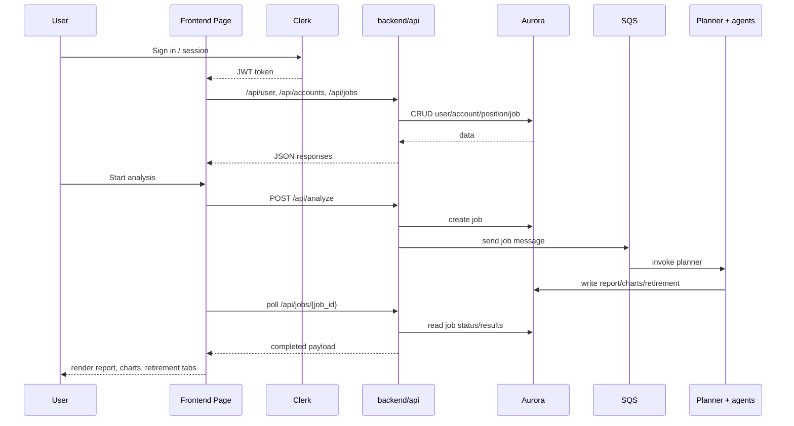
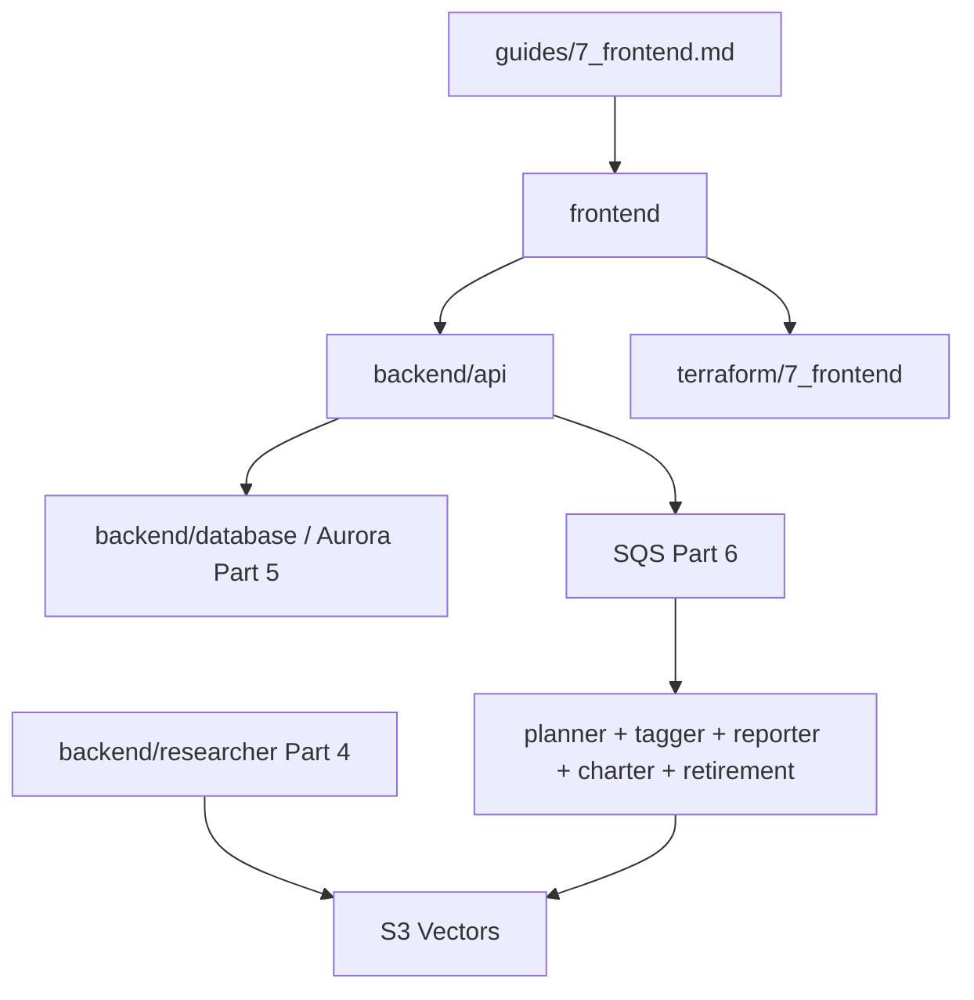

# `frontend` — giao diện người dùng cho Guide 7

`frontend` là ứng dụng web Next.js của Alex trong **Guide 7 - Frontend & API**. Đây là lớp người dùng trực tiếp tương tác để đăng nhập bằng Clerk, quản lý tài khoản đầu tư, kích hoạt phân tích AI, và xem kết quả report/chart/retirement. Theo hiện trạng repo, frontend bám **Pages Router**, build ra static export, và trong production dựa vào CloudFront để route `/api/*` sang API Gateway của Part 7.

README này mô tả **hiện trạng code đang có** trong repo, không mô tả target state giả định. Phần backend mà frontend gọi là `backend/api`, còn dữ liệu và AI phía sau lần lượt đi qua Aurora Part 5 và Agent Orchestra Part 6.

## Cấu trúc thư mục

```text
frontend/
├── package.json                 # Scripts npm và dependency frontend
├── next.config.ts               # Static export, unoptimized images, no trailing slash
├── tsconfig.json                # TypeScript config + alias @/*
├── styles/
│   └── globals.css              # Tailwind v4 + theme colors + animations
├── lib/
│   ├── api.ts                   # API client có auth token, typed interfaces, error handling
│   ├── config.ts                # Chọn API base URL cho local vs production
│   └── events.ts                # Event bus giữa các page khi analysis start/complete/fail
├── components/
│   ├── Layout.tsx               # Shell chung có nav, footer, Protect, PageTransition
│   ├── Toast.tsx                # Toast system toàn app
│   ├── ErrorBoundary.tsx        # Global error boundary
│   ├── PageTransition.tsx       # Fade transition khi đổi route
│   ├── Skeleton.tsx             # Loading placeholders
│   └── ConfirmModal.tsx         # Modal xác nhận delete/reset
├── pages/
│   ├── _app.tsx                 # ClerkProvider + ErrorBoundary + ToastContainer
│   ├── _document.tsx            # favicon, manifest, theme meta
│   ├── index.tsx                # Landing page + Clerk auth entry
│   ├── dashboard.tsx            # User settings + portfolio summary
│   ├── accounts.tsx             # Danh sách account, populate test data, reset
│   ├── accounts/[id].tsx        # Chi tiết account, edit account, CRUD positions
│   ├── advisor-team.tsx         # Kích hoạt analysis và hiển thị progress
│   ├── analysis.tsx             # Render report/charts/retirement theo job
│   ├── 404.tsx                  # Custom 404
│   └── 500.tsx                  # Custom 500
└── public/                      # favicon, manifest và asset tĩnh nhỏ
```

## Sơ đồ tổng quan

```mermaid
graph TD
    Browser[User Browser] --> Clerk[Clerk UI + JWT]
    Browser --> Pages[Next.js Pages Router]
    Pages --> Layout[Layout + Protect]
    Pages --> ApiClient[lib/api.ts / fetch]
    ApiClient --> API[/api/*]
    API --> BackendAPI[backend/api]
    BackendAPI --> Aurora[(Aurora Part 5)]
    BackendAPI --> SQS[SQS Part 6]
    SQS --> Planner[Planner + specialist agents]
    Planner --> Aurora
    Aurora --> Pages
```

## Chi tiết từng file quan trọng

### 1. `package.json` — scripts và dependency runtime

**Vai trò:** khai báo app là Next.js frontend private package.

**Điểm chính:**
- scripts: `dev`, `build`, `start`, `lint`
- framework: `next@15.5.3`, `react@19.1.0`
- auth: `@clerk/nextjs`
- report rendering: `react-markdown`, `remark-gfm`, `remark-breaks`
- chart rendering: `recharts`
- transport realtime đơn giản: `@microsoft/fetch-event-source` đã được cài, dù chưa thấy dùng trực tiếp trong pages hiện tại

| Nhóm | Package chính |
|---|---|
| Framework | `next`, `react`, `react-dom` |
| Auth | `@clerk/nextjs` |
| Visualization | `recharts` |
| Rich text | `react-markdown`, `remark-gfm`, `remark-breaks` |
| Styling/Tooling | `tailwindcss`, `eslint`, `typescript` |

### 2. `next.config.ts` — build mode của frontend

**Vai trò:** cấu hình Next.js để deploy kiểu static frontend.

| Thuộc tính | Giá trị |
|---|---|
| `reactStrictMode` | `true` |
| `output` | `'export'` |
| `images.unoptimized` | `true` |
| `trailingSlash` | `false` |

**Ý nghĩa:** frontend được build thành static site để sync lên S3/CloudFront; phần động không nằm ở Next server mà ở API Lambda riêng.

### 3. `lib/config.ts` — xác định API URL local vs production

**Vai trò:** chọn base URL cho fetch calls.

**Logic chính:**
- nếu đang chạy trên `localhost` ở browser → dùng `http://localhost:8000`
- nếu đang chạy production → trả `''` để gọi tương đối `/api/*`
- server-side/build-time cũng trả `''`

**Ý nghĩa kiến trúc:** production không cần hard-code API Gateway URL ở client; CloudFront sẽ route `/api/*` sang origin API Gateway.

### 4. `lib/api.ts` — typed API client

**Vai trò:** cung cấp interface typed để gọi backend kèm Bearer token.

**Nhiệm vụ chi tiết:**
- định nghĩa các type cơ bản: `User`, `Account`, `Position`, `Job`
- `apiRequest()` gắn `Authorization: Bearer <token>`
- xử lý lỗi phổ biến:
  - `401` → toast + redirect về `/`
  - `429` → toast rate limit
  - lỗi khác → parse `detail`
- `createApiClient(token)` expose nhóm method `user`, `accounts`, `positions`, `analysis`, `jobs`

| Hàm | Chức năng |
|---|---|
| `apiRequest()` | Fetch có auth + error normalization |
| `createApiClient()` | Factory theo token |
| `useApiClient()` | Helper nhẹ cho component layer |

### 5. `lib/events.ts` — event bus cho analysis lifecycle

**Vai trò:** truyền tín hiệu giữa pages mà không cần state manager toàn cục.

| Event | Mục đích |
|---|---|
| `analysis:started` | Báo advisor-team vừa tạo job |
| `analysis:completed` | Báo dashboard/accounts cần refresh |
| `analysis:failed` | Báo analysis thất bại |

**Nhận xét:** đây là coupling khá thực dụng cho app nhỏ; không dùng Redux/Zustand.

### 6. `pages/_app.tsx` — app shell cấp cao nhất

**Vai trò:** bọc toàn bộ app với các provider và error handling.

| Thành phần | Vai trò |
|---|---|
| `ErrorBoundary` | Bắt lỗi render cấp app |
| `ClerkProvider` | Inject auth/session |
| `ToastContainer` | Hiển thị toast global |

### 7. `components/Layout.tsx` — khung protected của app

**Vai trò:** layout chuẩn cho phần sau sign-in.

**Nhiệm vụ chi tiết:**
- dùng `Protect` của Clerk để chặn người chưa login
- nav desktop/mobile tới `dashboard`, `accounts`, `advisor-team`, `analysis`
- hiển thị `UserButton`
- bọc main content bằng `PageTransition`
- footer disclaimer tài chính

**Ý nghĩa:** hầu hết page nghiệp vụ trong app đều chạy trong layout này.

### 8. `pages/index.tsx` — landing page

**Vai trò:** trang marketing/entry point.

**Điểm chính:**
- dùng `SignInButton`, `SignUpButton`, `SignedIn`, `SignedOut`
- signed-in user được đưa tới `/dashboard`
- mô tả 4 AI specialists ở mức UI copy

### 9. `pages/dashboard.tsx` — trang tổng quan người dùng

**Vai trò:** nơi user xem health của portfolio và chỉnh preference tài chính.

**Nhiệm vụ chi tiết:**
- sync user qua `GET /api/user`
- tải accounts + positions + embedded instrument data
- tải jobs để lấy ngày phân tích gần nhất
- tính `totalValue` và `assetClassBreakdown` ở client
- cho phép sửa:
  - `display_name`
  - `years_until_retirement`
  - `target_retirement_income`
  - allocation targets
- lắng nghe `analysis:completed` để refresh dashboard

**Điểm đáng chú ý:** logic tổng hợp portfolio nằm khá nhiều ở client side, không phải chỉ render response đã pre-compute.

### 10. `pages/accounts.tsx` — quản lý danh sách account

**Vai trò:** CRUD account cấp danh sách.

**Nhiệm vụ chi tiết:**
- load toàn bộ accounts rồi fetch tiếp positions cho từng account
- hỗ trợ:
  - add account
  - delete account
  - reset toàn bộ account
  - populate test data qua `/api/populate-test-data`
- hiển thị summary tổng portfolio
- lắng nghe `analysis:completed` để refresh giá trị account

### 11. `pages/accounts/[id].tsx` — chi tiết account và positions

**Vai trò:** quản trị một account cụ thể.

**Nhiệm vụ chi tiết:**
- load account theo `id` từ danh sách accounts
- load positions của account
- load instrument list cho autocomplete
- edit account metadata
- add/update/delete position
- tính cash, positions value và total value tại client

### 12. `pages/advisor-team.tsx` — kích hoạt analysis

**Vai trò:** UI orchestration cho người dùng khi bắt đầu portfolio analysis.

**Nhiệm vụ chi tiết:**
- gọi `POST /api/analyze`
- lưu `job_id`
- poll `GET /api/jobs/{job_id}` mỗi 2 giây
- map status sang progress stages:
  - `starting`
  - `planner`
  - `parallel`
  - `complete`
  - `error`
- phát `analysis:started`, `analysis:completed`, `analysis:failed`
- redirect sang `/analysis?job_id=...` khi hoàn tất

### 13. `pages/analysis.tsx` — hiển thị output của multi-agent pipeline

**Vai trò:** render kết quả analysis theo job.

**Nhiệm vụ chi tiết:**
- nếu có `job_id` query param → load job đó
- nếu không có → load job completed mới nhất
- render 3 tab:
  - `overview` → markdown report
  - `charts` → chart payload động từ `charts_payload`
  - `retirement` → markdown retirement analysis
- hỗ trợ các trạng thái:
  - loading
  - no analysis
  - pending/running
  - failed
  - completed

**Điểm đáng chú ý:** `charts_payload` được coi là dynamic keyed object, nên page này phải suy đoán chart type tại client.

### 14. `components/Toast.tsx`, `ErrorBoundary.tsx`, `Skeleton.tsx`, `PageTransition.tsx`, `ConfirmModal.tsx`

**Vai trò:** bộ utility UI dùng lại.

| File | Vai trò |
|---|---|
| `Toast.tsx` | Toast global thông qua `window.dispatchEvent` |
| `ErrorBoundary.tsx` | Fallback UI khi component tree lỗi |
| `Skeleton.tsx` | Loading placeholders đơn giản |
| `PageTransition.tsx` | Fade opacity khi đổi route |
| `ConfirmModal.tsx` | Modal xác nhận generic cho reset/delete |

### 15. `styles/globals.css` và `_document.tsx`

**Vai trò:** lớp presentational và metadata nền.

| File | Điểm chính |
|---|---|
| `globals.css` | Tailwind v4, custom theme colors cho Alex, animation pulse/glow/slide-in |
| `_document.tsx` | favicon, manifest, theme color, description meta |

## Workflow chính



## Mối liên kết giữa các file

```mermaid
graph LR
    App[pages/_app.tsx] --> Layout[components/Layout.tsx]
    App --> Toast[components/Toast.tsx]
    App --> ErrorBoundary[components/ErrorBoundary.tsx]

    Layout --> Transition[components/PageTransition.tsx]

    Dashboard[pages/dashboard.tsx] --> Config[lib/config.ts]
    Dashboard --> Toast
    Dashboard --> Events[lib/events.ts]

    Accounts[pages/accounts.tsx] --> Config
    Accounts --> Confirm[components/ConfirmModal.tsx]
    Accounts --> Skeleton[components/Skeleton.tsx]
    Accounts --> Events

    AccountDetail[pages/accounts/[id].tsx] --> Config
    AccountDetail --> Confirm

    Advisor[pages/advisor-team.tsx] --> Config
    Advisor --> Events

    Analysis[pages/analysis.tsx] --> Config
    Analysis --> Layout

    ApiLib[lib/api.ts] --> Toast
```

## Mối liên hệ với folder khác



| Folder/Part | Frontend cần gì | Dùng vào đâu |
|---|---|---|
| `backend/api` | toàn bộ `/api/*` routes | auth, accounts, positions, jobs, trigger analysis |
| `backend/database` + Part 5 | user/account/job data | hiển thị dashboard, analysis, account detail |
| Part 6 agents | completed job payloads | report/charts/retirement tabs |
| `terraform/7_frontend` | CloudFront + API routing + Lambda API | deploy production frontend |
| Guide 7 | flow nghiệp vụ chính | sign-in, manage portfolio, start analysis |

## Hạ tầng tương ứng

Hạ tầng deploy frontend này nằm ở `terraform/7_frontend`.

- S3 website bucket chứa static export
- CloudFront phục vụ UI và route `/api/*`
- API Gateway + Lambda `alex-api` phục vụ backend của frontend

Đọc chi tiết ở [`terraform/7_frontend/README.md`](../terraform/7_frontend/README.md).

## Hiện trạng và khoảng trống

- README này bám **repo hiện tại**, không bám nguyên văn guide gốc.
- Frontend đang dùng **Next.js static export** (`output: 'export'`), nên phần động thực sự nằm ở API Lambda chứ không ở Next server.
- Ở production, client logic kỳ vọng **CloudFront route `/api/*`** sang API Gateway; local mode lại fetch thẳng `http://localhost:8000`.
- Frontend không có global state manager; đồng bộ sau khi analysis xong đang dùng `window` custom events.
- `lib/api.ts` tồn tại như typed client, nhưng nhiều page vẫn `fetch()` trực tiếp thay vì dùng đồng nhất một abstraction.
- `pages/analysis.tsx` phải suy đoán chart type từ payload động của charter agent, cho thấy contract chart payload hiện khá linh hoạt hơn là schema cứng.

## Cách sử dụng nhanh

```bash
cd frontend
npm install
npm run dev
```

Chạy local toàn hệ thống theo flow của repo:

```bash
cd scripts
uv run run_local.py
```

Build production static export:

```bash
cd frontend
npm run build
```

Các URL thường dùng:

```text
http://localhost:3000       # Frontend local
http://localhost:8000/docs  # Swagger của backend/api local
```

## Tóm tắt

| Thành phần | Vai trò ngắn |
|---|---|
| `pages/index.tsx` | Landing page + Clerk entry |
| `pages/dashboard.tsx` | Portfolio summary + user settings |
| `pages/accounts.tsx` | Danh sách account + reset/populate |
| `pages/accounts/[id].tsx` | CRUD positions trong một account |
| `pages/advisor-team.tsx` | Bắt đầu analysis và theo dõi tiến độ |
| `pages/analysis.tsx` | Render output report/charts/retirement |
| `lib/config.ts` | Chọn API URL local vs production |
| `lib/api.ts` | Typed API client và error handling |
| `lib/events.ts` | Event bus giữa các page |
| `components/Layout.tsx` | Auth-protected shell của app |
| `components/Toast.tsx` | Toast notification |
| `components/ErrorBoundary.tsx` | Fallback khi UI lỗi |
| `styles/globals.css` | Theme color và animation |
