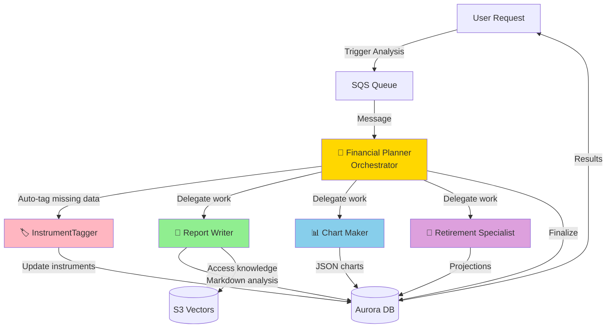

# Building Alex: Part 6 - AI Agent Orchestra

Welcome to the most exciting part of Alex! In this guide, you'll deploy a sophisticated multi-agent AI system where specialized agents collaborate to provide comprehensive financial analysis. This is where Alex truly comes to life as an intelligent financial advisor.

## REMINDER - MAJOR TIP!!

There's a file `gameplan.md` in the project root that describes the entire Alex project to an AI Agent, so that you can ask questions and get help. There's also an identical `CLAUDE.md` and `AGENTS.md` file. If you need help, simply start your favorite AI Agent, and give it this instruction:

> I am a student on the course AI in Production. We are in the course repo. Read the file `gameplan.md` for a briefing on the project. Read this file completely and read all the linked guides carefully. Do not start any work apart from reading and checking directory structure. When you have completed all reading, let me know if you have questions before we get started.

After answering questions, say exactly which guide you're on and any issues. Be careful to validate every suggestion; always ask for the root cause and evidence of problems. LLMs have a tendency to jump to conclusions, but they often correct themselves when they need to provide evidence.

## What You're Building

You'll deploy five specialized AI agents that work together:

1. **Planner** (Orchestrator) - The conductor of our AI orchestra
2. **Tagger** - Classifies and tags financial instruments
3. **Reporter** - Generates detailed portfolio analysis reports
4. **Charter** - Creates data visualizations for your portfolio
5. **Retirement** - Projects retirement scenarios with Monte Carlo simulations

Here's how they collaborate:



## Why Multi-Agent Architecture?

Instead of one giant AI doing everything, we use specialized agents because:

1. **Specialization**: Each agent excels at its specific task
2. **Reliability**: Smaller, focused prompts are more reliable
3. **Parallel Processing**: Multiple agents can work simultaneously
4. **Maintainability**: Easy to update individual agents without affecting others
5. **Cost Efficiency**: Only run the agents you need

## Prerequisites

Before starting, ensure you have:
- Completed Guides 1-5 (all infrastructure deployed)
- AWS CLI configured
- Python with `uv` package manager installed
- Docker Desktop running
- Access to AWS Bedrock models in us-west-2

## Before we start - Context Engineering

Read this seminal post by Google DeepMind Senior AI Relation Engineer Philipp Schmid:

https://www.philschmid.de/context-engineering

## Step 0: Request Additional Bedrock Model Access

Our agents use Amazon's Nova Pro model for improved reliability. Let's ensure you have access:

1. Sign in to the AWS Console
2. Navigate to **Amazon Bedrock**
3. Switch to **US West (Oregon) us-west-2** region
4. Click **Model access** in the left sidebar
5. Click **Manage model access**
6. Find the **Amazon** section
7. Check the box for **Amazon Nova Pro**
8. Click **Request model access**
9. Wait for approval (usually instant)

**Note**: The agents will use this model cross-region from your deployment region.

## Step 1: Configure Environment Variables

Our agents need several environment variables, including a Polygon API key for real-time market data.

### 1.1 Get Polygon API Key (Free)

The Planner agent fetches real-time stock prices using Polygon.io. Let's get a free API key:

1. Go to [polygon.io](https://polygon.io)
2. Click **Get your Free API Key**
3. Sign up with email (no credit card required)
4. Verify your email
5. Copy your API key from the dashboard

The free tier includes:
- 5 API calls per minute
- End-of-day price data
- Perfect for development and testing

**Optional**: For production use, consider the Basic plan ($29/month) for:
- 100 API calls per minute
- Real-time price data
- WebSocket streaming

### 1.2 Configure Agent Environment

Open your `.env` file in Cursor and add these lines:

```bash
# Part 6 - Agent Configuration
BEDROCK_MODEL_ID=us.amazon.nova-pro-v1:0
BEDROCK_REGION=us-west-2
DEFAULT_AWS_REGION=us-east-1  # Or your preferred region

# Polygon.io API for real-time stock prices (sign up free at polygon.io) - change free to paid if you're using paid plan
POLYGON_API_KEY=your_polygon_api_key_here
POLYGON_PLAN=free
```

The `BEDROCK_MODEL_ID` uses Amazon's Nova Pro model which has excellent tool-calling capabilities and high rate limits.

## Step 2: Explore the Agent Code

Before testing, let's understand what each agent does. Use Cursor's file explorer to navigate to the `backend` directory.

### 2.1 InstrumentTagger (Simplest Agent)

**Directory**: `backend/tagger`

Open `backend/tagger/agent.py` in Cursor. This agent:
- Uses structured outputs (the only one that does)
- Classifies financial instruments (ETFs, stocks)
- Determines asset allocation (stocks, bonds, real estate)
- Identifies geographic exposure
- No tools needed - pure classification

Open `backend/tagger/templates.py` to see the prompt that guides its analysis.

### 2.2 Report Writer Agent

**Directory**: `backend/reporter`

Open `backend/reporter/agent.py`. This agent:
- Generates comprehensive portfolio analysis
- Uses tools to access S3 Vectors for market insights
- Writes detailed markdown reports
- Identifies strengths and weaknesses

Check `backend/reporter/templates.py` for its analytical framework.

### 2.3 Chart Maker Agent

**Directory**: `backend/charter`

Open `backend/charter/agent.py`. This agent:
- Creates 4-6 different charts
- Chooses appropriate visualizations (pie, bar, donut)
- Generates Recharts-compatible JSON
- No tools - returns pure JSON

Look at `backend/charter/templates.py` for visualization guidelines.

### 2.4 Retirement Specialist Agent

**Directory**: `backend/retirement`

Open `backend/retirement/agent.py`. This agent:
- Runs Monte Carlo simulations
- Projects retirement scenarios
- Calculates success probabilities
- Uses tools to save projections

Review `backend/retirement/templates.py` for retirement planning logic.

### 2.5 Financial Planner (Orchestrator)

**Directory**: `backend/planner`

Open `backend/planner/agent.py`. This orchestrator:
- Receives analysis requests via SQS
- Auto-tags missing instrument data
- Decides which agents to invoke
- Coordinates parallel execution
- Finalizes results

Examine `backend/planner/templates.py` for orchestration logic.

## Step 3: Test Agents Locally

Let's test each agent locally, starting with the simplest. Each test uses mock data to verify the agent works correctly.

### 3.1 Test InstrumentTagger

**In directory**: `backend/tagger`

```bash
uv run test_simple.py
```

**Expected output**: You'll see the agent classify VTI as an ETF. Output shows "Tagged: 1 instruments" and "Updated: ['VTI']". The test runs quickly (5-10 seconds).

### 3.2 Test Report Writer

**In directory**: `backend/reporter`

```bash
uv run test_simple.py
```

**Expected output**: Shows "Success: 1" and "Message: Report generated and stored". The report (2800+ characters) includes portfolio analysis with executive summary, key observations, and recommendations. Takes 15-20 seconds.

### 3.3 Test Chart Maker

**In directory**: `backend/charter`

```bash
uv run test_simple.py
```

**Expected output**: Shows "Success: True" and "Message: Generated 5 charts". You'll see detailed chart information including top holdings, asset allocation, sector breakdown, and geographic exposure. Each chart shows title, type (pie/bar/donut), and data points with colors. Takes 10-15 seconds.

### 3.4 Test Retirement Specialist

**In directory**: `backend/retirement`

```bash
uv run test_simple.py
```

**Expected output**: Shows "Success: 1" and "Message: Retirement analysis completed". The analysis (3900+ characters) includes Monte Carlo simulation results with success rate, portfolio projections, and specific recommendations for improving retirement readiness. Takes 10-15 seconds.

### 3.5 Test Financial Planner

**In directory**: `backend/planner`

```bash
uv run test_simple.py
```

**Expected output**: Shows "Success: True" and "Message: Analysis completed for job [job-id]". The planner coordinates the analysis and returns quickly since it's using mock agents locally. Takes 5-10 seconds.

### 3.6 Test Complete System Locally

**In directory**: `backend`

```bash
uv run test_simple.py
```

**Expected output**: Runs all agent tests sequentially. You'll see a summary showing "Passed: 5/5" with checkmarks for each agent (tagger, reporter, charter, retirement, planner). Final message: "✅ ALL TESTS PASSED!". Takes 60-90 seconds total.

## Step 4: Package Lambda Functions

Now let's create deployment packages for AWS Lambda. Each agent needs its dependencies packaged correctly for the Lambda environment.

### 4.1 Package All Agents

**In directory**: `backend`

```bash
uv run package_docker.py
```

This script:
1. Uses Docker to ensure Linux compatibility
2. Packages each agent with its dependencies
3. Creates zip files for Lambda deployment
4. Takes 2-3 minutes total

**Expected output**: 
```
Packaging tagger...
✅ Created tagger_lambda.zip (52 MB)
Packaging reporter...
✅ Created reporter_lambda.zip (68 MB)
Packaging charter...
✅ Created charter_lambda.zip (54 MB)
Packaging retirement...
✅ Created retirement_lambda.zip (55 MB)
Packaging planner...
✅ Created planner_lambda.zip (72 MB)
All agents packaged successfully!
```

## Step 5: Configure Terraform

Now let's set up the infrastructure configuration.

### 5.1 Set Terraform Variables

**In directory**: `terraform/6_agents`

```bash
cp terraform.tfvars.example terraform.tfvars
```

Edit `terraform.tfvars` in Cursor and update with your values:

```hcl
# Your AWS region for Lambda functions (should match your database region)
aws_region = "us-east-1"

# Aurora cluster ARN from Part 5 - populate with the ARN from Part 5  
aurora_cluster_arn = ""

# Aurora secret ARN from Part 5 - populate with the secret from Part 5  
aurora_secret_arn = ""

# S3 Vectors bucket name from Part 3
vector_bucket = "alex-vectors-123456789012"  # Replace with your account ID

# Bedrock model configuration
bedrock_model_id = "us.amazon.nova-pro-v1:0"  # Amazon Nova Pro model

# Bedrock region (can be different from Lambda region)
bedrock_region = "us-west-2"

# SageMaker endpoint name from Part 2
sagemaker_endpoint = "alex-embedding-endpoint"

# Polygon API configuration (for real-time prices)
polygon_api_key = "your_polygon_api_key_here"
polygon_plan = "free"
```

## Step 6: Deploy Infrastructure

Let's deploy all five Lambda functions and supporting infrastructure.

### 6.1 Initialize Terraform

**In directory**: `terraform/6_agents`

```bash
terraform init
```

### 6.2 Review the Plan

```bash
terraform plan
```

Review what will be created:
- 5 Lambda functions with different memory/timeout settings
- S3 bucket for Lambda packages
- SQS queue with dead letter queue
- IAM roles and policies
- CloudWatch log groups

### 6.3 Deploy

```bash
terraform apply
```

Type `yes` when prompted. This takes 3-5 minutes to complete.

**Expected output**:
```
Apply complete! Resources: 25 added, 0 changed, 0 destroyed.

Outputs:
lambda_functions = {
  "charter" = "alex-charter"
  "planner" = "alex-planner"
  "reporter" = "alex-reporter"
  "retirement" = "alex-retirement"
  "tagger" = "alex-tagger"
}
sqs_queue_url = "https://sqs.us-east-1.amazonaws.com/123456789012/alex-analysis-jobs"
```

## Step 7: Deploy Lambda Code Updates

The Terraform deployment created the Lambda functions, but now we need to update them with our latest code:

**In directory**: `backend`

```bash
uv run deploy_all_lambdas.py
```

This updates all five Lambda functions with your packaged code. Takes about 1 minute.

**Expected output**:
```
Updating alex-tagger... ✅
Updating alex-reporter... ✅
Updating alex-charter... ✅
Updating alex-retirement... ✅
Updating alex-planner... ✅
All Lambda functions updated successfully!
```

## Step 8: Test Deployed Agents

Now let's test each agent running in AWS Lambda.

### 8.1 Test Individual Agents

Test each agent in AWS (run 3 times each to ensure reliability):

**In directory**: `backend/tagger`
```bash
uv run test_full.py
```

**In directory**: `backend/reporter`
```bash
uv run test_full.py
```

**In directory**: `backend/charter`
```bash
uv run test_full.py
```

**In directory**: `backend/retirement`
```bash
uv run test_full.py
```

**In directory**: `backend/planner`
```bash
uv run test_full.py
```

Each test should complete successfully. The planner test takes longer (60-90 seconds) as it coordinates all agents.

### 8.2 Test Complete System via SQS

**In directory**: `backend`

```bash
uv run test_full.py
```

This sends a message to SQS, triggering the full analysis pipeline. You'll see:
1. Job created in database
2. Message sent to SQS
3. Planner picks up message
4. Agents process in parallel
5. Results stored in database
6. Job marked complete

Total time: 90-120 seconds.

## Step 9: Test Advanced Scenarios

### 9.1 Multiple Accounts Test

Test with a user having multiple investment accounts:

**In directory**: `backend`

```bash
uv run test_multiple_accounts.py
```

This creates a user with 3 accounts (401k, IRA, Taxable) and runs full analysis. The system should handle all accounts correctly.

### 9.2 Scale Test

Test with multiple users simultaneously:

**In directory**: `backend`

```bash
uv run test_scale.py
```

This creates 5 users with varying portfolio sizes and runs analysis for all concurrently. Shows the system can handle multiple requests.

## Step 10: Explore the Database

Let's check what our agents created in the database:

**In directory**: `backend`

```bash
uv run check_jobs.py
```

This shows recent analysis jobs with their status and results. You'll see:
- Job IDs and timestamps
- User information
- Status (pending, processing, completed)
- Result sizes for each agent's output

## Step 11: Explore AWS Console

Let's see your infrastructure in action:

### 11.1 View Lambda Functions

1. Go to [Lambda Console](https://console.aws.amazon.com/lambda)
2. You'll see 5 functions: `alex-planner`, `alex-tagger`, `alex-reporter`, `alex-charter`, `alex-retirement`
3. Click on `alex-planner`
4. Go to the **Monitor** tab
5. Click **View CloudWatch logs**
6. Click on the latest log stream
7. You'll see detailed execution logs showing agent reasoning

### 11.2 Check SQS Queue

1. Go to [SQS Console](https://console.aws.amazon.com/sqs)
2. Click on `alex-analysis-jobs`
3. Check **Monitoring** tab for message metrics
4. The **Messages available** should be 0 (all processed)
5. Check the dead letter queue `alex-analysis-jobs-dlq` (should be empty)

### 11.3 Monitor Costs

1. Go to [Cost Management Console](https://console.aws.amazon.com/cost-management)
2. Click **Cost Explorer**
3. Filter by service to see:
   - Lambda costs (minimal, pay per invocation)
   - Aurora costs (~$1-2/day when paused)
   - Bedrock costs (pay per token)
   - SQS costs (fractions of a cent)

Expected monthly cost for development: $30-50.

## Troubleshooting

### Agent Timeout Issues

If agents time out:
1. Check Lambda function timeout settings (should be 60s for agents, 300s for planner)
2. Verify Bedrock model access in us-west-2
3. Check CloudWatch logs for specific errors

### Database Connection Failed

If database errors occur:
1. Verify Aurora cluster is running (not paused)
2. Check DATABASE_CLUSTER_ARN in Lambda environment variables
3. Ensure Data API is enabled on the cluster

### SQS Message Not Processing

If messages stay in queue:
1. Check planner Lambda has SQS trigger enabled
2. Verify IAM permissions for SQS access
3. Check dead letter queue for failed messages

### Rate Limit Errors

If you see rate limit errors:
1. The agents automatically retry with exponential backoff
2. Consider spacing out requests
3. The Nova Pro model has high limits but can still be exceeded

### Wrong Model Errors

If you see model not found errors:
1. Verify Bedrock model access in us-west-2
2. Check BEDROCK_MODEL_ID environment variable
3. Ensure using `us.amazon.nova-pro-v1:0` format

### Empty Results

If agents return empty results:
1. Check the test data includes valid portfolio positions
2. Verify database has instrument data (run migrate.py if needed)
3. Review CloudWatch logs for agent reasoning

## Architecture Deep Dive

### Agent Communication Pattern

The agents use a sophisticated pattern for collaboration:

1. **Asynchronous Triggering**: SQS decouples request from processing
2. **Pre-processing**: Orchestrator handles data preparation
3. **Parallel Execution**: Agents work simultaneously when possible
4. **Isolated Writes**: Each agent writes to its own database field
5. **Atomic Completion**: Job marked complete only when all succeed

### Tool Usage Strategy

Each agent uses tools differently:
- **Tagger**: No tools (structured outputs only)
- **Reporter**: Tools for S3 Vectors access and database writes
- **Charter**: No tools (returns JSON directly)
- **Retirement**: Tools for database writes
- **Planner**: Tools for invoking other agents and finalizing

This design avoids the tools + structured outputs conflict in the OpenAI Agents SDK.

### Error Handling

The system handles errors gracefully:
- Automatic retries with exponential backoff for rate limits
- Dead letter queue for failed messages
- Detailed logging for debugging
- Database tracks error states

## Next Steps

Congratulations! You've deployed a sophisticated multi-agent AI system. Your agents are now ready to provide intelligent financial analysis.

Continue to [Guide 7](7_frontend.md) where you'll build the frontend application that users will interact with to manage their portfolios and request analysis from your AI agents.

## Summary

In this guide, you:
- ✅ Deployed 5 specialized AI agents
- ✅ Set up agent orchestration with SQS
- ✅ Tested local and remote execution
- ✅ Verified multi-user scalability
- ✅ Explored monitoring and cost management

Your AI orchestra is now ready to perform! 🎭

---

# Phụ lục: Nhật ký triển khai thực tế Guide 6

Phần này ghi lại chính xác những gì đã làm trong Guide 6, các lỗi đã gặp, cách fix, và trạng thái cuối cùng. Đây là source of truth cho lần triển khai thực tế trên môi trường WSL2 + AWS `ap-southeast-1`.

## Phạm vi thực tế

Guide 6 được triển khai sau khi đã hoàn thành Guides 1-5. Hạ tầng sẵn có:

- SageMaker endpoint `alex-embedding-endpoint` (Part 2)
- S3 Vectors bucket `alex-vectors-487592470523` (Part 3)
- Researcher Lambda Function URL (Part 4)
- Aurora Serverless v2 PostgreSQL + Data API (Part 5)
- Database schema 5 bảng + 22 instruments seed

## Migration từ Bedrock sang OpenAI — đã hoàn thành trước khi package

Toàn bộ 5 agent đã được migrate từ AWS Bedrock (Nova Pro) sang OpenAI models qua LiteLLM. Đây là thay đổi lớn nhất so với guide gốc.

### Lý do migrate

- Bedrock Nova Pro yêu cầu inference profiles cross-region, phức tạp về IAM
- OpenAI models qua LiteLLM đơn giản hơn: chỉ cần `OPENAI_API_KEY`
- Tận dụng được model nhỏ hơn, rẻ hơn cho từng task cụ thể

### Model mapping

| Agent | Env var | Model |
|---|---|---|
| Tagger | `MODEL_ID_TAGGER` | `openai/gpt-5.4-nano` |
| Retirement | `MODEL_ID_RETIREMENT` | `openai/gpt-5.4-nano` |
| Charter | `MODEL_ID_CHARTER` | `openai/gpt-5.4-nano` |
| Reporter | `MODEL_ID_REPORTER` | `openai/gpt-5.4-nano` |
| Planner | `MODEL_ID_PLANNER` | `openai/gpt-5.4-mini` |

### Code changes trong từng agent

Mỗi agent (`agent.py` + `lambda_handler.py`) đã được cập nhật:

1. Xóa `bedrock_region` / `bedrock_model_id` khỏi parameter
2. Thay `LitellmModel(model=f"bedrock/{model_id}")` bằng model từ env var riêng
3. Xóa `os.environ["AWS_REGION_NAME"] = bedrock_region` (không cần cho OpenAI)
4. Thêm `[TIMING]` log: `create`, `agent`, `db`, `lambda_total`
5. Response body chứa `model` + `timing` breakdown

### Terraform thay đổi

Trong `terraform/6_agents/`:

- `variables.tf`: Xóa `bedrock_model_id` + `bedrock_region`, thêm 5 biến `model_id_<agent>` có default
- `main.tf`: Mỗi Lambda inject `MODEL_ID_<AGENT>` thay vì `BEDROCK_MODEL_ID`/`BEDROCK_REGION`. Xóa Bedrock IAM policy
- `outputs.tf`: Thêm `model_config` output
- `terraform.tfvars.example`: Cập nhật với 5 model vars + `openai_api_key` bắt buộc
- `terraform.tfvars`: Đã cấu hình đầy đủ với OpenAI models + API key

## Step 3: Test local — ALL PASSED

```bash
cd backend && uv run test_simple.py
```

Kết quả: **Passed: 5/5**

Mỗi agent test với MOCK_LAMBDAS=true, dùng model thật qua OpenAI API. Tất cả đều pass.

## Step 4: Package Lambda Functions

### Lỗi WSL2 + Docker Permission

Khi chạy `uv run package_docker.py` ở `backend/`:

```
PermissionError: [Errno 1] Operation not permitted: 
'/tmp/tmpXXX/package/opentelemetry_exporter_otlp_proto_common-1.37.0.dist-info'
```

**Root cause**: Docker container chạy với user `root`, `pip install --target ./package` tạo files thuộc sở hữu của root trong `/tmp/...`. Khi Python host (user thường) cố cleanup `TemporaryDirectory`, nó không thể xóa root-owned files trên WSL2. Đây là known WSL2 issue.

**Quan trọng**: ZIP files **đã được tạo thành công** (86-88 MB each) — dòng "Package created" xuất hiện trước mỗi error. Lỗi chỉ xảy ra ở bước dọn dẹp temp folder.

### Fix

Sửa `main()` trong từng agent's `package_docker.py` để bắt `PermissionError`:

```python
try:
    zip_path = package_lambda()
except PermissionError:
    # WSL2 + Docker: temp dir cleanup fails on root-owned files.
    # The ZIP was already created before cleanup runs.
    zip_path = Path(__file__).parent.absolute() / "<agent>_lambda.zip"
    if not zip_path.exists():
        print("Error: Package failed - ZIP file not created")
        sys.exit(1)
    print("Note: ignoring WSL2 permission error during temp directory cleanup")
```

**Đã thử nhưng KHÔNG hoạt động**: `tempfile.TemporaryDirectory(ignore_cleanup_errors=True)` — Python's `_resetperms()` gọi `os.chmod(path, 0o700)` trả về `EPERM` (Errno 1) trên WSL2, không được `ignore_cleanup_errors` xử lý.

### Kết quả sau fix

```
Packaging TAGGER agent...   ✅ Created: tagger_lambda.zip (86.4 MB)
Packaging REPORTER agent...  ✅ Created: reporter_lambda.zip (86.5 MB)
Packaging CHARTER agent...   ✅ Created: charter_lambda.zip (87.6 MB)
Packaging RETIREMENT agent...✅ Created: retirement_lambda.zip (86.4 MB)
Packaging PLANNER agent...   ✅ Created: planner_lambda.zip (87.9 MB)
Packaged: 5/5
✅ ALL LAMBDA FUNCTIONS PACKAGED SUCCESSFULLY!
```

## Step 5-6: Terraform deploy

```bash
cd terraform/6_agents
terraform init
terraform apply
```

Kết quả: **22 resources created**, bao gồm:
- 5 Lambda functions với memory/timeout phù hợp
- S3 bucket `alex-lambda-packages-487592470523`
- SQS queue `alex-analysis-jobs` + DLQ
- IAM role + policy
- CloudWatch log groups
- Lambda event source mapping (SQS -> Planner)

Không còn Bedrock IAM policy — thay bằng OpenAI API key inject qua env var.

### Model config output

```
model_config = {
  charter    = "openai/gpt-5.4-nano"
  planner    = "openai/gpt-5.4-mini"
  reporter   = "openai/gpt-5.4-nano"
  retirement = "openai/gpt-5.4-nano"
  tagger     = "openai/gpt-5.4-nano"
}
```

## Step 7: Deploy Lambda code

```bash
cd backend && uv run deploy_all_lambdas.py
```

Script tự động:
1. Taint tất cả 5 Lambda functions để force recreate
2. Upload ZIP files mới lên S3
3. Terraform apply — destroy + recreate từng Lambda
4. Tất cả 5 Lambda active với code mới nhất

## Step 8: Test deployed agents

### Test full system qua SQS

```bash
cd backend && uv run test_full.py
```

Kết quả: **Job completed successfully trong 54 giây**

```
📊 Analysis Results:
📝 Report Generated: 10427 characters
📊 Charts Created: 5 visualizations
   - sector_breakdown (donut, 10 data points)
   - geographic_exposure (bar, 5 data points)
   - account_type_allocation (pie, 3 data points)
   - asset_class_distribution (pie, 4 data points)
   - top_holdings_concentration (horizontalBar, 5 data points)
🎯 Retirement Analysis: 10571 characters
```

Toàn bộ pipeline hoạt động: Planner điều phối -> Tagger phân loại -> Reporter + Charter + Retirement chạy song song -> kết quả lưu vào database.

## Lỗi và bẫy quan trọng

### Lỗi 1: WSL2 `package_docker.py` PermissionError

- **triệu chứng**: `PermissionError: [Errno 1] Operation not permitted` khi cleanup temp dir
- **root cause**: Docker (root) tạo files trong `/tmp`, Python host (user) không xóa được trên WSL2
- **cách fix**: Bắt `PermissionError` trong `main()`, kiểm tra ZIP đã tồn tại
- **không fix được bằng**: `ignore_cleanup_errors=True` (EPERM không được Python stdlib xử lý)

### Lỗi 2: Terraform provider crash

- **triệu chứng**: `Error: Plugin did not respond` khi chạy `terraform apply` lần đầu
- **root cause**: AWS provider transient error
- **cách fix**: Chạy lại `terraform apply`

### Lỗi 3: Biến local không visible trong except block

- **triệu chứng**: `NameError: name 'tagger_dir' is not defined` trong `except PermissionError`
- **root cause**: `tagger_dir` được định nghĩa trong `package_lambda()`, không phải trong `main()`
- **cách fix**: Dùng `Path(__file__).parent.absolute()` trực tiếp trong except block

## Các lệnh cốt lõi

### Test local tất cả agent

```bash
cd backend && uv run test_simple.py
```

### Package tất cả Lambda

```bash
cd backend && uv run package_docker.py
```

### Deploy infrastructure

```bash
cd terraform/6_agents
terraform init
terraform apply
```

### Deploy Lambda code updates

```bash
cd backend && uv run deploy_all_lambdas.py
```

### Test full system

```bash
cd backend && uv run test_full.py
```

### Kiểm tra model config từ Terraform output

```bash
cd terraform/6_agents && terraform output model_config
```

### Xem CloudWatch logs

```bash
aws logs tail /aws/lambda/alex-planner --since 10m --region ap-southeast-1
```

## Trạng thái kết thúc Guide 6

1. Toàn bộ 5 agent đã migrate từ Bedrock sang OpenAI models qua LiteLLM
2. Tất cả Lambda functions đã được deploy và active trên AWS
3. `test_simple.py`: 5/5 PASSED
4. `test_full.py`: Job completed trong 54s, đầy đủ report + charts + retirement
5. SQS orchestration hoạt động: Planner nhận message, điều phối 4 worker agents
6. ZIP files (86-88 MB each) đã được tạo và upload lên S3
7. `terraform.tfvars` đã cấu hình đầy đủ với OpenAI models + API key
8. README files đã được cập nhật cho tất cả agent directories + terraform/6_agents

## Handoff sang Guide 7

Trước khi sang `guides/7_frontend.md`, cần xác minh:

1. Tất cả 5 Lambda đang Active trong AWS Console
2. `terraform output` trong `6_agents` trả về đúng model_config
3. SQS queue `alex-analysis-jobs` không có message tồn đọng
4. CloudWatch logs không có error pattern lặp lại
5. Database có jobs hoàn thành từ các lần test
6. `.env` đã có `OPENAI_API_KEY`

Các giá trị quan trọng cho Guide 7:

- 5 Lambda function names: `alex-planner`, `alex-tagger`, `alex-reporter`, `alex-charter`, `alex-retirement`
- SQS queue URL: `https://sqs.ap-southeast-1.amazonaws.com/487592470523/alex-analysis-jobs`
- Region: `ap-southeast-1`
- Model config: 4 agents dùng `gpt-5.4-nano`, Planner dùng `gpt-5.4-mini`