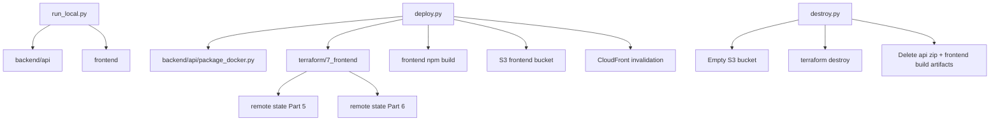
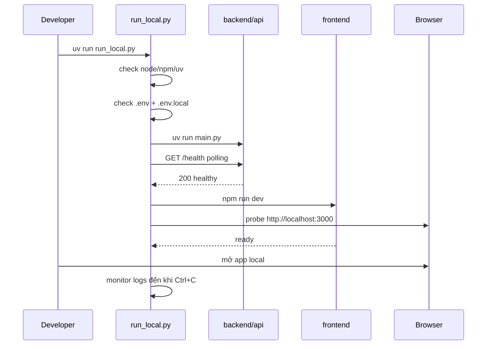
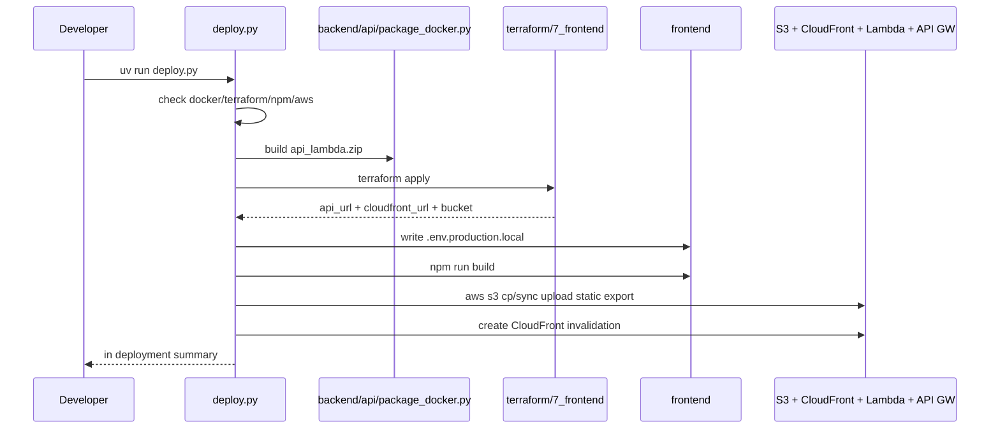
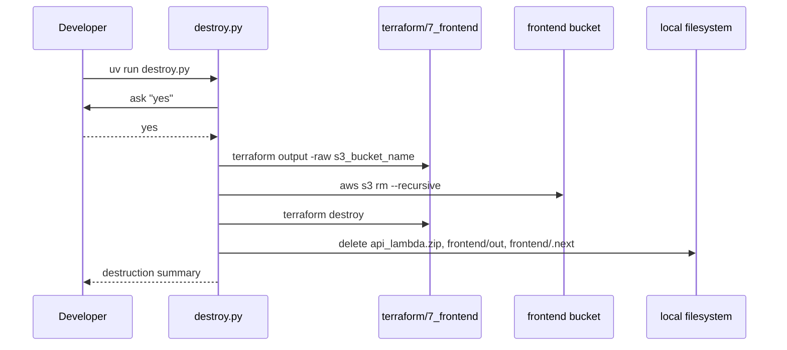
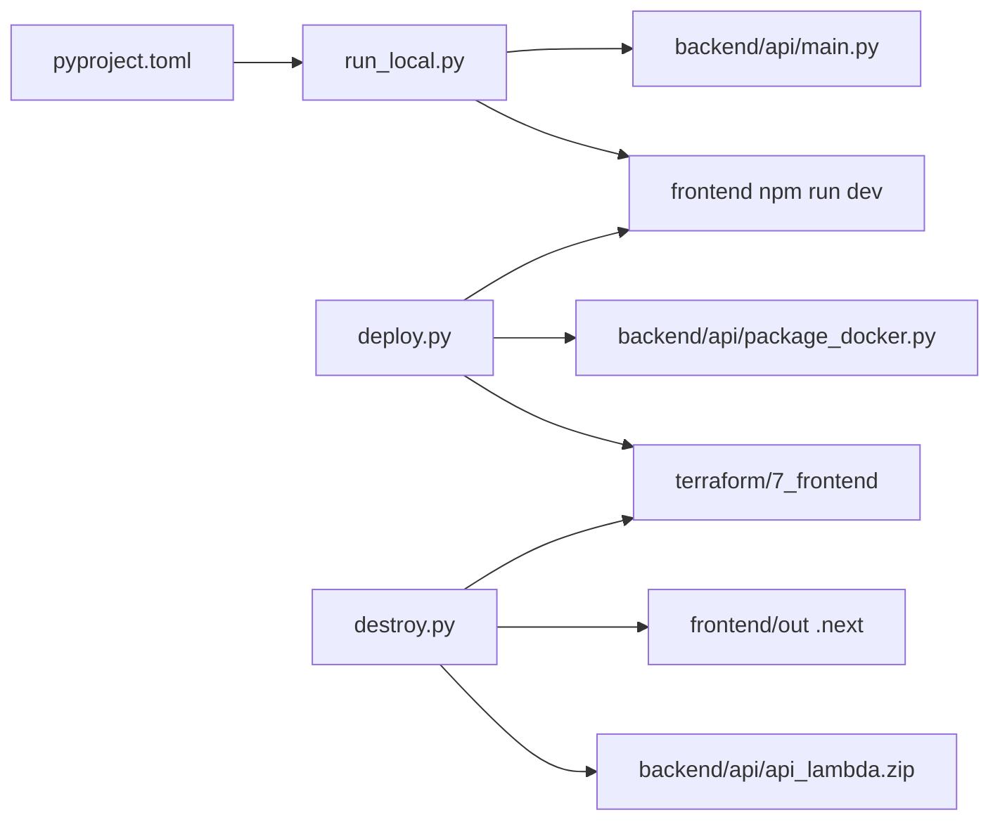
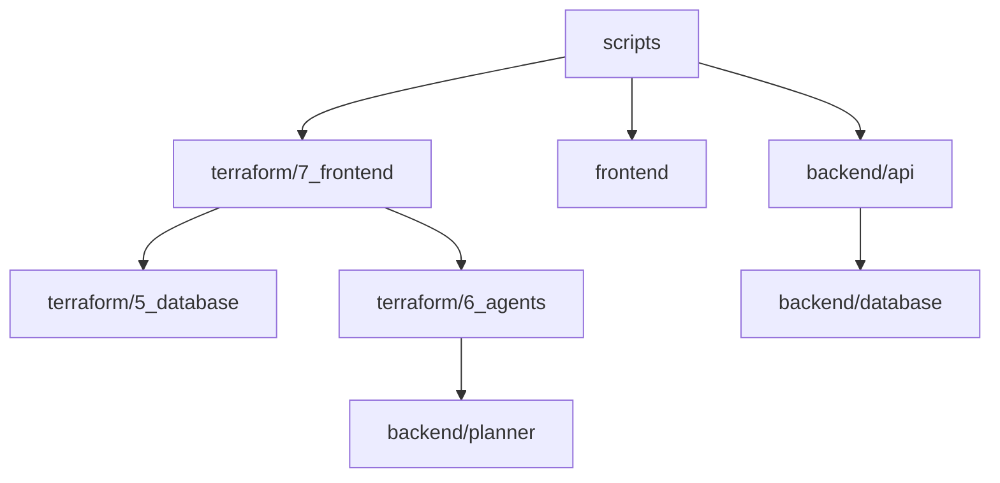

# `scripts` — orchestration script cho local/dev/deploy của Guide 7

`scripts` là bộ CLI Python hỗ trợ **Guide 7 - Frontend & API** trong repo Alex. Thư mục này không chứa business logic tài chính; nó đóng vai trò automation layer để chạy local đồng thời frontend + backend, deploy production lên AWS, và destroy hạ tầng Part 7 khi cần tiết kiệm chi phí. Theo code hiện tại, các script này bám trực tiếp vào `backend/api`, `frontend`, và `terraform/7_frontend`, đồng thời gián tiếp kế thừa remote state từ Part 5 và Part 6 qua Terraform.

## Cấu trúc thư mục

```text
scripts/
├── run_local.py         # Chạy backend/api và frontend song song trên máy local
├── deploy.py            # Package Lambda, apply Terraform, build frontend, upload S3, invalidate CloudFront
├── destroy.py           # Empty S3 bucket, terraform destroy, dọn artifact local
├── pyproject.toml       # Dependency tối thiểu cho các script
└── uv.lock              # Lock file của uv project
```

## Sơ đồ tổng quan



## Bối cảnh phụ thuộc trực tiếp

- `run_local.py` phụ thuộc trực tiếp vào:
  - `backend/api/main.py`
  - `frontend` dev server
  - file môi trường `.env` và `frontend/.env.local`
- `deploy.py` phụ thuộc trực tiếp vào:
  - `backend/api/package_docker.py`
  - `terraform/7_frontend`
  - `frontend` production build
  - AWS CLI + Docker + Terraform
- `destroy.py` phụ thuộc trực tiếp vào:
  - `terraform/7_frontend`
  - output `s3_bucket_name`
  - artifact local từ `backend/api` và `frontend`

Chi tiết hạ tầng production nằm ở [terraform/7_frontend/README.md](/home/hieu0606sunny/AiProduction_t6_2026_wsl/projects/alex/terraform/7_frontend/README.md). Với môi trường hiện tại, hãy coi `ap-southeast-1` là region chính nếu không có override khác.

## Chi tiết từng file

### 1. `run_local.py` — chạy local full stack

**Vai trò:** Script dev tiện dụng để bật đồng thời FastAPI backend và Next.js frontend trên máy local.

**Nhiệm vụ chi tiết:**
- kiểm tra `node`, `npm`, `uv`
- kiểm tra tồn tại `.env` và `frontend/.env.local`
- tự cài `httpx` nếu thiếu
- khởi động `backend/api` bằng `uv run main.py`
- khởi động `frontend` bằng `npm run dev`
- health-check backend `http://localhost:8000/health`
- probe frontend `http://localhost:3000`
- theo dõi process và cleanup khi `Ctrl+C`

**Thông số runtime:**

| Thuộc tính | Giá trị |
|---|---|
| Backend local URL | `http://localhost:8000` |
| Frontend local URL | `http://localhost:3000` |
| Backend startup timeout | 30s |
| Frontend startup timeout | 30s |
| Windows special case | `shell=True` cho `npm` |

**Hàm then chốt:**

| Hàm | Chức năng |
|---|---|
| `check_requirements()` | check `node`, `npm`, `uv` |
| `check_env_files()` | bắt buộc `.env` và `.env.local` tồn tại |
| `start_backend()` | chạy `uv run main.py` trong `backend/api` |
| `start_frontend()` | chạy `npm run dev` trong `frontend` |
| `monitor_processes()` | theo dõi stdout và phát hiện process chết |
| `cleanup()` | terminate/kill toàn bộ subprocess |

### 2. `deploy.py` — deploy production cho Part 7

**Vai trò:** Script chính để deploy end-to-end frontend + API production.

**Nhiệm vụ chi tiết:**
- kiểm tra `docker`, `terraform`, `npm`, `aws`
- kiểm tra Docker đang chạy và AWS credentials hợp lệ
- package Lambda API bằng Docker
- `terraform apply` trong `terraform/7_frontend`
- lấy `api_gateway_url`, `cloudfront_url`, `s3_bucket_name`
- tạo `.env.production.local` cho frontend build
- `npm run build` để xuất static site
- upload frontend lên S3 theo nhóm content-type
- tạo CloudFront invalidation

**Workflow thực tế trong code:**

| Bước | Hàm |
|---|---|
| Check prerequisites | `check_prerequisites()` |
| Build `api_lambda.zip` | `package_lambda()` |
| Apply Part 7 Terraform | `deploy_terraform()` |
| Build frontend static export | `build_frontend()` |
| Upload và invalidate | `upload_frontend()` |
| In summary | `display_deployment_info()` |

**Toolchain bắt buộc:**

| Tool | Lý do |
|---|---|
| Docker | package Lambda tương thích AWS |
| Terraform | deploy Part 7 infrastructure |
| npm | build Next.js frontend |
| AWS CLI | upload S3 và invalidate CloudFront |

**Điểm implementation quan trọng:**
- script deploy hạ tầng trước để lấy `api_gateway_url`, rồi mới build frontend
- dùng `.env.production.local` để override `NEXT_PUBLIC_API_URL`, không sửa `.env.local`
- nếu không tìm được CloudFront distribution ID thì vẫn sync S3, chỉ bỏ qua invalidation tự động

### 3. `destroy.py` — teardown Part 7

**Vai trò:** Script dọn hạ tầng production của Guide 7.

**Nhiệm vụ chi tiết:**
- yêu cầu người dùng gõ `yes`
- lấy `s3_bucket_name` từ `terraform output`
- xóa object trong bucket trước khi destroy
- chạy `terraform destroy` trong `terraform/7_frontend`
- xóa artifact local:
  - `backend/api/api_lambda.zip`
  - `frontend/out`
  - `frontend/.next`

**Thông số quan trọng:**

| Thuộc tính | Giá trị |
|---|---|
| Terraform target folder | `terraform/7_frontend` |
| Bucket output name | `s3_bucket_name` |
| Prompt xác nhận | phải gõ `yes` |

**Lưu ý kỹ thuật:**
- script có một lệnh `aws s3api delete-objects` dùng cú pháp `$(...)` dạng shell nhưng lại truyền như list argv; path xóa versioned objects này hiện không thực sự portable
- kể cả khi bước xóa version lỗi, script vẫn tiếp tục teardown

### 4. `pyproject.toml` — dependency của script layer

**Vai trò:** uv project tối giản cho thư mục `scripts`.

**Dependencies:**

| Package | Mục đích |
|---|---|
| `httpx` | health-check localhost trong `run_local.py` |

### 5. `uv.lock` — lock file

**Vai trò:** khóa dependency cho `scripts` project để local run ổn định hơn giữa các máy.

## Workflow

### Workflow 1: Chạy local full stack



### Workflow 2: Deploy production Part 7



### Workflow 3: Destroy Part 7



## Mối liên kết giữa các file



## Mối liên hệ với folder khác



| Folder | Cần gì | Dùng ở script nào |
|---|---|---|
| `backend/api` | local server, Lambda zip packaging | `run_local.py`, `deploy.py`, `destroy.py` |
| `frontend` | dev server, production build, static export | cả 3 script |
| `terraform/7_frontend` | API/S3/CloudFront infrastructure | `deploy.py`, `destroy.py` |
| `terraform/5_database` | remote state cho Part 7 | gián tiếp qua `deploy.py` |
| `terraform/6_agents` | remote state queue ARN/URL | gián tiếp qua `deploy.py` |

## Cách sử dụng nhanh

```bash
cd scripts

# Chạy local frontend + backend
uv run run_local.py
```

```bash
cd scripts

# Deploy production Guide 7
uv run deploy.py
```

```bash
cd scripts

# Destroy production Guide 7
uv run destroy.py
```

```bash
# Sau deploy, xem log API Lambda
aws logs tail /aws/lambda/alex-api --follow --region ap-southeast-1
```

## Tóm tắt

| File | Vai trò ngắn |
|---|---|
| `run_local.py` | chạy local full stack và giám sát subprocess |
| `deploy.py` | deploy end-to-end Part 7 lên AWS |
| `destroy.py` | teardown Part 7 và dọn artifact local |
| `pyproject.toml` | dependency tối thiểu cho script layer |
| `uv.lock` | lock dependency cho uv |

Checklist chức năng:

- Có script local dev cho frontend + backend
- Có script deploy package Lambda + Terraform + S3 + CloudFront
- Có script destroy có xác nhận
- Có phụ thuộc trực tiếp vào `backend/api`, `frontend`, `terraform/7_frontend`
