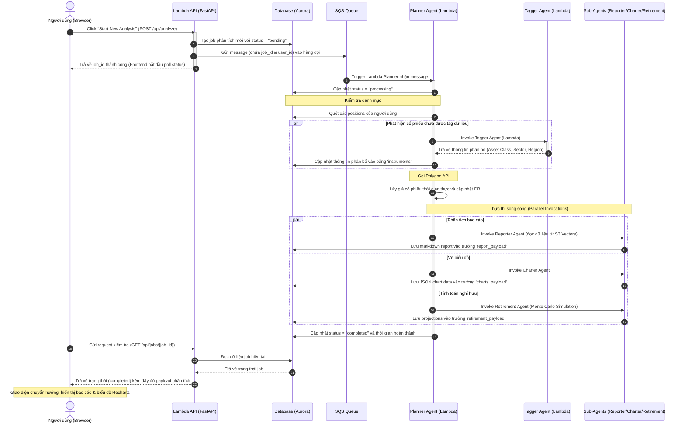

# Day 3 - Building the Frontend and Deploying API Gateway & Lambda to Production

Course domain: AI Engineer Production Track: Deploy LLMs & Agents at Scale
Course name: AI Engineer Production Track: Deploy LLMs & Agents at Scale

---

# 102. Day 3 - Building the Frontend for Your Production AI Agent System

Course domain: AI Engineer Production Track: Deploy LLMs & Agents at Scale
Course name: AI Engineer Production Track: Deploy LLMs & Agents at Scale

## 1. Source Map - Bản đồ nguồn
- Transcript: đã dùng
- Slide: đã dùng
- Code: đã dùng (ở mức cấu trúc tổng quan thư mục `frontend` và `terraform/7_frontend`)
- Summary lịch sử: đã dùng (Day 1 - Database và Day 2 - Agent Orchestra của Week 4)

## 2. Executive Summary - Tóm tắt cốt lõi
- Bài học mở đầu ngày học thứ 3 của Tuần 4 với nhiệm vụ hoàn thiện sản phẩm Capstone bằng việc xây dựng giao diện người dùng (Frontend) và lớp API kết nối (API Layer).
- Review (đánh giá) lại toàn bộ kiến trúc multi-agent đã deploy trên Lambda ở ngày trước đó, với Planner làm điều phối trung tâm thông qua SQS Queue.
- Triển khai Frontend sử dụng mô hình Static Web Hosting trên S3 kết hợp với CloudFront CDN để tối ưu hóa latency (độ trễ) và cost (chi phí).
- Lớp API sẽ được bảo vệ bởi AWS API Gateway với cấu hình rate limiting (giới hạn tần suất) và throttling (điều tiết lưu lượng) nhằm ngăn chặn các hành vi tấn công từ chối dịch vụ hoặc spam API làm tăng chi phí LLM.
- Tích hợp Clerk Authentication để quản lý đăng nhập và xác thực người dùng thông qua mã hóa JWT Token.

## 3. Lesson Goals - Mục tiêu bài học
- **Concept goals - mục tiêu kiến thức**:
  - Nắm vững kiến trúc tích hợp hệ thống AI agentic dạng full-stack trong môi trường enterprise (doanh nghiệp).
  - Hiểu cách thức hoạt động phối hợp giữa CloudFront CDN, S3, API Gateway và Lambda API.
  - Hiểu lý do vì sao việc deploy mỗi agent như một Lambda độc lập lại tăng tính linh hoạt và khả năng scale (mở rộng) của hệ thống.
- **Practical goals - mục tiêu thực hành**:
  - Biết cách cấu hình các khóa bảo mật của Clerk trong các file môi trường `.env` và `.env.local`.
- **What learner should be able to explain - người học cần giải thích được**:
  - Cơ chế định tuyến của CloudFront đối với các file tĩnh và các API request động `/api/*`.

## 4. Previous Context - Liên hệ với bài trước
- Bài học này trực tiếp kế thừa hạ tầng cơ sở dữ liệu Aurora Serverless v2 ở Day 1 và Agent Orchestra trên Lambda/SQS ở Day 2. Giao diện người dùng được xây dựng ở bài này sẽ giúp người dùng cuối kích hoạt và quan sát kết quả xử lý của các Lambda agents đó.

## 5. Core Theory - Lý thuyết cốt lõi
- **Content delivery network - mạng phân phối nội dung (CloudFront)**: Hệ thống máy chủ được phân bố toàn cầu để cache (lưu trữ tạm thời) nội dung tĩnh của website gần vị trí địa lý của người dùng nhất, giảm thiểu latency (độ trễ) mạng.
- **Rate limiting - giới hạn tần suất yêu cầu**: Cơ chế kiểm soát số lượng request tối đa mà một IP hoặc người dùng được phép gửi đến hệ thống trong một đơn vị thời gian (ví dụ: 5 requests/minute).
- **Throttling - điều tiết lưu lượng**: Hành động từ chối hoặc xếp hàng các request vượt quá giới hạn xử lý đồng thời để bảo vệ backend resources (tài nguyên hệ thống) không bị quá tải.

## 6. Workflow / Pipeline - Quy trình / luồng hoạt động
- **Input**: Các thao tác của người dùng trên Browser (trình duyệt) như cập nhật thiết lập, thêm vị thế đầu tư, click bắt đầu phân tích.
- **Processing steps**:
  1. Browser gửi request đi qua CloudFront CDN.
  2. Các request lấy file tĩnh (HTML, CSS, JS) được CloudFront lấy trực tiếp từ S3 bucket.
  3. Các request động đến endpoint `/api/*` được CloudFront chuyển hướng (proxy) sang API Gateway.
  4. API Gateway kiểm tra tính hợp lệ của token Clerk JWT, áp dụng chính sách rate-limiting, rồi gọi Lambda API.
  5. Lambda API thực hiện truy vấn DB Aurora hoặc gửi tin nhắn vào SQS Queue để Planner Agent Lambda xử lý bất tuần tự.
- **Output**: Dữ liệu cập nhật hiển thị trực tiếp trên giao diện của người dùng.

## 7. Techniques - Kỹ thuật sử dụng
- **CORS (Cross-Origin Resource Sharing) - chia sẻ tài nguyên giữa các nguồn gốc khác nhau**: Cấu hình phía backend (FastAPI) để cho phép client từ nguồn gốc khác (như domain CloudFront hoặc localhost:3000) được quyền truy xuất tài nguyên của backend (chạy trên localhost:8000 hoặc API Gateway).

## 8. Code Walkthrough - Phân tích code nếu có
`Code được cung cấp trong session nhưng chưa thấy code liên quan trực tiếp tới lesson này` (bài học này chỉ mang tính chất giới thiệu kiến trúc tổng quan, chi tiết code của Frontend và Backend API sẽ được phân tích ở các bài tiếp theo).

## 9. Options / Trade-offs - Bản đồ lựa chọn
- **Option 1: Deploy Next.js app trên EC2 hoặc App Runner (luôn hoạt động)**:
  - *Pros (Ưu điểm)*: Dễ cấu hình ban đầu, sử dụng được App Router với server-side rendering một cách tự nhiên.
  - *Cons (Nhược điểm)*: Cost (chi phí) cố định cao kể cả khi không có ai truy cập, khó cấu hình auto-scale hơn.
- **Option 2 (Được chọn): Build Next.js thành static site và deploy lên S3 + CloudFront**:
  - *Pros (Ưu điểm)*: Chi phí cực kỳ rẻ (gần như miễn phí ở quy mô nhỏ), bảo mật tuyệt đối cho server code, khả năng chịu tải cực lớn nhờ mạng lưới CDN toàn cầu.
  - *Cons (Nhược điểm)*: Bắt buộc dùng Pages Router do các hạn chế về Static Export của Next.js khi tích hợp với Clerk Auth.

## 10. Pitfalls - Lỗi / bẫy thường gặp
- **Failure mode**: Request từ browser bị chặn bởi lỗi CORS.
- **Root cause**: Thiếu cấu hình tên miền Frontend trong thiết lập CORS của FastAPI Backend.
- **Symptom**: Console của browser hiển thị thông báo lỗi CORS màu đỏ, ứng dụng không thể load dữ liệu từ API.
- **Fix / prevention**: Điền chính xác domain của CloudFront (hoặc localhost:3000 khi chạy local) vào biến môi trường `CORS_ORIGINS`.

## 11. Knowledge Extension - Kiến thức mở rộng
- **JWKS (JSON Web Key Set) - Tập hợp khóa web JSON**: Cơ chế cho phép Lambda API xác thực chữ ký số của Clerk JWT token mà không cần phải thực hiện một HTTP request gọi sang server của Clerk ở mỗi lần validate, giúp cải thiện đáng kể tốc độ phản hồi của API và giảm thiểu rủi ro khi Clerk gặp sự cố.

## 12. Study Pack - Gói ôn tập
### Must remember
1. Việc deploy các AI agents thành từng Lambda riêng biệt là một kiến trúc chuẩn hóa giúp scale (mở rộng) hệ thống độc lập.
2. Static site hosting trên S3 kết hợp CloudFront CDN là giải pháp tối ưu nhất về mặt cost (chi phí) cho phần Frontend của ứng dụng SaaS.
3. API Gateway là chốt chặn quan trọng giúp thiết lập các cơ chế bảo mật mạng và giới hạn tần suất gọi API.

### Self-check questions
1. Tại sao chúng ta cần sử dụng API Gateway làm proxy đứng trước Lambda API?
2. CloudFront CDN giải quyết bài toán gì cho việc phân phối Frontend tĩnh?

### Flashcards
- **Q**: CDN là gì?
  - **A**: Content Delivery Network - Mạng phân phối nội dung toàn cầu giúp cache tài nguyên tĩnh gần người dùng nhất để giảm latency (độ trễ).

---

# 103. Day 3 - Running Full-Stack AI Apps Locally Before Production Deployment

Course domain: AI Engineer Production Track: Deploy LLMs & Agents at Scale
Course name: AI Engineer Production Track: Deploy LLMs & Agents at Scale

## 1. Source Map - Bản đồ nguồn
- Transcript: đã dùng
- Slide: đã dùng
- Code: đã dùng (`scripts/run_local.py`, `backend/api/main.py`, thư mục `frontend/pages/`)

## 2. Executive Summary - Tóm tắt cốt lõi
- Bài học hướng dẫn chạy thử toàn bộ ứng dụng full-stack Alex ở môi trường local trước khi deploy lên hạ tầng AWS.
- Phân tích cấu trúc thư mục Frontend: Giải thích lý do lựa chọn Pages Router (trong thư mục `pages/`) thay vì App Router do yêu cầu kỹ thuật của Clerk Auth khi xuất ra trang tĩnh.
- Backend API được xây dựng bằng framework FastAPI đặt trong thư mục `backend/api/` nhằm mục đích boilerplate (mã nguồn khuôn mẫu) kết nối Database thông qua thư viện `database` dùng chung.
- Script khởi động local `scripts/run_local.py` sẽ tự động chạy đồng thời cả Backend API (cổng 8000) và Next.js Frontend (cổng 3000).

## 3. Lesson Goals - Mục tiêu bài học
- **Concept goals - mục tiêu kiến thức**:
  - Hiểu được sự khác biệt cơ bản giữa Pages Router và App Router trong Next.js và trường hợp sử dụng thích hợp cho static site generation.
  - Hiểu cách thức hoạt động của một API wrapper (FastAPI) đóng vai trò trung gian giữa Database và Client Frontend.
- **Practical goals - mục tiêu thực hành**:
  - Cài đặt các package Node.js thông qua lệnh `npm install`.
  - Khởi động đồng thời cả frontend và backend local thông qua một script Python duy nhất sử dụng `uv run`.
- **What learner should be able to explain - người học cần giải thích được**:
  - Tại sao LLM lại tạo mã nguồn Frontend và Boilerplate API rất chuẩn xác trong khi lại gặp khó khăn đối với mã nguồn Agentic.

## 4. Previous Context - Liên hệ với bài trước
- Bài học này sử dụng thư viện kết nối Database dùng chung đã được xây dựng và kiểm tra ở Day 1 (`backend/database`).

## 5. Core Theory - Lý thuyết cốt lõi
- **Pages Router**: Cơ chế định tuyến truyền thống của Next.js dựa trên cấu trúc file vật lý trong thư mục `pages/`, hỗ trợ export tĩnh tốt cho các thư viện auth chạy phía client.
- **FastAPI**: Thư viện Python hiện đại, hiệu năng cao để xây dựng các REST API dựa trên đặc tả OpenAPI, tự động sinh tài liệu giao diện Swagger UI.

## 6. Workflow / Pipeline - Quy trình / luồng hoạt động
- **Input**: Lệnh thực thi `uv run run_local.py` chạy tại máy local của lập trình viên.
- **Processing steps**:
  1. Python script khởi chạy một tiến trình con (subprocess) thực thi FastAPI server trên cổng 8000 (`uvicorn main:app`).
  2. Song song đó, script chạy tiến trình Next.js dev server trên cổng 3000 (`npm run dev`).
  3. Cấu hình Frontend được thiết lập biến môi trường `NEXT_PUBLIC_API_URL` trỏ về `http://localhost:8000`.
- **Output**: Hai server chạy song song trên local, giao diện sẵn sàng truy cập tại cổng 3000.

## 7. Techniques - Kỹ thuật sử dụng
- **Subprocess Management - Quản lý tiến trình con**: Sử dụng thư viện `subprocess` của Python để quản lý vòng đời của nhiều tiến trình đồng thời, tự động tắt tiến trình này khi tiến trình kia gặp lỗi hoặc khi người dùng ngắt lệnh (Ctrl+C).

## 8. Code Walkthrough - Phân tích code nếu có

### [scripts/run_local.py](file:///g:/AIProduction_t6_2026/production/scripts/run_local.py)
- **Purpose**: Script Python quản lý việc khởi chạy đồng thời server Frontend Next.js và Backend FastAPI ở local.
- **Key logic**: Sử dụng `subprocess.Popen` để kích hoạt cả hai server một cách bất tuần tự và xử lý tín hiệu thoát một cách an toàn.
- **Key code snippet**:
```python
# Khởi chạy Backend FastAPI trên port 8000
backend_process = subprocess.Popen(
    ["uv", "run", "uvicorn", "main:app", "--host", "0.0.0.0", "--port", "8000"],
    cwd="../backend/api"
)

# Khởi chạy Frontend Next.js trên port 3000
frontend_process = subprocess.Popen(
    ["npm", "run", "dev"],
    cwd="../frontend"
)

# Chờ đợi tín hiệu ngắt từ người dùng để tắt cả hai tiến trình con
try:
    backend_process.wait()
    frontend_process.wait()
except KeyboardInterrupt:
    backend_process.terminate()
    frontend_process.terminate()
```
*Ghi chú: Đoạn mã sử dụng `subprocess.Popen` để chạy bất đồng bộ các tiến trình, sau đó bắt ngoại lệ `KeyboardInterrupt` để đảm bảo khi nhà phát triển nhấn Ctrl+C, cả hai tiến trình con đều được dọn dẹp sạch sẽ.*

## 9. Options / Trade-offs - Bản đồ lựa chọn
- **Option 1: Khởi chạy thủ công từng server bằng 2 tab terminal**:
  - *Pros (Ưu điểm)*: Dễ theo dõi log (nhật ký hệ thống) riêng biệt của từng thành phần.
  - *Cons (Nhược điểm)*: Thao tác thủ công mất thời gian, dễ quên tắt tiến trình chạy ngầm gây xung đột cổng (port conflicts) lần sau.
- **Option 2 (Được chọn): Dùng một script Python duy nhất để quản lý**:
  - *Pros (Ưu điểm)*: Tiện lợi, một lệnh duy nhất khởi động toàn bộ hệ thống, tự động dọn dẹp tiến trình khi tắt.
  - *Cons (Nhược điểm)*: Log của cả hai tiến trình bị trộn lẫn trong một cửa sổ terminal duy nhất.

## 10. Pitfalls - Lỗi / bẫy thường gặp
- **Failure mode**: Lỗi xung đột cổng `Address already in use` khi chạy script local.
- **Root cause**: Một tiến trình server cũ chạy ngầm chưa được tắt hoàn toàn và vẫn chiếm dụng cổng 8000 hoặc 3000.
- **Symptom**: Terminal báo lỗi khởi chạy tiến trình thất bại và thoát ngay lập tức.
- **Fix / prevention**: Kiểm tra và tắt các tiến trình đang chiếm dụng cổng bằng lệnh `lsof -i :8000` (Mac/Linux) hoặc `netstat -ano | findstr 8000` (Windows) rồi tắt tiến trình đó.

## 11. Knowledge Extension - Kiến thức mở rộng
- **Boilerplate code vs Innovative code**: AI tạo mã nguồn boilerplate (các tác vụ có khuôn mẫu lặp đi lặp lại như CRUD database, cấu hình CORS, login UI) cực tốt nhờ lượng training data (dữ liệu huấn luyện) khổng lồ trên internet. Tuy nhiên, với các công nghệ quá mới như OpenAI Agents SDK hay các tích hợp Bedrock Nova mới phát hành, dữ liệu của AI bị thiếu hụt nghiêm trọng, dẫn đến việc sinh code bị sai lệch và dễ rơi vào các vòng lặp overengineering (thiết kế quá phức tạp). Do đó, nhà phát triển cần tự tay kiểm soát phần logic Agentic cốt lõi.

## 12. Study Pack - Gói ôn tập
### Must remember
1. `scripts/run_local.py` là công cụ giúp chạy thử toàn bộ luồng full-stack (Next.js + FastAPI) ở local.
2. Next.js Pages Router được chọn để đảm bảo tính tương thích tĩnh của Clerk Auth.
3. FastAPI tự động sinh trang Swagger UI hỗ trợ test API trực quan tại route `/docs`.

### Self-check questions
1. Tại sao log của Next.js và FastAPI lại xuất hiện chung trên một màn hình terminal khi chạy `run_local.py`?
2. Có thể cấu hình port khác cho FastAPI chạy ở local không? Nếu có thì cần sửa ở những file nào?

### Flashcards
- **Q**: FastAPI chạy ở local mặc định cổng nào?
  - **A**: Cổng 8000.

---

# 104. Day 3 - When AI Code Generation Works vs Fails in Production Apps

Course domain: AI Engineer Production Track: Deploy LLMs & Agents at Scale
Course name: AI Engineer Production Track: Deploy LLMs & Agents at Scale

## 1. Source Map - Bản đồ nguồn
- Transcript: đã dùng
- Slide: đã dùng
- Code: đã dùng (`frontend/lib/api.ts`, `backend/api/main.py`, `frontend/pages/dashboard.tsx`)

## 2. Executive Summary - Tóm tắt cốt lõi
- Bài học đánh giá giao diện người dùng hoạt động thực tế ở local và phân tích chuyên sâu về hiệu quả sinh code của AI trong các dự án thực tế.
- Trên giao diện: Người dùng đăng nhập qua Clerk, cấu hình các thiết lập như Target Retirement Income, điều chỉnh tỷ lệ phân bổ tài sản qua thanh trượt (slider) với hiệu ứng biểu đồ tròn cập nhật động bằng Recharts.
- Thao tác trên Accounts Page cho phép "Populate Test Data" để sinh ra 3 tài khoản mẫu (401k, Roth IRA, Brokerage) cùng các cổ phiếu công nghệ lớn (AAPL, AMZN, NVDA, MSFT, GOOGL) lấy dữ liệu giá thực tế từ Polygon.io.
- Đánh giá thực nghiệm: AI (Claude Code/Cursor Agent) giúp tăng tốc độ làm Frontend và Boilerplate API gấp nhiều lần (chỉ mất 1.5 ngày so với 2 tuần viết tay), nhưng lại làm chậm tiến độ đối với phần Agentic code (mất 2 tuần so với 1 tuần tự viết tay) do công nghệ mới và thiếu dữ liệu huấn luyện.

## 3. Lesson Goals - Mục tiêu bài học
- **Concept goals - mục tiêu kiến thức**:
  - Nắm được các chỉ số tài chính cá nhân cốt lõi trong ứng dụng Alex (Portfolio value, Asset allocation, Retirement target).
  - Hiểu cơ chế cập nhật trạng thái đồng bộ giữa UI Frontend và REST API Backend.
- **Practical goals - mục tiêu thực hành**:
  - Biết cách tích hợp thư viện vẽ biểu đồ động (Recharts) tương thích với dữ liệu JSON sinh ra từ Agent.
- **What learner should be able to explain - người học cần giải thích được**:
  - Phân tích được các vùng biên giới thế mạnh và điểm yếu của AI Code Generation trong một dự án phần mềm doanh nghiệp.

## 4. Previous Context - Liên hệ với bài trước
- Dữ liệu vị thế đầu tư được đồng bộ và tính toán giá dựa trên cấu trúc bảng dữ liệu `instruments` và `positions` đã migrate từ Day 1.

## 5. Core Theory - Lý thuyết cốt lõi
- **Token Validation - Xác thực mã token**: Việc kiểm tra tính hợp lệ của JWT token được đính kèm ở header `Authorization: Bearer <token>` tại mỗi request gửi từ client lên server.
- **Boilerplate API**: Các API có logic đơn giản, chủ yếu thực hiện các tác vụ đọc/ghi dữ liệu cơ bản (CRUD) vào database mà không chứa logic nghiệp vụ phức tạp.

## 6. Workflow / Pipeline - Quy trình / luồng hoạt động
- **Input**: Người dùng thay đổi thông số phân bổ tài sản hoặc thêm một vị thế cổ phiếu mới trên UI.
- **Processing steps**:
  1. Frontend bắt sự kiện thay đổi dữ liệu, lấy JWT token hiện tại của người dùng từ Clerk.
  2. Gửi request HTTP `PUT` hoặc `POST` đính kèm Token trong Authorization Header lên cổng 8000.
  3. Backend FastAPI chặn request, giải mã token qua middleware `clerk_guard` để lấy `clerk_user_id`.
  4. Thực hiện lệnh SQL tương ứng để cập nhật dữ liệu trong database Aurora.
- **Output**: Phản hồi thành công (JSON) trả về Frontend, hiển thị Toast message thông báo thành công.

## 7. Techniques - Kỹ thuật sử dụng
- **JWT Authentication Guard - Chốt chặn xác thực JWT**: Sử dụng thư viện `fastapi-clerk-auth` để tự động chặn tất cả các request trái phép, chỉ cho phép các request có token hợp lệ đi vào các endpoint nghiệp vụ.

## 8. Code Walkthrough - Phân tích code nếu có

### [frontend/lib/api.ts](file:///g:/AIProduction_t6_2026/production/week4/alex/frontend/lib/api.ts)
- **Purpose**: API Client viết bằng TypeScript để quản lý việc gọi API từ client lên backend một cách thống nhất.
- **Key logic**: Hàm `apiRequest` đính kèm token xác thực vào mọi request, đồng thời bắt các mã lỗi hệ thống như 401 (session hết hạn để redirect về trang chủ) và 429 (bị rate limit để thông báo giảm tốc độ request).
- **Key code snippet**:
```typescript
export async function apiRequest<T = unknown>(
  endpoint: string,
  token: string,
  options: RequestInit = {}
): Promise<T> {
  const url = `${API_BASE_URL}${endpoint}`;

  const response = await fetch(url, {
    ...options,
    headers: {
      'Content-Type': 'application/json',
      'Authorization': `Bearer ${token}`,
      ...options.headers,
    },
  });

  // Xử lý khi token hết hạn
  if (response.status === 401) {
    showToast('error', 'Session expired. Please sign in again.');
    setTimeout(() => {
      window.location.href = '/';
    }, 2000);
    throw new Error('Session expired');
  }

  // Xử lý khi bị chặn bởi Rate Limiter
  if (response.status === 429) {
    showToast('error', 'Too many requests. Please slow down.');
    throw new Error('Rate limited');
  }

  if (!response.ok) {
    const error = await response.json().catch(() => ({ detail: 'Request failed' }));
    throw new Error(error.detail || `HTTP ${response.status}`);
  }

  return response.json();
}
```
*Ghi chú: Hàm `apiRequest` sử dụng cơ chế kiểm tra `response.status` để xử lý tập trung lỗi xác thực và lỗi giới hạn tần suất, mang lại trải nghiệm người dùng mượt mà hơn.*

### [backend/api/main.py](file:///g:/AIProduction_t6_2026/production/week4/alex/backend/api/main.py)
- **Purpose**: File khởi chạy chính của FastAPI Backend, định nghĩa cấu hình CORS, xác thực và các endpoint API.
- **Key logic**: Khởi tạo `ClerkHTTPBearer` để validate token và định nghĩa hàm dependency `get_current_user_id`.
- **Key code snippet**:
```python
# Cấu hình Clerk Authentication
clerk_config = ClerkConfig(jwks_url=os.getenv("CLERK_JWKS_URL"))
clerk_guard = ClerkHTTPBearer(clerk_config)

async def get_current_user_id(creds: HTTPAuthorizationCredentials = Depends(clerk_guard)) -> str:
    """Trích xuất Clerk User ID từ JWT token đã được xác thực"""
    user_id = creds.decoded["sub"]
    logger.info(f"Authenticated user: {user_id}")
    return user_id

# Endpoint yêu cầu đăng nhập để lấy thông tin
@app.get("/api/user")
async def get_or_create_user(
    clerk_user_id: str = Depends(get_current_user_id),
    creds: HTTPAuthorizationCredentials = Depends(clerk_guard)
):
    # Logic kiểm tra và tạo user mới trong database
    ...
```
*Ghi chú: Bằng cách sử dụng dependency injection `Depends(get_current_user_id)`, FastAPI tự động kiểm tra token trước khi cho phép code nghiệp vụ thực thi. Trường `sub` trong token đã giải mã chính là User ID duy nhất của người dùng cung cấp bởi Clerk.*

## 9. Options / Trade-offs - Bản đồ lựa chọn
- **Option 1: Sử dụng AI để sinh 100% code dự án (bao gồm cả agentic code)**:
  - *Pros (Ưu điểm)*: Cực nhanh ở giai đoạn đầu tạo khung dự án.
  - *Cons (Nhược điểm)*: Dễ tạo ra nhiều bug (lỗi) ẩn ở phần logic nghiệp vụ mới, mất rất nhiều thời gian debug (gấp đôi thời gian tự viết).
- **Option 2 (Được chọn): Phân chia công việc - AI viết Frontend/API boilerplate, nhà phát triển tự viết Agentic logic**:
  - *Pros (Ưu điểm)*: Tối ưu hóa thời gian phát triển (tiết kiệm khoảng 40% tổng thời gian dự án), code agentic được kiểm soát chặt chẽ và ổn định.
  - *Cons (Nhược điểm)*: Nhà phát triển phải tự code những phần kỹ thuật khó và mới.

## 10. Pitfalls - Lỗi / bẫy thường gặp
- **Failure mode**: Người dùng bị văng ra màn hình đăng nhập liên tục khi đang thao tác.
- **Root cause**: JWT token của Clerk mặc định có thời hạn ngắn (1 giờ). Client không thực hiện refresh token tự động, dẫn đến hàm `apiRequest` liên tục nhận mã lỗi 401 từ backend.
- **Fix / prevention**: Cấu hình Clerk Provider ở frontend để tự động cập nhật token chạy ngầm trước khi token cũ hết hạn.

## 11. Knowledge Extension - Kiến thức mở rộng
- **Recharts**: Thư viện React chuyên biệt để vẽ biểu đồ dựa trên cấu trúc SVG, được thiết kế để render (kết xuất) động một cách mượt mà thông qua dữ liệu đầu vào dạng React state. Charter Agent sẽ tận dụng cấu trúc JSON trả về để khớp trực tiếp với các thẻ `<PieChart>` hoặc `<BarChart>` của Recharts.

## 12. Study Pack - Gói ôn tập
### Must remember
1. AI sinh mã nguồn rất tốt đối với các framework phổ biến (React, Tailwind, FastAPI) nhờ nguồn training data phong phú.
2. Với các công nghệ mới (OpenAI Agents SDK, Bedrock Nova), AI thường sinh code lỗi, overengineer và làm mất thời gian debug.
3. Hàm `apiRequest` trong `api.ts` xử lý tập trung mã lỗi 401 và 429 để bảo vệ trải nghiệm người dùng.

### Self-check questions
1. Tại sao Claude Code lại sinh code Frontend tốt hơn nhiều so với code Agentic trên AWS Lambda?
2. Hàm `get_current_user_id` trong FastAPI lấy thông tin định danh người dùng từ nguồn nào?

### Flashcards
- **Q**: Mã lỗi HTTP nào trả về khi JWT token hết hạn?
  - **A**: 401 Unauthorized.

---

# 105. Day 3 - Deploying AI-Generated APIs to Production with AWS Lambda & Terraform

Course domain: AI Engineer Production Track: Deploy LLMs & Agents at Scale
Course name: AI Engineer Production Track: Deploy LLMs & Agents at Scale

## 1. Source Map - Bản đồ nguồn
- Transcript: đã dùng
- Slide: đã dùng
- Code: đã dùng (`backend/api/package_docker.py`, `terraform/7_frontend/main.tf`)

## 2. Executive Summary - Tóm tắt cốt lõi
- Bài học hướng dẫn quy trình đóng gói và deploy hạ tầng API Backend lên AWS sử dụng Docker và Terraform.
- Để deploy FastAPI lên AWS Lambda, chúng ta sử dụng thư viện **Mangum** làm adapter chuyển đổi request từ API Gateway sang định dạng ASGI tương thích với FastAPI.
- Script `package_docker.py` sử dụng Docker container với hệ điều hành Linux (kiến trúc `amd64`) để cài đặt các dependency (thư viện phụ thuộc) của Python nhằm đảm bảo tính tương thích tuyệt đối khi chạy trên môi trường AWS Lambda.
- Cấu hình hạ tầng trong file `terraform/7_frontend/main.tf` định nghĩa các tài nguyên quan trọng bao gồm: S3 Bucket chứa static website, CloudFront CDN làm phân phối toàn cầu, Lambda API chứa code backend, và API Gateway tích hợp các chính sách rate-limiting/throttling.

## 3. Lesson Goals - Mục tiêu bài học
- **Concept goals - mục tiêu kiến thức**:
  - Hiểu cách thức hoạt động của Mangum adapter trong việc tích hợp FastAPI với AWS Lambda.
  - Hiểu sự cần thiết của việc build thư viện dependency Python trên môi trường Linux amd64 trước khi tải lên Lambda.
  - Nắm được các thành phần bảo mật và điều tiết mạng của API Gateway.
- **Practical goals - mục tiêu thực hành**:
  - Thực thi script `package_docker.py` để sinh file `api_lambda.zip`.
  - Khởi tạo và apply Terraform cấu hình hạ tầng Frontend/API.
- **What learner should be able to explain - người học cần giải thích được**:
  - Tại sao cần dùng CloudFront CDN làm proxy định tuyến `/api/*` thay vì cho Frontend gọi trực tiếp URL của API Gateway.

## 4. Previous Context - Liên hệ với bài trước
- Module Terraform này sử dụng cơ chế `data.terraform_remote_state` hoặc tham chiếu trực tiếp để lấy thông tin `aurora_cluster_arn` và `aurora_secret_arn` đã deploy ở Day 1.

## 5. Core Theory - Lý thuyết cốt lõi
- **ASGI (Asynchronous Server Gateway Interface)**: Giao diện chuẩn cho các ứng dụng web Python bất đồng bộ, cho phép xử lý đồng thời nhiều kết nối cùng lúc (FastAPI dựa trên chuẩn này).
- **Mangum**: Thư viện adapter dùng để bọc (wrap) ứng dụng ASGI (FastAPI) để có thể chạy trên môi trường Serverless AWS Lambda.
- **Origin Path Routing - Định tuyến nguồn**: Cơ chế của CloudFront cho phép phân phối request đến các backend khác nhau dựa trên đường dẫn (ví dụ: request tĩnh gửi tới S3, request `/api/*` gửi tới API Gateway).

## 6. Workflow / Pipeline - Quy trình / luồng hoạt động
- **Input**: File code FastAPI Backend (`main.py`) và file hạ tầng Terraform.
- **Processing steps**:
  1. Chạy `package_docker.py`: Khởi động Docker container Linux amd64 -> Mount thư mục code -> Cài đặt thư viện bằng `pip` -> Nén toàn bộ thành `api_lambda.zip`.
  2. Cấu hình các biến Clerk trong `terraform.tfvars`.
  3. Thực hiện `terraform init` và `terraform apply` để triển khai hạ tầng lên AWS.
  4. Terraform tải file zip lên Lambda, tạo API Gateway, tạo S3 bucket và cấu hình CloudFront CDN.
- **Output**: URL CloudFront đại diện cho ứng dụng SaaS đã sẵn sàng hoạt động trên internet.

## 7. Techniques - Kỹ thuật sử dụng
- **Cross-Compilation via Docker - Biên dịch chéo qua Docker**: Sử dụng Docker để giả lập môi trường chạy thực tế của AWS Lambda (Amazon Linux) nhằm compile (biên dịch) các thư viện C-extension của Python (như psycopg2 hoặc cryptography), tránh lỗi crash (đổ vỡ) hệ thống do khác biệt hệ điều hành của máy lập trình viên.

## 8. Code Walkthrough - Phân tích code nếu có

### [backend/api/package_docker.py](file:///g:/AIProduction_t6_2026/production/week4/alex/backend/api/package_docker.py)
- **Purpose**: Script Python đóng gói mã nguồn và thư viện phụ thuộc của FastAPI Backend bằng Docker để tương thích với môi trường AWS Lambda.
- **Key logic**: Gọi lệnh `docker run` mount thư mục hiện tại vào container `public.ecr.aws/sam/build-python3.12` để cài đặt các package trong môi trường Linux amd64.
- **Key code snippet**:
```python
# Xây dựng câu lệnh chạy Docker để cài đặt dependencies
docker_cmd = [
    "docker", "run", "--rm",
    "-v", f"{project_dir}:/var/task",
    "public.ecr.aws/sam/build-python3.12",
    "/bin/sh", "-c",
    "pip install -r requirements.txt -t /var/task/package && "
    "cp -r /var/task/src /var/task/package/src && "
    "cp /var/task/main.py /var/task/package/main.py && "
    "cp /var/task/lambda_handler.py /var/task/package/lambda_handler.py"
]

# Thực thi lệnh docker
subprocess.run(docker_cmd, check=True)

# Tiến hành nén thư mục 'package' thành file zip 'api_lambda.zip'
...
```
*Ghi chú: Container build-python3.12 của AWS SAM cung cấp môi trường Linux chuẩn xác. Lệnh pip install với tham số `-t` giúp cài đặt tất cả thư viện trực tiếp vào thư mục `/var/task/package` để sau đó nén toàn bộ mã nguồn cùng thư viện vào một file zip duy nhất.*

### [terraform/7_frontend/main.tf](file:///g:/AIProduction_t6_2026/production/week4/alex/terraform/7_frontend/main.tf)
- **Purpose**: Định nghĩa hạ tầng AWS cho Frontend tĩnh và API Gateway kết nối Lambda API.
- **Key logic**: Cấu hình CloudFront Distribution với hai Origins: một trỏ tới S3 Bucket (cho web tĩnh) và một trỏ tới API Gateway (cho API động).
- **Key code snippet**:
```hcl
# Định nghĩa CloudFront Distribution
resource "aws_cloudfront_distribution" "s3_distribution" {
  # Origin cho trang tĩnh S3
  origin {
    domain_name = aws_s3_bucket.frontend_bucket.bucket_regional_domain_name
    origin_id   = "S3-Static-Web"
    ...
  }

  # Origin cho Backend API Gateway
  origin {
    domain_name = replace(aws_apigatewayv2_stage.api_stage.invoke_url, "/^https?://([^/]+).*/", "$1")
    origin_id   = "APIGateway-Backend"
    ...
  }

  # Mặc định trỏ về S3 (phục vụ giao diện)
  default_cache_behavior {
    target_origin_id       = "S3-Static-Web"
    viewer_protocol_policy = "redirect-to-https"
    ...
  }

  # Các request bắt đầu bằng /api/* sẽ định tuyến sang API Gateway
  ordered_cache_behavior {
    path_pattern           = "/api/*"
    target_origin_id       = "APIGateway-Backend"
    viewer_protocol_policy = "https-only"
    # Tắt tính năng cache của CDN đối với các API động
    allowed_methods        = ["GET", "HEAD", "OPTIONS", "PUT", "POST", "PATCH", "DELETE"]
    cached_methods         = ["GET", "HEAD"]
    ...
  }
}
```
*Ghi chú: Thuộc tính `ordered_cache_behavior` với `path_pattern = "/api/*"` là kỹ thuật cốt lõi giúp giải quyết vấn đề CORS, vì lúc này cả Frontend và Backend đều hoạt động dưới chung một domain (tên miền) CloudFront duy nhất.*

## 9. Options / Trade-offs - Bản đồ lựa chọn
- **Option 1: Đóng gói trực tiếp trên máy local (không dùng Docker)**:
  - *Pros (Ưu điểm)*: Cực nhanh, không cần cài đặt Docker Desktop.
  - *Cons (Nhược điểm)*: Rất dễ xảy ra lỗi crash trên Lambda do các thư viện C-extension (như psycopg2) được build cho Windows/MacOS không thể chạy trên môi trường Linux của AWS Lambda.
- **Option 2 (Được chọn): Đóng gói bằng Docker container**:
  - *Pros (Ưu điểm)*: Đảm bảo tính tương thích tuyệt đối của thư viện với môi trường chạy thực tế của Lambda.
  - *Cons (Nhược điểm)*: Yêu cầu cài đặt và khởi động Docker Desktop, thời gian build lâu hơn một chút.

## 10. Pitfalls - Lỗi / bẫy thường gặp
- **Failure mode**: Lambda API báo lỗi `Runtime.ImportModuleError: Unable to import module 'lambda_handler'`.
- **Root cause**: Khi tạo file zip, cấu trúc thư mục bị nén sai (ví dụ: file `lambda_handler.py` bị nằm sâu trong một thư mục con thay vì nằm ở thư mục gốc của file zip).
- **Fix / prevention**: Đảm bảo cấu trúc file zip được nén từ bên trong thư mục `package`, sao cho file `lambda_handler.py` và `main.py` nằm ngay tại thư mục root của file zip.

## 11. Knowledge Extension - Kiến thức mở rộng
- **Mangum Handler**: Mangum chuyển đổi đối tượng Event và Context của AWS Lambda (định dạng API Gateway HTTP payload v2) thành định dạng chuẩn ASGI scope. Nhờ đó, FastAPI có thể xử lý request như thể nó đang chạy trên một server truyền thống như Uvicorn.

## 12. Study Pack - Gói ôn tập
### Must remember
1. Mangum là adapter giúp chuyển đổi các request Lambda thành chuẩn ASGI của FastAPI.
2. Việc đóng gói bằng Docker ECR/SAM container giúp tránh lỗi bất tương thích thư viện C-extension trên AWS Lambda.
3. CloudFront giải quyết triệt để lỗi CORS bằng cách gộp cả S3 tĩnh và API Gateway động dưới cùng một tên miền duy nhất.

### Self-check questions
1. Tại sao các thư viện Python cài đặt trên máy Windows đôi khi không thể chạy được khi upload trực tiếp lên AWS Lambda?
2. Trong cấu hình CloudFront, tại sao chúng phải cấu hình cache behavior cho `/api/*` với phương thức cache ở mức tối thiểu?

### Flashcards
- **Q**: Mangum dùng để làm gì?
  - **A**: Làm cầu nối (adapter) để chạy ứng dụng ASGI (FastAPI) trên AWS Lambda serverless.

---

# 106. Day 3 - Testing Your Multi-Agent Financial AI System Live in Production

Course domain: AI Engineer Production Track: Deploy LLMs & Agents at Scale
Course name: AI Engineer Production Track: Deploy LLMs & Agents at Scale

## 1. Source Map - Bản đồ nguồn
- Transcript: đã dùng
- Slide: đã dùng
- Code: đã dùng (`backend/api/main.py`, `backend/planner/agent.py`, `backend/database/src/jobs.py`)

## 2. Executive Summary - Tóm tắt cốt lõi
- Bài học hướng dẫn chạy thử nghiệm thực tế toàn bộ hệ thống multi-agent capstone Alex trực tiếp trên môi trường production (AWS CloudFront domain).
- Khi người dùng click nút "Start New Analysis" trên giao diện, một chuỗi luồng xử lý end-to-end bất đồng bộ được kích hoạt: Lambda API nhận request, tạo job, đẩy message vào SQS.
- Planner Agent Lambda tiêu thụ tin nhắn từ SQS, tự động phát hiện các cổ phiếu mới (ví dụ: JP Morgan) chưa được tag dữ liệu để gọi InstrumentTagger Agent cập nhật DB, đồng thời gọi Polygon API lấy giá thời gian thực.
- Planner kích hoạt song song 3 Agent phân tích (Reporter, Chart Specialist, Retirement Specialist) lưu kết quả phân tích vào các trường JSONB tương ứng trong DB. Giao diện frontend liên tục poll (truy vấn) trạng thái job và hiển thị kết quả trực quan (Recharts + Markdown report) khi hoàn thành.
- Bài học kết thúc với việc chỉ ra thiếu sót lớn nhất hiện tại của hệ thống: Thiếu khả năng giám sát (monitoring) và đo lường (observability) đối với luồng gọi Model/Agent chạy ngầm.

## 3. Lesson Goals - Mục tiêu bài học
- **Concept goals - mục tiêu kiến thức**:
  - Nắm vững luồng đi của dữ liệu trong một kiến trúc bất đồng bộ (event-driven) sử dụng hàng đợi tin nhắn SQS.
  - Hiểu cách thức hoạt động của mô hình Parallel Agent Execution (thực thi agent song song) để tối ưu hóa thời gian phản hồi của hệ thống.
- **Practical goals - mục tiêu thực hành**:
  - Thực hiện thành công một phiên phân tích danh mục hoàn chỉnh trên production và kiểm tra kết quả lưu trữ trong database.
- **What learner should be able to explain - người học cần giải thích được**:
  - Giải thích được tại sao việc thiết kế dữ liệu đầu ra của mỗi Agent lưu vào một trường JSONB riêng biệt trong bảng `jobs` lại giúp hệ thống tránh được xung đột dữ liệu (race conditions).

## 4. Previous Context - Liên hệ với bài trước
- Luồng kiểm tra này phụ thuộc vào 5 Lambda agents đã deploy ở Day 2, SQS Queue kết nối và cấu hình Database Aurora ở Day 1.

## 5. Core Theory - Lý thuyết cốt lõi
- **Event-driven Architecture - Kiến trúc hướng sự kiện**: Mô hình thiết kế hệ thống trong đó việc giao tiếp giữa các dịch vụ được thực hiện thông qua việc gửi và nhận các sự kiện (messages) thông qua một message broker (hàng đợi tin nhắn SQS), giúp giải phóng tài nguyên server và tăng tính chịu tải.
- **Parallel processing - xử lý song song**: Việc chạy nhiều tiến trình (ở đây là các Agent con: Reporter, Charter, Retirement) cùng một lúc thay vì tuần tự, giúp giảm tổng thời gian phản hồi từ hơn 2 phút xuống dưới 60-90 giây.

## 6. Workflow / Pipeline - Quy trình / luồng hoạt động

### Luồng xử lý phân tích danh mục đầu tư End-to-End (End-to-End Analysis Workflow)


## 7. Techniques - Kỹ thuật sử dụng
- **Polling Pattern - Mẫu truy vấn định kỳ**: Kỹ thuật client liên tục gửi request HTTP `GET` đến endpoint `/api/jobs/{job_id}` sau mỗi khoảng thời gian cố định (ví dụ: 3 giây) để theo dõi tiến độ của một tác vụ bất đồng bộ chạy phía backend.

## 8. Code Walkthrough - Phân tích code nếu có

### [backend/api/main.py](file:///g:/AIProduction_t6_2026/production/week4/alex/backend/api/main.py)
- **Purpose**: Phân tích API endpoint `/api/analyze` chịu trách nhiệm tiếp nhận yêu cầu phân tích, ghi nhận trạng thái ban đầu và xếp hàng công việc vào SQS.
- **Key logic**: Tạo job trong bảng `jobs` bằng lệnh `db.jobs.create_job` để lấy `job_id`, sau đó đóng gói thông tin gửi vào hàng đợi SQS thông qua thư viện `boto3`.
- **Key code snippet**:
```python
@app.post("/api/analyze", response_model=AnalyzeResponse)
async def trigger_analysis(request: AnalyzeRequest, clerk_user_id: str = Depends(get_current_user_id)):
    """API endpoint kích hoạt luồng phân tích danh mục"""
    try:
        # 1. Đọc thông tin user
        user = db.users.find_by_clerk_id(clerk_user_id)
        if not user:
            raise HTTPException(status_code=404, detail="User not found")

        # 2. Tạo bản ghi job trong database với trạng thái pending
        job_id = db.jobs.create_job(
            clerk_user_id=clerk_user_id,
            job_type="portfolio_analysis",
            request_payload=request.model_dump()
        )

        # 3. Đóng gói message gửi vào hàng đợi SQS
        if SQS_QUEUE_URL:
            message = {
                'job_id': str(job_id),
                'clerk_user_id': clerk_user_id,
                'analysis_type': request.analysis_type,
                'options': request.options
            }

            sqs_client.send_message(
                QueueUrl=SQS_QUEUE_URL,
                MessageBody=json.dumps(message)
            )
            logger.info(f"Sent analysis job to SQS: {job_id}")
        else:
            logger.warning("SQS_QUEUE_URL not configured")

        return AnalyzeResponse(
            job_id=str(job_id),
            message="Analysis started. Check job status for results."
        )
    except Exception as e:
        logger.error(f"Error triggering analysis: {e}")
        raise HTTPException(status_code=500, detail=str(e))
```
*Ghi chú: Lệnh `sqs_client.send_message` thực hiện gửi tin nhắn bất đồng bộ. Điều này giúp API phản hồi về Client gần như ngay lập tức (dưới 100ms) thay vì bắt Client phải chờ đợi 90 giây khi các Agent chạy.*

## 9. Options / Trade-offs - Bản đồ lựa chọn
- **Option 1: Đồng bộ hóa hoàn toàn (Synchronous API Execution)**:
  - *Pros (Ưu điểm)*: Client không cần thực hiện polling, chỉ cần gửi 1 request và chờ kết quả trả về.
  - *Cons (Nhược điểm)*: Kết nối HTTP sẽ bị ngắt (timeout) do các CloudFront/API Gateway giới hạn thời gian chờ tối đa 30 giây, trong khi luồng Agent chạy mất 60-90 giây. Server bị chiếm dụng tài nguyên kết nối lâu.
- **Option 2 (Được chọn): Bất đồng bộ qua SQS + Polling**:
  - *Pros (Ưu điểm)*: Tránh hoàn toàn lỗi HTTP timeout, hệ thống chịu tải cực tốt nhờ hàng đợi tin nhắn, client có thể theo dõi tiến độ thời gian thực của từng agent.
  - *Cons (Nhược điểm)*: Tăng độ phức tạp của mã nguồn ở cả frontend (viết code loop poll) và backend (quản lý trạng thái job).

## 10. Pitfalls - Lỗi / bẫy thường gặp
- **Failure mode**: Job bị kẹt vĩnh viễn ở trạng thái `processing` mà không bao giờ chuyển sang `completed`.
- **Root cause**: Một trong các Sub-Agent Lambda (như Reporter hoặc Retirement) gặp lỗi runtime crash hoặc timeout nhưng Planner Agent không bắt được ngoại lệ (exception) để cập nhật trạng thái lỗi cho job.
- **Fix / prevention**: Cấu hình khối lệnh `try...except` bao quanh các lệnh gọi Sub-Agent trong file `backend/planner/agent.py`, đảm bảo cập nhật trạng thái job thành `failed` kèm thông tin lỗi chi tiết trong trường `error_message` của bảng `jobs`.

## 11. Knowledge Extension - Kiến thức mở rộng
- **Distributed tracing - Dấu vết phân tán**: Khi một request đi qua nhiều dịch vụ serverless khác nhau (API Gateway -> Lambda API -> SQS -> Planner Lambda -> Sub-Lambdas), việc theo dõi log (nhật ký) hệ thống trở nên cực kỳ khó khăn. Khái niệm Observability (khả năng đo lường) ra đời để giải quyết vấn đề này bằng cách đính kèm một `trace_id` duy nhất vào header của tất cả các request, giúp xâu chuỗi log của tất cả các dịch vụ lại với nhau trên các công cụ như AWS X-Ray hay Langfuse.

## 12. Study Pack - Gói ôn tập
### Must remember
1. SQS Queue giải quyết bài toán giao tiếp bất đồng bộ giữa API Layer và lớp Agent Orchestrator.
2. Xử lý song song (Parallel Invocations) giúp tối ưu hóa đáng kể thời gian phản hồi của hệ thống AI.
3. Ghi đè kết quả của các Agent vào các trường JSONB riêng biệt (`report_payload`, `charts_payload`, `retirement_payload`) trong bảng `jobs` giúp loại bỏ hoàn toàn tranh chấp ghi dữ liệu (race conditions).

### Self-check questions
1. Tại sao việc chạy tuần tự các Agent Reporter, Charter và Retirement lại không phải là thiết kế tốt cho môi trường sản xuất?
2. Điều gì xảy ra với tin nhắn SQS nếu Planner Agent Lambda bị crash giữa chừng khi đang xử lý công việc?

### Flashcards
- **Q**: Kỹ thuật nào giúp Client cập nhật tiến độ của một tác vụ chạy ngầm phía server mà không dùng WebSockets?
  - **A**: HTTP Polling (truy vấn định kỳ).

## 13. Missing Inputs - Còn thiếu gì
`Không có`
