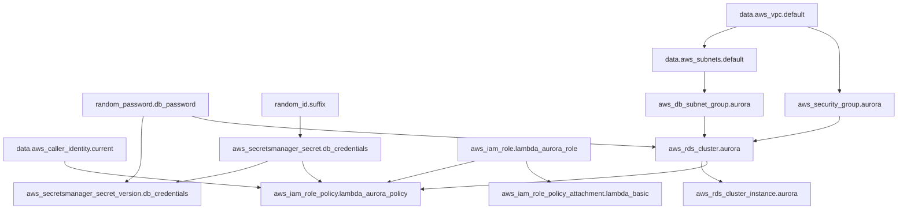
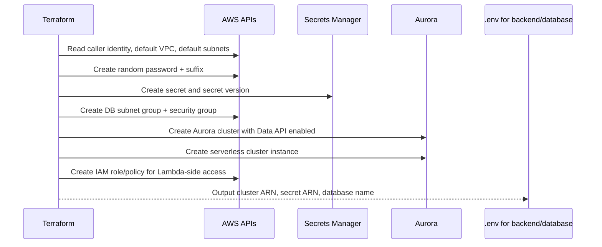
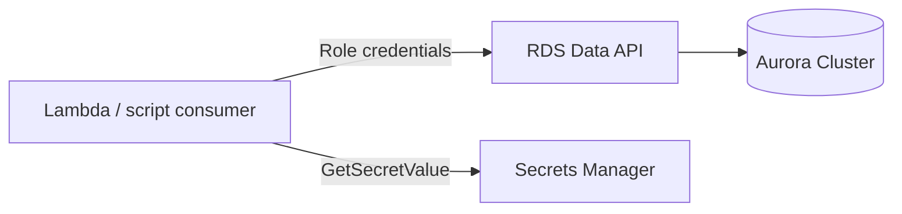
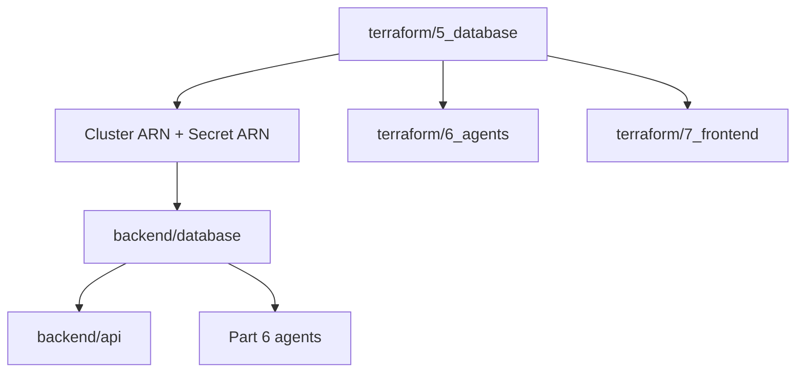

# Terraform Part 5 Database

`terraform/5_database` là implementation hạ tầng của Guide 5. Folder này tạo Aurora PostgreSQL Serverless v2, bật Data API, sinh credentials trong Secrets Manager, cấu hình network tối thiểu bằng default VPC, và tạo IAM role/policy để Lambda side có thể gọi database an toàn ở các phần sau.

Nếu [`backend/database`](../../backend/database/README.md) là lớp ứng dụng và schema logic, thì folder này là lớp AWS resource graph làm cho lớp đó chạy được. README này cũng đi theo phong cách vừa học Guide 5 vừa làm maintainer reference.

## 1. Guide 5 đang dạy gì ở tầng infrastructure

Guide 5 muốn sinh viên hiểu 4 ý lớn:

1. **Aurora PostgreSQL** cho dữ liệu quan hệ tốt hơn các lựa chọn NoSQL trong bài toán portfolio.
2. **Serverless v2** cho phép scale theo tải, phù hợp với project học và workload không đều.
3. **Data API** giúp Lambda và local scripts truy cập DB qua HTTP, tránh kéo sinh viên vào bài toán VPC networking sớm.
4. **Secrets Manager + IAM** là đường đi đúng để cấp quyền thay vì hard-code credentials.

Implementation hiện tại trong repo bám khá sát tinh thần đó, nhưng có vài chi tiết đáng nhớ:

- cluster dùng `engine_mode = "provisioned"` với `db.serverless`, tức đúng style Aurora Serverless v2
- network đang dựa vào **default VPC + default subnets**
- IAM role tạo ở đây là role tiện ích cho Lambda access path, nhưng agent/API Lambda ở Part 6/7 còn có role riêng

## 2. Map từ Guide 5 sang Terraform thật

| Bước trong guide | File Terraform | Resource / kết quả |
|---|---|---|
| Copy tfvars | `terraform.tfvars.example` -> `terraform.tfvars` | Chọn region và scaling range |
| `terraform init` | `.terraform.lock.hcl` | Khóa provider versions |
| `terraform apply` | `main.tf` | Tạo cluster, instance, secret, subnet group, SG, IAM |
| Lấy output để đưa vào `.env` | `outputs.tf` | `aurora_cluster_arn`, `aurora_secret_arn`, `database_name`, `lambda_role_arn` |
| Chạy local scripts Part 5 | outputs -> `.env` | Cho `backend/database` biết cần nói chuyện với cluster nào |

## 3. Cấu trúc thư mục

```text
terraform/5_database/
├── main.tf                  # Toàn bộ resource AWS của Part 5
├── variables.tf             # Input variables cho region và scaling
├── outputs.tf               # Output để nối sang .env và các phần sau
├── terraform.tfvars.example # Mẫu cấu hình cho sinh viên
├── terraform.tfvars         # State local hiện tại của repo này
└── .terraform.lock.hcl      # Provider versions đã khóa bởi terraform init
```

## 4. Tài nguyên AWS ở Part 5



## 5. Resource creation flow



## 6. Chi tiết từng tài nguyên quan trọng

### 6.1 `aws_rds_cluster.aurora` — `alex-aurora-cluster`

Đây là resource trung tâm của toàn bộ Part 5.

| Thuộc tính | Giá trị hiện tại |
|---|---|
| `cluster_identifier` | `alex-aurora-cluster` |
| `engine` | `aurora-postgresql` |
| `engine_mode` | `provisioned` |
| `engine_version` | `15.12` |
| `database_name` | `alex` |
| `master_username` | `alexadmin` |
| `enable_http_endpoint` | `true` |
| `backup_retention_period` | `7` |
| `preferred_backup_window` | `03:00-04:00` |
| `preferred_maintenance_window` | `sun:04:00-sun:05:00` |
| `skip_final_snapshot` | `true` |
| `apply_immediately` | `true` |

**Ý nghĩa kiến trúc**

- `enable_http_endpoint = true` chính là công tắc bật **Data API**
- `serverlessv2_scaling_configuration` dùng `var.min_capacity` và `var.max_capacity`
- cluster nhận password từ `random_password`, không hard-code

### 6.2 `aws_rds_cluster_instance.aurora` — `alex-aurora-instance-1`

Aurora Serverless v2 vẫn cần cluster instance resource.

| Thuộc tính | Giá trị hiện tại |
|---|---|
| `identifier` | `alex-aurora-instance-1` |
| `instance_class` | `db.serverless` |
| `engine` | lấy từ cluster |
| `engine_version` | lấy từ cluster |
| `performance_insights_enabled` | `false` |

**Maintainer note**

- `performance_insights_enabled = false` là quyết định tiết kiệm chi phí cho môi trường học/dev

### 6.3 `aws_secretsmanager_secret.db_credentials`

Secret chứa credentials cho cluster.

| Thuộc tính | Giá trị hiện tại |
|---|---|
| `name` | `alex-aurora-credentials-${random_id.suffix.hex}` |
| `recovery_window_in_days` | `0` |

Secret thật sự được populate bởi `aws_secretsmanager_secret_version.db_credentials` với payload JSON:

- `username = "alexadmin"`
- `password = random_password.db_password.result`

**Maintainer note**

- tên secret có suffix ngẫu nhiên, nên đừng hard-code tên secret trong script; luôn lấy ARN từ output
- `recovery_window_in_days = 0` tiện cho môi trường học, nhưng rõ ràng không phải cấu hình production cứng

### 6.4 `aws_db_subnet_group.aurora`

| Thuộc tính | Giá trị hiện tại |
|---|---|
| `name` | `alex-aurora-subnet-group` |
| `subnet_ids` | lấy từ `data.aws_subnets.default.ids` |

**Ý nghĩa**

- Terraform đang giả định account có **default VPC** và default subnets usable
- điều này giảm friction cho course, nhưng là dependency quan trọng nếu deploy vào account đã bị dọn default networking

### 6.5 `aws_security_group.aurora`

| Thuộc tính | Giá trị hiện tại |
|---|---|
| `name` | `alex-aurora-sg` |
| `ingress` | TCP `5432` từ `data.aws_vpc.default.cidr_block` |
| `egress` | all traffic ra ngoài |

**Ý nghĩa**

- SG này đủ để database chấp nhận truy cập PostgreSQL từ bên trong VPC
- với Data API, local scripts không trực tiếp dùng ingress này; nhưng Aurora cluster vẫn cần networking hợp lệ

### 6.6 `aws_iam_role.lambda_aurora_role`

Role tiện ích dành cho Lambda-style workloads cần truy cập Aurora qua Data API.

| Thuộc tính | Giá trị hiện tại |
|---|---|
| `name` | `alex-lambda-aurora-role` |
| Principal | `lambda.amazonaws.com` |
| Assume action | `sts:AssumeRole` |

### 6.7 `aws_iam_role_policy.lambda_aurora_policy`

Inline policy gắn với role phía trên.

| Nhóm quyền | Actions | Resource |
|---|---|---|
| RDS Data API | `ExecuteStatement`, `BatchExecuteStatement`, `BeginTransaction`, `CommitTransaction`, `RollbackTransaction` | `aws_rds_cluster.aurora.arn` |
| Secrets Manager | `GetSecretValue` | `aws_secretsmanager_secret.db_credentials.arn` |
| CloudWatch Logs | `CreateLogGroup`, `CreateLogStream`, `PutLogEvents` | `arn:aws:logs:${var.aws_region}:${account_id}:*` |

### 6.8 `aws_iam_role_policy_attachment.lambda_basic`

Attach AWS managed policy:

- `service-role/AWSLambdaBasicExecutionRole`

Nó bổ sung baseline execution/logging capability cho Lambda.

## 7. Inputs cần điền trong `terraform.tfvars`

| Biến | Mô tả | Mặc định | Bắt buộc |
|---|---|---|---|
| `aws_region` | Region deploy Aurora | không có | Có |
| `min_capacity` | Min ACU cho Aurora Serverless v2 | `0.5` | Không |
| `max_capacity` | Max ACU cho Aurora Serverless v2 | `1` | Không |

**Repo-portable note**

- `terraform.tfvars.example` dùng `us-east-1`
- file `terraform.tfvars` đang tồn tại trong repo local này có thể mang region khác
- README này không coi file local đó là chuẩn dùng chung; chuẩn hành vi nằm ở code Terraform và biến đầu vào

## 8. Outputs sau khi deploy

| Output | Giá trị nguồn | Sensitive | Dùng ở đâu |
|---|---|---|---|
| `aurora_cluster_arn` | `aws_rds_cluster.aurora.arn` | No | `.env`, agent/API env vars |
| `aurora_cluster_endpoint` | `aws_rds_cluster.aurora.endpoint` | No | kiểm tra/quan sát thủ công |
| `aurora_secret_arn` | `aws_secretsmanager_secret.db_credentials.arn` | No | `.env`, agent/API env vars |
| `database_name` | `aws_rds_cluster.aurora.database_name` | No | scripts/backend convention |
| `lambda_role_arn` | `aws_iam_role.lambda_aurora_role.arn` | No | tham chiếu IAM path |
| `data_api_enabled` | ternary từ cluster | No | xác nhận setup |
| `setup_instructions` | heredoc text | No | hướng dẫn sau deploy |

Lưu ý:

- output không in password
- ARN của secret không phải secret value; nó an toàn hơn nhưng vẫn nên xử lý cẩn thận

## 9. Version constraints

| Thành phần | Version |
|---|---|
| Terraform CLI | `>= 1.5` |
| AWS provider | `~> 5.0` (`5.100.0` trong lock file local) |
| Random provider | `~> 3.5` (`3.7.2` trong lock file local) |

## 10. IAM và security model

### 10.1 Trust relationship

Chỉ `lambda.amazonaws.com` được assume role `alex-lambda-aurora-role`.

### 10.2 Access path đúng theo thiết kế



Thực tế ở repo:

- local scripts Part 5 dùng AWS CLI/boto3 credentials của người chạy máy local
- Lambda ở Part 6/7 lấy `AURORA_CLUSTER_ARN` và `AURORA_SECRET_ARN` từ env, rồi gọi Data API bằng role riêng của chúng

### 10.3 Đây là design thiên về học/dev

Các quyết định sau là intentional trade-off cho course:

- dùng **default VPC**
- mở ingress PostgreSQL từ toàn bộ CIDR của default VPC
- cho phép `skip_final_snapshot = true`
- immediate secret deletion (`recovery_window_in_days = 0`)

Nếu bạn harden cho production thật, đây là nhóm đầu tiên cần xem lại.

## 11. Folder này nối với backend/database như thế nào

### 11.1 Flow cấu hình

1. Terraform tạo cluster và secret
2. `outputs.tf` in ra `aurora_cluster_arn` và `aurora_secret_arn`
3. Bạn copy hai giá trị này vào `.env`
4. `backend/database/src/client.py` đọc các biến env đó để tạo `boto3.client("rds-data")`

### 11.2 Vì sao backend không cần connection pool

Vì lớp Python không mở PostgreSQL socket trực tiếp. Nó dùng:

- `execute_statement`
- `query`
- `query_one`

qua Data API. Đây là lý do Guide 5 có thể giữ application code rất gọn.

**Maintainer note**

- downstream code gần như luôn cần `AURORA_CLUSTER_ARN` và `AURORA_SECRET_ARN`
- `AURORA_DATABASE` không phải lúc nào cũng được inject rõ ràng ở Part 6/7; lớp Python hiện dựa vào default `alex` nếu biến này vắng mặt

Đọc chi tiết application layer tại: [`backend/database/README.md`](../../backend/database/README.md)

## 12. Quan hệ với các phần khác



| Phần khác | Quan hệ với Part 5 |
|---|---|
| `backend/database` | đọc outputs qua `.env`, dùng Data API |
| `terraform/6_agents` | nhận `aurora_cluster_arn` và `aurora_secret_arn` làm input variables |
| `terraform/7_frontend` | dùng database outputs cho API Lambda qua remote state |
| `backend/api` | CRUD user/account/position/job trên Aurora |
| `backend/planner` và specialist agents | đọc/ghi `jobs`, `positions`, `instruments`, `users` |

## 13. Cách sử dụng nhanh

```bash
cd terraform/5_database

cp terraform.tfvars.example terraform.tfvars
# sửa aws_region, min_capacity, max_capacity

terraform init
terraform plan
terraform apply

terraform output
```

Sau đó:

```bash
# copy outputs vào .env rồi chuyển sang application layer
cd ../../backend/database
uv run test_data_api.py
uv run run_migrations.py
uv run seed_data.py
uv run verify_database.py
```

## 14. Troubleshooting và maintainer notes

### 14.1 `terraform apply` fail vì không có default VPC/default subnets

`main.tf` đang phụ thuộc vào:

- `data.aws_vpc.default`
- `data.aws_subnets.default`

Nếu account AWS đã bị dọn default VPC, bạn phải sửa hạ tầng để dùng VPC/subnet do bạn chỉ định.

### 14.2 Cluster tạo xong nhưng Data API không hoạt động

Kiểm tra:

- `aws_rds_cluster.aurora.enable_http_endpoint = true`
- cluster đã lên trạng thái `available`
- region trong `.env` trùng region deploy

`backend/database/test_data_api.py` là smoke test nhanh nhất để xác minh.

### 14.3 Secret tồn tại nhưng app không kết nối được

Thường do một trong ba nguyên nhân:

- copy sai `aurora_secret_arn`
- cluster ARN và secret ARN không cùng deployment
- region env khác region thật của cluster

### 14.4 Vì sao output `lambda_role_arn` có vẻ ít được dùng trực tiếp

Role này mô tả access pattern chuẩn cho Lambda-Aurora via Data API, nhưng các phần sau của repo thường tạo role riêng phù hợp với từng service rồi cấp quyền tương tự trên chính role đó.

### 14.5 Vấn đề chi phí

Guide 5 nhấn mạnh rất đúng: Aurora là phần đắt nhất từ đây trở đi.

Trong config hiện tại:

- `min_capacity = 0.5`
- `max_capacity = 1`

Đây là mức hợp lý cho dev/course. Nếu không dùng một thời gian dài, nên `terraform destroy` Part 5 để cắt chi phí.

## 15. Checklist tài nguyên được tạo

- **1 `random_password`** (`db_password`) — sinh DB password ngẫu nhiên
- **1 `random_id`** (`suffix`) — thêm suffix cho tên secret
- **1 `aws_secretsmanager_secret`** (`alex-aurora-credentials-*`) — chứa credentials DB
- **1 `aws_secretsmanager_secret_version`** — ghi JSON username/password vào secret
- **1 `aws_db_subnet_group`** (`alex-aurora-subnet-group`) — gom default subnets cho Aurora
- **1 `aws_security_group`** (`alex-aurora-sg`) — network rules cho cluster
- **1 `aws_rds_cluster`** (`alex-aurora-cluster`) — Aurora PostgreSQL cluster với Data API
- **1 `aws_rds_cluster_instance`** (`alex-aurora-instance-1`) — serverless DB instance
- **1 `aws_iam_role`** (`alex-lambda-aurora-role`) — role cho Lambda-style access
- **1 `aws_iam_role_policy`** (`alex-lambda-aurora-policy`) — quyền Data API + secret + logs
- **1 `aws_iam_role_policy_attachment`** — attach AWSLambdaBasicExecutionRole
- **3 data sources** — caller identity, default VPC, default subnets

## 16. Tóm tắt nhanh

- `terraform/5_database` là lớp infra mở đường cho toàn bộ Part 5 và Part 6.
- Resource trung tâm là `aws_rds_cluster.aurora` với Data API bật sẵn.
- Secret credentials được tạo bằng Secrets Manager và tham chiếu qua ARN, không hard-code password.
- Hạ tầng dùng default VPC/subnets để giảm friction cho course, nhưng đó cũng là assumption lớn nhất về môi trường AWS.
- Outputs của folder này là cầu nối trực tiếp sang `.env`, `backend/database`, `terraform/6_agents`, và `terraform/7_frontend`.

Đọc tiếp: [`backend/database/README.md`](../../backend/database/README.md)
