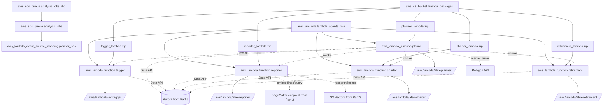

# `terraform/6_agents` — hạ tầng Terraform cho Agent Orchestra Part 6

## Mục tiêu

Folder này triển khai lớp hạ tầng AWS cho Part 6 của Alex:

- tạo hàng đợi `alex-analysis-jobs` và DLQ cho orchestration bất đồng bộ
- tạo 1 IAM role dùng chung cho 5 Lambda agents
- tạo S3 bucket chứa deployment package lớn hơn 50MB
- deploy 5 Lambda `alex-planner`, `alex-tagger`, `alex-reporter`, `alex-charter`, `alex-retirement`
- nối SQS với planner bằng `aws_lambda_event_source_mapping`
- tạo log groups CloudWatch với retention 7 ngày

Folder này không build ZIP, không tạo Aurora, không tạo S3 Vectors bucket, không tạo SageMaker endpoint, và không tạo Researcher service. Những phần đó đến từ các part trước.

Trạng thái hiện tại của repo vẫn Bedrock-centric ở tầng infra:

- Terraform inject `BEDROCK_MODEL_ID` và `BEDROCK_REGION` vào toàn bộ Lambda Part 6
- model runtime trong code backend hiện vẫn đi theo `LitellmModel(model=f"bedrock/{model_id}")`
- `OPENAI_API_KEY` đã có trong env nhưng hiện chủ yếu phục vụ tracing/observability, chưa phải model provider chính

## Sơ đồ tài nguyên AWS



## Chi tiết từng tài nguyên

| Resource | Loại | Vai trò |
| --- | --- | --- |
| `aws_sqs_queue.analysis_jobs` | SQS queue | Queue chính nhận `job_id` để planner xử lý async. `visibility_timeout_seconds = 910`, `receive_wait_time_seconds = 10`, retention 1 ngày. |
| `aws_sqs_queue.analysis_jobs_dlq` | SQS queue | DLQ cho message fail sau `maxReceiveCount = 3`. |
| `aws_iam_role.lambda_agents_role` | IAM role | Execution role dùng chung cho cả 5 Lambdas. |
| `aws_iam_role_policy.lambda_agents_policy` | Inline IAM policy | Gói quyền CloudWatch Logs, SQS receive/delete, Lambda invoke, Aurora Data API, Secrets Manager, S3/S3 Vectors, SageMaker invoke, Bedrock invoke. |
| `aws_iam_role_policy_attachment.lambda_agents_basic` | IAM attachment | Gắn AWS managed policy `AWSLambdaBasicExecutionRole`. |
| `aws_s3_bucket.lambda_packages` | S3 bucket | Bucket `alex-lambda-packages-{account_id}` để chứa ZIP deploy. |
| `aws_s3_object.lambda_packages` | S3 object set | Upload 5 artifact từ `../../backend/{agent}/{agent}_lambda.zip`. |
| `aws_lambda_function.planner` | Lambda | Orchestrator chính, timeout 900s, memory 2048MB, trigger từ SQS. |
| `aws_lambda_event_source_mapping.planner_sqs` | Event source mapping | Nối queue `analysis_jobs` vào `alex-planner` với `batch_size = 1`. |
| `aws_lambda_function.tagger` | Lambda | Specialist phân loại instrument, timeout 300s, memory 1024MB. |
| `aws_lambda_function.reporter` | Lambda | Specialist viết report markdown, timeout 300s, memory 1024MB. |
| `aws_lambda_function.charter` | Lambda | Specialist sinh chart payload, timeout 300s, memory 1024MB. |
| `aws_lambda_function.retirement` | Lambda | Specialist phân tích retirement, timeout 300s, memory 1024MB. |
| `aws_cloudwatch_log_group.agent_logs` | CloudWatch log groups | Tạo trước log group cho cả 5 Lambdas, retention 7 ngày. |

Inventory đáng chú ý từ `main.tf`:

- mọi Lambda đều dùng `runtime = "python3.12"` và `handler = "lambda_handler.lambda_handler"`
- Terraform deploy code qua S3, không dùng `filename = ...`
- `source_code_hash` chỉ được set khi ZIP local đã tồn tại
- planner có memory/timeout cao hơn các specialist agents
- log groups được tạo bằng `for_each` cho `planner`, `tagger`, `reporter`, `charter`, `retirement`

## IAM Roles & Policies

Execution role dùng chung là `alex-lambda-agents-role`. Inline policy hiện cấp các nhóm quyền sau:

| Nhóm quyền | Scope hiện tại | Ghi chú |
| --- | --- | --- |
| CloudWatch Logs | `arn:aws:logs:${var.aws_region}:${account_id}:*` | Cho phép create log group/stream và put log events. |
| SQS consumer | `aws_sqs_queue.analysis_jobs.arn` | Chỉ đủ để planner nhận, xóa message và đọc queue attributes. |
| Lambda invoke | `arn:aws:lambda:${var.aws_region}:${account_id}:function:alex-*` | Planner dùng để gọi specialist Lambdas; policy đang cấp cho mọi agent vì role dùng chung. |
| Aurora Data API | `var.aurora_cluster_arn` | `ExecuteStatement`, `BatchExecuteStatement`, transaction APIs. |
| Secrets Manager | `var.aurora_secret_arn` | Chỉ `GetSecretValue` cho DB secret. |
| S3 | `arn:aws:s3:::${var.vector_bucket}` và `/*` | `GetObject`, `ListBucket`; phục vụ access liên quan vector bucket. |
| S3 Vectors API | `arn:aws:s3vectors:${var.aws_region}:${account_id}:bucket/${var.vector_bucket}/index/*` | `QueryVectors`, `GetVectors`; chủ yếu reporter dùng tra cứu research chunks. |
| SageMaker | endpoint ARN từ `var.sagemaker_endpoint` | `InvokeEndpoint`; policy ghi là cho reporter, nhưng role chia sẻ khiến agent khác cũng có quyền này. |
| Bedrock | wildcard mọi region cho foundation-model và inference-profile | Có comment workaround để tránh lỗi region/inference profile. |

Điểm cần hiểu đúng:

- IAM ở đây thiên về sự đơn giản cho bài học hơn là least-privilege tuyệt đối theo từng Lambda riêng lẻ.
- `bedrock:InvokeModel` và `bedrock:InvokeModelWithResponseStream` vẫn là quyền trung tâm của current state.
- Không có IAM riêng cho `OPENAI_API_KEY`; secret này đi qua env var, không qua Secrets Manager trong folder này.

## Environment Variables tổng hợp

Terraform inject env theo từng Lambda như sau:

| Biến | Planner | Tagger | Reporter | Charter | Retirement | Ý nghĩa |
| --- | --- | --- | --- | --- | --- | --- |
| `AURORA_CLUSTER_ARN` | Yes | Yes | Yes | Yes | Yes | Aurora cluster ARN từ Part 5. |
| `AURORA_SECRET_ARN` | Yes | Yes | Yes | Yes | Yes | Secrets Manager secret ARN từ Part 5. |
| `DATABASE_NAME` | Yes | Yes | Yes | Yes | Yes | Hardcode là `alex`. |
| `VECTOR_BUCKET` | Yes | No | No | No | No | S3 Vectors bucket name từ Part 3, hiện chỉ Planner nhận env này từ Terraform. |
| `BEDROCK_MODEL_ID` | Yes | Yes | Yes | Yes | Yes | Model ID hiện tại cho LiteLLM Bedrock. |
| `BEDROCK_REGION` | Yes | Yes | Yes | Yes | Yes | Region Bedrock hiện tại. |
| `DEFAULT_AWS_REGION` | Yes | Yes | Yes | Yes | Yes | Region deploy Lambda và boto3 mặc định. |
| `SAGEMAKER_ENDPOINT` | Yes | No | Yes | No | No | Planner giữ env này nhưng reporter mới là nơi dùng trực tiếp cho embeddings/query flow. |
| `POLYGON_API_KEY` | Yes | No | No | No | No | Dùng cho planner refresh market prices. |
| `POLYGON_PLAN` | Yes | No | No | No | No | `free` hoặc `paid`. |
| `LANGFUSE_PUBLIC_KEY` | Yes | Yes | Yes | Yes | Yes | Observability tùy chọn. |
| `LANGFUSE_SECRET_KEY` | Yes | Yes | Yes | Yes | Yes | Observability tùy chọn. |
| `LANGFUSE_HOST` | Yes | Yes | Yes | Yes | Yes | Mặc định `https://us.cloud.langfuse.com`. |
| `OPENAI_API_KEY` | Yes | Yes | Yes | Yes | Yes | trạng thái hiện tại chủ yếu để tracing/export cho OpenAI Agents SDK và LangFuse. |

Các biến không do Terraform inject nhưng code backend có thể tự fallback:

- planner có default function names `alex-tagger`, `alex-reporter`, `alex-charter`, `alex-retirement`
- nhiều backend README ghi rõ code fallback `BEDROCK_MODEL_ID` / `BEDROCK_REGION` về giá trị hardcoded nếu env thiếu

Chi tiết code-level cho từng Lambda nằm ở:

- [`../../backend/planner/README.md`](../../backend/planner/README.md)
- [`../../backend/tagger/README.md`](../../backend/tagger/README.md)
- [`../../backend/reporter/README.md`](../../backend/reporter/README.md)
- [`../../backend/charter/README.md`](../../backend/charter/README.md)
- [`../../backend/retirement/README.md`](../../backend/retirement/README.md)

## Outputs sau khi triển khai

`outputs.tf` hiện export 4 nhóm output:

| Output | Nội dung |
| --- | --- |
| `sqs_queue_url` | URL của queue `alex-analysis-jobs`. |
| `sqs_queue_arn` | ARN của queue chính. |
| `lambda_functions` | Map tên 5 Lambda đã deploy. |
| `setup_instructions` | Chuỗi hướng dẫn test/deploy sau `terraform apply`. |

Lưu ý quan trọng về current state:

- `setup_instructions` vẫn nhắc `uv run run_full_test.py`
- repo hiện tại không có file `run_full_test.py`
- file test thực tế là `backend/test_full.py` và `backend/planner/test_full.py`

Vì vậy, khi đọc output sau deploy:

1. dùng output queue và lambda names như bình thường
2. coi phần `run_full_test.py` là text cũ chưa đồng bộ
3. ưu tiên backend READMEs và file hiện có trong repo cho lệnh kiểm thử thật

## Các biến cần điền trong `terraform.tfvars`

`terraform.tfvars.example` hiện yêu cầu các biến sau:

| Biến | Bắt buộc | Current sample | Nguồn lấy giá trị |
| --- | --- | --- | --- |
| `aws_region` | Yes | `us-east-1` | Region deploy Lambda, thường khớp Part 5 database. |
| `aurora_cluster_arn` | Yes | ARN mẫu | Lấy từ `terraform/5_database` outputs. |
| `aurora_secret_arn` | Yes | ARN mẫu | Lấy từ `terraform/5_database` outputs. |
| `vector_bucket` | Yes | `alex-vectors-123456789012` | Lấy từ Part 3. |
| `bedrock_model_id` | Yes | `us.amazon.nova-pro-v1:0` | Current guide/sample cho model Part 6. |
| `bedrock_region` | Yes | `us-west-2` | Region Bedrock được sample khuyến nghị. |
| `sagemaker_endpoint` | No | `alex-embedding-endpoint` | Có default trong `variables.tf`; reporter dùng cho embeddings. |
| `polygon_api_key` | Yes | placeholder | Key từ Polygon.io. |
| `polygon_plan` | No | `free` | `free` hoặc `paid`. |
| `langfuse_public_key` | Optional | comment mẫu | Dùng ở Part 8 nếu bật observability. |
| `langfuse_secret_key` | Optional | comment mẫu | Sensitive. |
| `langfuse_host` | Optional | `https://us.cloud.langfuse.com` | Có default. |
| `openai_api_key` | Optional in Terraform schema, nhưng thực tế nên điền nếu cần tracing | comment mẫu | trạng thái hiện tại: tracing/observability cho OpenAI Agents SDK. |

Điểm nên kiểm tra trước `terraform apply`:

- 5 file ZIP đã tồn tại ở `backend/{planner,tagger,reporter,charter,retirement}/*_lambda.zip`
- ARN Aurora đúng region
- `vector_bucket` đúng tên bucket S3 Vectors đã tạo từ Part 3
- `polygon_api_key` không để placeholder nếu muốn planner cập nhật giá thật

## Version Constraints

Version constraints đọc trực tiếp từ code hiện tại:

| Thành phần | Constraint / Version |
| --- | --- |
| Terraform CLI | `>= 1.5` |
| AWS provider | `~> 5.0` |
| AWS provider thực tế trong `.terraform.lock.hcl` | `5.100.0` |
| Lambda runtime | `python3.12` |

Hệ quả thực tế:

- nếu chưa có `.terraform.lock.hcl`, `terraform init` có thể resolve sang patch khác trong `5.x`
- repo hiện đã khóa `hashicorp/aws` ở `5.100.0` trong lock file của folder này

## Quan hệ với các phần khác

Folder này là infra-level counterpart của 5 backend folders Part 6:

| Thành phần khác | Quan hệ |
| --- | --- |
| `backend/planner` | Terraform deploy `alex-planner`, gắn SQS trigger, inject DB/model/Polygon/observability env. |
| `backend/tagger` | Terraform deploy `alex-tagger`, inject DB/model/observability env. |
| `backend/reporter` | Terraform deploy `alex-reporter`, inject DB/model/SageMaker/observability env. |
| `backend/charter` | Terraform deploy `alex-charter`, inject DB/model/observability env. |
| `backend/retirement` | Terraform deploy `alex-retirement`, inject DB/model/observability env. |
| `terraform/5_database` | Cung cấp `aurora_cluster_arn` và `aurora_secret_arn`. |
| `terraform/3_ingestion` | Cung cấp `vector_bucket` và luồng dữ liệu vào S3 Vectors. |
| `terraform/2_sagemaker` | Cung cấp `sagemaker_endpoint` cho reporter. |
| `backend/researcher` / `terraform/4_researcher` | Researcher nạp dữ liệu research vào S3 Vectors, reporter query lại khi viết report. |
| `frontend` / `terraform/7_frontend` | API Lambda ở Part 7 sẽ gửi job vào queue Part 6 và đọc kết quả từ Aurora. |

Nếu cần hiểu logic code, xem backend READMEs trước. Nếu cần hiểu resource wiring, env injection, IAM và outputs, đọc file này trước.

## Cách sử dụng nhanh

Luồng tối thiểu để deploy folder này theo current repo:

1. Build ZIP cho 5 agents.
2. Điền `terraform.tfvars`.
3. Chạy `terraform init`.
4. Chạy `terraform apply`.
5. Chạy integration test từ backend.

Các lệnh thường dùng:

```bash
cd backend
uv run package_docker.py
```

```bash
cd terraform/6_agents
cp terraform.tfvars.example terraform.tfvars
terraform init
terraform apply
terraform output
```

```bash
cd backend
uv run test_simple.py
uv run test_full.py
```

```bash
cd backend
uv run watch_agents.py --region us-east-1 --lookback 5 --interval 2
```

## Cách chuyển sang OpenAI models

Trạng thái hiện tại phải giữ nguyên khi document:

- Terraform đang inject `BEDROCK_MODEL_ID` và `BEDROCK_REGION` vào toàn bộ Lambda của Part 6
- code backend hiện vẫn Bedrock-centric
- Bedrock IAM policy blocks vẫn tồn tại và đang cần cho runtime hiện tại

Hướng migrate giai đoạn đầu ở tầng infra:

1. Có thể giữ tên biến `BEDROCK_MODEL_ID` và `BEDROCK_REGION` để giảm churn, nhưng đổi semantics và values.
2. Review đồng thời 4 nơi:
   - Bedrock IAM policy blocks trong `terraform/6_agents/main.tf`
   - env vars inject vào từng Lambda trong `terraform/6_agents/main.tf`
   - biến `openai_api_key` trong `terraform/6_agents/variables.tf`
   - narrative/sample values trong `terraform/6_agents/terraform.tfvars.example`
3. README này chỉ giải thích hạ tầng; thay đổi code-level phải xem lại từng backend README tương ứng.

Mapping model khuyến nghị ở góc nhìn hạ tầng:

| Lambda | Model khuyến nghị khi migrate | Ghi chú |
| --- | --- | --- |
| `alex-planner` | `openai/gpt-5.4-mini` | Planner là tầng orchestration quan trọng nhất. |
| `alex-tagger` | `openai/gpt-5.4-nano` | Structured classification, scope hẹp. |
| `alex-reporter` | `openai/gpt-5.4-nano` | Ưu tiên cost/latency; có thể nâng lên `mini` nếu chất lượng report chưa đạt. |
| `alex-charter` | `openai/gpt-5.4-nano` | JSON chart payload cần nhanh và rẻ. |
| `alex-retirement` | `openai/gpt-5.4-nano` | Phần tính toán đã chạy sẵn trong Python. |

Những gì README này khuyến nghị review khi migrate thật:

- bỏ hoặc điều kiện hóa Bedrock IAM nếu model calls không còn đi qua AWS Bedrock
- xem lại `OPENAI_API_KEY`: từ vai trò observability-only sang khả năng là credential cho model calls
- cập nhật sample values trong `terraform.tfvars.example` nhưng vẫn có thể giữ tên biến `bedrock_model_id` và `bedrock_region` ở giai đoạn đầu
- sửa narrative outputs/docs để không làm người đọc tưởng repo vẫn chạy Bedrock nếu thực tế đã đổi provider

Các backend README cần đọc cùng:

- [`../../backend/planner/README.md`](../../backend/planner/README.md): code-level migration cho orchestrator và các script cross-cutting
- [`../../backend/tagger/README.md`](../../backend/tagger/README.md): structured output migration
- [`../../backend/reporter/README.md`](../../backend/reporter/README.md): tool flow + `judge.py`
- [`../../backend/charter/README.md`](../../backend/charter/README.md): JSON output stability
- [`../../backend/retirement/README.md`](../../backend/retirement/README.md): retirement reasoning quality

## Tóm tắt

`terraform/6_agents` là lớp hạ tầng tập trung cho Agent Orchestra của Part 6: SQS, IAM, S3 package bucket, 5 Lambda agents, SQS trigger cho planner, và log groups. Trạng thái hiện tại của folder này vẫn inject `BEDROCK_MODEL_ID` và `BEDROCK_REGION` vào toàn bộ Lambdas, đồng thời truyền `OPENAI_API_KEY` chủ yếu cho tracing/observability.

Nếu bạn cần đọc theo đúng vai trò:

- đọc file này để hiểu resource inventory, IAM, env injection, outputs và dependency với các part trước
- đọc 5 backend READMEs để hiểu code của từng agent
- khi migrate sang OpenAI models, hãy đổi hạ tầng và code cùng nhau, nhưng có thể tạm giữ naming Bedrock để giảm churn ở giai đoạn đầu

## Checklist sau khi apply

- queue `alex-analysis-jobs` và `alex-analysis-jobs-dlq` tồn tại
- bucket `alex-lambda-packages-{account_id}` tồn tại
- cả 5 Lambda `alex-*` ở trạng thái Active
- planner có SQS trigger attached
- log groups `/aws/lambda/alex-*` đã có
