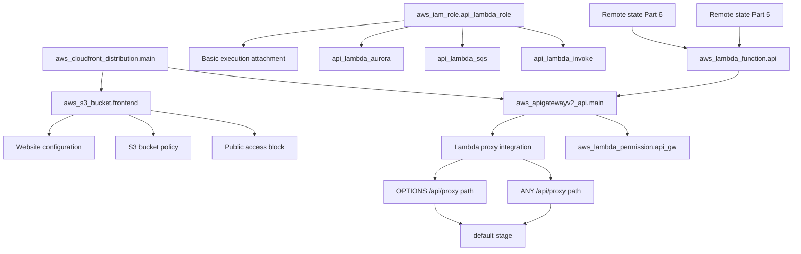
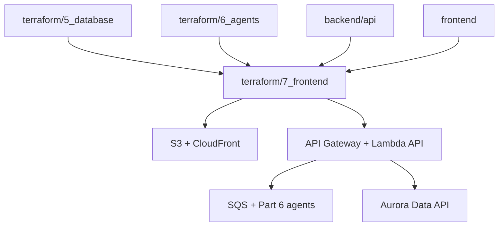

# `terraform/7_frontend` — hạ tầng Frontend & API cho Guide 7

Thư mục này triển khai lớp hạ tầng AWS cho **Guide 7 - Frontend & API** của Alex. Theo implementation hiện tại trong repo, Part 7 deploy một static frontend lên S3 + CloudFront, đồng thời deploy `backend/api` thành Lambda phía sau API Gateway HTTP API. Folder này không tạo database hay agent Lambdas; nó **kế thừa** remote state từ Part 5 và Part 6.

Source of truth ở đây là `main.tf` và các file Terraform hiện tại. Nếu guide gốc mô tả theo hướng khác, README này vẫn bám đúng implementation đang có trong repo.

## Sơ đồ tài nguyên AWS



## Chi tiết từng tài nguyên quan trọng

### 1. `aws_s3_bucket.frontend` — `alex-frontend-<account_id>`

| Thuộc tính | Giá trị |
|---|---|
| Resource type | `aws_s3_bucket` |
| Tên thực tế | `alex-frontend-<aws_account_id>` |
| Vai trò | chứa static export của Next.js frontend |
| Tags | `Project=alex`, `Part=7_frontend`, `ManagedBy=terraform` |

### 2. `aws_s3_bucket_public_access_block.frontend`

| Thuộc tính | Giá trị |
|---|---|
| `block_public_acls` | `false` |
| `block_public_policy` | `false` |
| `ignore_public_acls` | `false` |
| `restrict_public_buckets` | `false` |

**Ý nghĩa:** bucket đang được mở public để phục vụ website endpoint trực tiếp cho CloudFront origin.

### 3. `aws_s3_bucket_website_configuration.frontend`

| Thuộc tính | Giá trị |
|---|---|
| `index_document.suffix` | `index.html` |
| `error_document.key` | `404.html` |

### 4. `aws_s3_bucket_policy.frontend`

| Thuộc tính | Giá trị |
|---|---|
| Principal | `*` |
| Action | `s3:GetObject` |
| Resource | `${aws_s3_bucket.frontend.arn}/*` |

**Ý nghĩa:** kết hợp với public access block ở trên để website bucket có thể public-read.

### 5. `aws_iam_role.api_lambda_role` — `alex-api-lambda-role`

| Thuộc tính | Giá trị |
|---|---|
| Resource type | `aws_iam_role` |
| Tên thực tế | `alex-api-lambda-role` |
| Trust principal | `lambda.amazonaws.com` |
| Vai trò | execution role cho `alex-api` |

### 6. `aws_iam_role_policy_attachment.api_lambda_basic`

| Thuộc tính | Giá trị |
|---|---|
| Managed policy | `service-role/AWSLambdaBasicExecutionRole` |
| Gắn vào | `alex-api-lambda-role` |

### 7. `aws_iam_role_policy.api_lambda_aurora`

| Thuộc tính | Giá trị |
|---|---|
| Policy name | `alex-api-lambda-aurora` |
| Actions | `rds-data:*` subset + `secretsmanager:GetSecretValue` |
| Resource | cluster ARN + secret ARN từ remote state Part 5 |

### 8. `aws_iam_role_policy.api_lambda_sqs`

| Thuộc tính | Giá trị |
|---|---|
| Policy name | `alex-api-lambda-sqs` |
| Actions | `sqs:SendMessage`, `sqs:GetQueueAttributes` |
| Resource | `sqs_queue_arn` từ remote state Part 6 |

### 9. `aws_iam_role_policy.api_lambda_invoke`

| Thuộc tính | Giá trị |
|---|---|
| Policy name | `alex-api-lambda-invoke` |
| Action | `lambda:InvokeFunction` |
| Resources | 5 function `alex-planner`, `alex-tagger`, `alex-reporter`, `alex-charter`, `alex-retirement` |

**Ghi chú:** policy này được giữ cho test/direct invoke path, dù API chính vẫn dùng SQS để kích hoạt analysis.

### 10. `aws_lambda_function.api` — `alex-api`

| Thuộc tính | Giá trị |
|---|---|
| `filename` | `../../backend/api/api_lambda.zip` |
| `function_name` | `alex-api` |
| `handler` | `lambda_handler.handler` |
| `runtime` | `python3.12` |
| `architectures` | `["x86_64"]` |
| `timeout` | `30` |
| `memory_size` | `512` |
| `depends_on` | IAM policies + CloudFront distribution |

**Backend tương ứng:** `backend/api`

### 11. `aws_apigatewayv2_api.main` — `alex-api-gateway`

| Thuộc tính | Giá trị |
|---|---|
| Protocol | `HTTP` |
| Tên thực tế | `alex-api-gateway` |
| CORS allow origins | `["*"]` |
| Auth tại gateway | không có JWT authorizer |

**Ý nghĩa:** authentication được xử lý trong Lambda bằng Clerk token validation, không làm ở API Gateway layer.

### 12. `aws_apigatewayv2_integration.lambda`, `aws_apigatewayv2_route.*`, `aws_apigatewayv2_stage.default`

| Resource | Vai trò |
|---|---|
| `integration.lambda` | Lambda proxy integration tới `alex-api` |
| `route.api_any` | `ANY /api/{proxy+}` |
| `route.api_options` | `OPTIONS /api/{proxy+}` |
| `stage.default` | `$default`, `auto_deploy = true`, throttling `100/100` |

### 13. `aws_lambda_permission.api_gw`

| Thuộc tính | Giá trị |
|---|---|
| Statement ID | `AllowExecutionFromAPIGateway` |
| Principal | `apigateway.amazonaws.com` |
| Source ARN | `${api.execution_arn}/*/*` |

### 14. `aws_cloudfront_distribution.main`

| Thuộc tính | Giá trị |
|---|---|
| `enabled` | `true` |
| `default_root_object` | `index.html` |
| S3 origin | website endpoint của bucket frontend |
| API origin | API Gateway endpoint |
| Default cache behavior | static files từ S3 |
| Ordered cache behavior | `/api/*` route sang API Gateway, TTL = 0 |
| SPA fallback | custom error `404 -> /index.html`, `403 -> /index.html` |
| Viewer certificate | CloudFront default certificate |

## IAM Roles & Policies — tổng hợp

| Resource | Name | Type | Policies |
|---|---|---|---|
| `aws_iam_role.api_lambda_role` | `alex-api-lambda-role` | Role | trust `lambda.amazonaws.com` |
| `aws_iam_role_policy_attachment.api_lambda_basic` | AWS managed | Attachment | `AWSLambdaBasicExecutionRole` |
| `aws_iam_role_policy.api_lambda_aurora` | `alex-api-lambda-aurora` | Inline policy | RDS Data API + Secrets Manager |
| `aws_iam_role_policy.api_lambda_sqs` | `alex-api-lambda-sqs` | Inline policy | SQS send/get attrs |
| `aws_iam_role_policy.api_lambda_invoke` | `alex-api-lambda-invoke` | Inline policy | invoke 5 agent Lambdas |

## Environment Variables tổng hợp

Các biến sau được inject vào `aws_lambda_function.api`:

| Biến | Nguồn | Mặc định | Mô tả |
|---|---|---|---|
| `AURORA_CLUSTER_ARN` | remote state Part 5 | không có | ARN cluster Aurora |
| `AURORA_SECRET_ARN` | remote state Part 5 | không có | ARN secret DB |
| `AURORA_DATABASE` | remote state Part 5 | không có | tên database |
| `DEFAULT_AWS_REGION` | `var.aws_region` | `us-east-1` | region boto3 mặc định |
| `SQS_QUEUE_URL` | remote state Part 6 | không có | queue để gửi analysis jobs |
| `CLERK_JWKS_URL` | `var.clerk_jwks_url` | không có | validate JWT trong Lambda |
| `CLERK_ISSUER` | `var.clerk_issuer` | `""` | issuer giữ lại để tương thích |
| `CORS_ORIGINS` | local string built from localhost + CloudFront domain | không có | origin whitelist trong FastAPI |

## Outputs sau khi triển khai

| Output | Giá trị | Sensitive | Mô tả |
|---|---|---|---|
| `cloudfront_url` | `https://<distribution>.cloudfront.net` | No | URL frontend production |
| `api_gateway_url` | API endpoint của HTTP API | No | endpoint gốc của API |
| `s3_bucket_name` | bucket frontend | No | nơi chứa static export |
| `lambda_function_name` | `alex-api` | No | tên Lambda API |
| `setup_instructions` | heredoc text | No | hướng dẫn deploy/test thủ công |

## Các biến cần điền trong `terraform.tfvars`

| Biến | Mô tả | Mặc định | Bắt buộc |
|---|---|---|---|
| `aws_region` | region deploy | `us-east-1` | Không |
| `clerk_jwks_url` | JWKS URL của Clerk | không có | Có |
| `clerk_issuer` | issuer URL của Clerk | `""` | Không |

## Version Constraints

| Thành phần | Version |
|---|---|
| Terraform CLI | `>= 1.0` |
| AWS Provider | `~> 5.0` |
| Backend artifact | local zip `../../backend/api/api_lambda.zip` |
| Remote state | local state từ `../5_database` và `../6_agents` |

## Quan hệ với các phần khác



| Folder/Part | Cần gì từ phần này | Mục đích |
|---|---|---|
| `frontend` | `cloudfront_url`, `/api/*` routing | chạy production UI |
| `backend/api` | `api_lambda.zip`, env vars, IAM | deploy backend API của Guide 7 |
| `terraform/5_database` | `aurora_cluster_arn`, `aurora_secret_arn`, `database_name` | cho API Lambda truy cập Data API |
| `terraform/6_agents` | `sqs_queue_url`, `sqs_queue_arn` | cho API đẩy job phân tích |

## Ứng dụng backend tương ứng

Folder backend được deploy bởi Terraform này là `backend/api`.

Nó hiện cung cấp các route chính:
- `/health`
- `/api/user`
- `/api/accounts`
- `/api/accounts/{account_id}/positions`
- `/api/positions`
- `/api/instruments`
- `/api/analyze`
- `/api/jobs`
- `/api/reset-accounts`
- `/api/populate-test-data`

Lambda entry point là `lambda_handler.handler`, dùng `Mangum(app, lifespan="off")` để chạy FastAPI trên API Gateway.

## Hiện trạng và khoảng trống

- Terraform này đang dùng **S3 website endpoint public** làm CloudFront origin, không phải private bucket + OAC/OAI.
- API Gateway không có JWT authorizer; Clerk validation được đẩy xuống FastAPI/Lambda layer.
- Folder này phụ thuộc trực tiếp vào **local Terraform state** của Part 5 và Part 6, nên thứ tự deploy và tính nhất quán state rất quan trọng.
- `allow_origins = ["*"]` ở API Gateway CORS khá nới lỏng; FastAPI mới là nơi dùng `CORS_ORIGINS` cụ thể hơn.
- `depends_on = [aws_cloudfront_distribution.main]` ở Lambda API cho thấy có coupling để build env `CORS_ORIGINS` với domain CloudFront ngay lúc apply.

## Cách sử dụng nhanh

```bash
cd terraform/7_frontend
cp terraform.tfvars.example terraform.tfvars
```

Chỉnh các biến cần thiết trong `terraform.tfvars`, rồi:

```bash
terraform init
terraform plan
terraform apply
terraform output
```

Trước khi apply, cần bảo đảm:

```text
1. Part 5 đã có terraform.tfstate hợp lệ
2. Part 6 đã có terraform.tfstate hợp lệ
3. backend/api/api_lambda.zip đã được build
4. frontend đã có static build nếu bạn chuẩn bị sync lên S3 sau đó
```

Build API Lambda package:

```bash
cd backend/api
uv run package_docker.py
```

Build frontend:

```bash
cd frontend
npm run build
```

## Tóm tắt

- **1 S3 bucket** (`alex-frontend-<account_id>`) — chứa static frontend
- **1 public access block config** — cho phép public website hosting
- **1 website configuration** — `index.html` + `404.html`
- **1 bucket policy** — public `GetObject`
- **1 IAM role** (`alex-api-lambda-role`) — execution role cho API Lambda
- **1 managed policy attachment** — basic Lambda logging
- **3 inline IAM policies** — Aurora, SQS, invoke agent Lambdas
- **1 Lambda function** (`alex-api`) — FastAPI backend của Guide 7
- **1 HTTP API** (`alex-api-gateway`) — route `/api/*`
- **1 integration** — API Gateway proxy sang Lambda
- **2 routes** — `ANY /api/{proxy+}` và `OPTIONS /api/{proxy+}`
- **1 stage** (`$default`) — auto deploy + throttling
- **1 lambda permission** — cho phép API Gateway invoke Lambda
- **1 CloudFront distribution** — frontend origin + `/api/*` origin split
