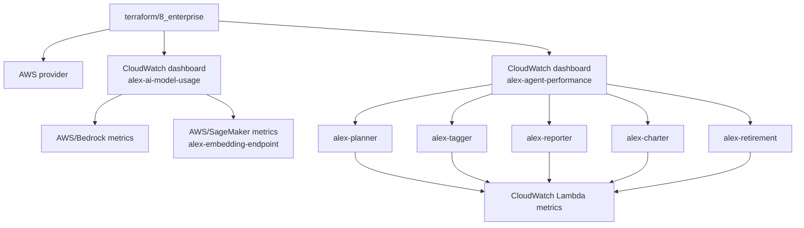
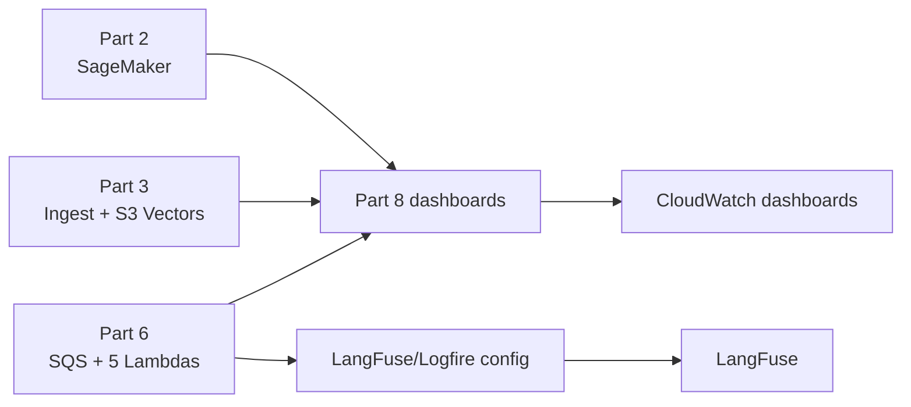

# `terraform/8_enterprise` - Monitoring enterprise cho Alex

Folder này là phần Terraform của **Guide 8 - Enterprise Grade**. Implementation hiện tại tạo hai CloudWatch dashboards để quan sát hạ tầng AI/ML và năm Lambda agents. Nó không phải một gói enterprise hoàn chỉnh: alarms, WAF, GuardDuty, VPC endpoints và các guardrail application-level trong guide không được tạo tại đây.

Quan trọng: Guide 8 và dashboard `ai_model_usage` được viết theo Bedrock. Runtime Part 6 hiện dùng OpenAI models qua LiteLLM (`MODEL_ID_*`), do đó metric Bedrock không đại diện cho agent inference hiện tại. README cấp dự án [README_about_enterprise.md](../../README_about_enterprise.md) ghi rõ phần evidence và roadmap rộng hơn.

## Scope và quy ước bằng chứng

- `Đã khai báo hạ tầng`: resource có trong Terraform.
- `Cần điều chỉnh`: resource tồn tại nhưng không còn khớp hoàn toàn với runtime hiện tại.
- README này chỉ dựa trên source/Terraform trong repo; không xác minh AWS live state.
- Không đặt secret trong `terraform.tfvars`; dùng `terraform.tfvars.example` làm khuôn mẫu.

## Sơ đồ tài nguyên AWS



Hai data source `aws_caller_identity.current` va `aws_region.current` hien duoc khai bao nhung chua duoc tham chieu trong dashboard body. `locals` dat `name_prefix = "alex"` va tags chung `Project`, `Part`, `ManagedBy`.

## Chi tiết tài nguyên

### 1. `aws_cloudwatch_dashboard.ai_model_usage` - `alex-ai-model-usage`

| Thuoc tinh | Gia tri |
|---|---|
| Vai tro | Theo doi AI model va embedding endpoint |
| Dashboard name | `alex-ai-model-usage` |
| Region cho Bedrock widgets | `var.bedrock_region` |
| Region cho SageMaker widgets | `var.aws_region` |
| Period | 300 giay |
| Trang thai | `Can dieu chinh` cho agent inference OpenAI |

| Nhom widget | Namespace/metric | Muc dich |
|---|---|---|
| Bedrock invocations | `AWS/Bedrock`: `Invocations`, client/server errors | Theo doi model ID tu `var.bedrock_model_id` |
| Bedrock tokens | `InputTokenCount`, `OutputTokenCount` | Token usage cua Bedrock |
| Bedrock latency | `InvocationLatency` average/max/min | Do tre Bedrock |
| SageMaker invocations | `Invocations`, `Invocation4XXErrors`, `Invocation5XXErrors` | Embedding endpoint |
| SageMaker latency | `ModelLatency` average/max/min | Do tre model embedding |

SageMaker widgets dung CloudWatch `SEARCH` expression va hien dang hard-code endpoint `alex-embedding-endpoint`. Neu endpoint duoc doi ten, Terraform can duoc cap nhat cung dashboard.

### 2. `aws_cloudwatch_dashboard.agent_performance` - `alex-agent-performance`

| Thuoc tinh | Gia tri |
|---|---|
| Vai tro | Theo doi Lambda execution cua Agent Orchestra Part 6 |
| Dashboard name | `alex-agent-performance` |
| Region | `var.aws_region` |
| Agents | planner, tagger, reporter, charter, retirement |
| Period | 300 giay |
| Trang thai | `Da khai bao ha tang` |

| Nhom widget | Namespace/metric | Statistic |
|---|---|---|
| Execution time | `AWS/Lambda: Duration` | Average |
| Errors | `AWS/Lambda: Errors` | Sum |
| Invocations | `AWS/Lambda: Invocations` | Sum |
| Concurrent executions | `AWS/Lambda: ConcurrentExecutions` | Maximum |
| Throttles | `AWS/Lambda: Throttles` | Sum |

Dashboard dung ten Lambda co dinh `alex-planner`, `alex-tagger`, `alex-reporter`, `alex-charter`, `alex-retirement`. Cac ten nay khop `terraform/6_agents/main.tf`.

## Inputs và outputs

### Variables

| Bien | Type | Default | Mo ta |
|---|---|---|---|
| `aws_region` | string | `us-east-1` | Region deploy dashboard va Lambda/SageMaker widgets |
| `bedrock_region` | string | `us-west-2` | Region cua Bedrock widgets |
| `bedrock_model_id` | string | `amazon.nova-pro-v1:0` | Model ID filter cho Bedrock widgets |

`terraform.tfvars.example` la template. No van dua ra Bedrock values theo Guide 8; voi Agent Orchestra da migrate sang OpenAI, khong nen suy dien day la model runtime cua Part 6.

### Outputs

| Output | Sensitive | Mo ta |
|---|---|---|
| `dashboard_urls` | No | Direct links toi hai CloudWatch dashboards |
| `dashboard_names` | No | Ten dashboard da tao |
| `setup_instructions` | No | Huong dan mo dashboard va y nghia metric |

## Version và dependency

| Thanh phan | Version/nguon |
|---|---|
| Terraform CLI | `>= 1.0` |
| AWS provider constraint | `~> 5.0` |
| AWS provider lock | `5.100.0` |
| Lambda metrics | `terraform/6_agents` |
| SageMaker endpoint | `terraform/2_sagemaker` |
| Ingest flow | `terraform/3_ingestion` |



Part 8 khong doc remote state cua cac Part truoc. Dependency la dependency van hanh: metric chi co du lieu khi endpoint/Lambda da duoc deploy va invoke.

## Cách sử dụng nhanh

```bash
cd terraform/8_enterprise
cp terraform.tfvars.example terraform.tfvars
# Chinh region/model monitoring phu hop neu ban dang dung Bedrock workload.
terraform init
terraform plan
terraform apply
terraform output dashboard_urls
```

Kiem tra sau deploy:

```bash
terraform output dashboard_names
aws logs tail /aws/lambda/alex-planner --since 10m --region ap-southeast-1
```

Khong dump Lambda environment variables, vi chung co the chua credentials. Dashboard metric co the can vai phut sau invocation dau tien moi hien du lieu.

Cleanup Part 8 khong xoa agents hay database:

```bash
cd terraform/8_enterprise
terraform destroy
```

## Giới hạn và roadmap

| Chu de Guide 8 | Hien trang cua folder | Huong tiep theo |
|---|---|---|
| CloudWatch dashboard | Co 2 dashboard | Bo sung alarm/SNS neu can paging |
| Bedrock observability | Co metric widgets | Thay/bo sung OpenAI or LangFuse cost, latency, error dashboard |
| Lambda monitoring | Duration/errors/invocations/concurrency/throttles | Bo sung DLQ age, API Gateway va Aurora metrics |
| WAF | Khong co | Can them o Part 7 neu yeu cau web protection |
| GuardDuty | Khong co | Can quyet dinh o account-level Terraform |
| VPC endpoints | Khong co | Can thiet ke lai network, khong phai thay doi nho o Part 8 |
| Alarms | Khong co resource `aws_cloudwatch_metric_alarm` | Xac dinh threshold va notification channel truoc khi them |

## Tóm tắt

- **2 CloudWatch dashboards** - AI/SageMaker usage va Lambda agent performance.
- **3 input variables** - AWS region, Bedrock region, Bedrock model ID.
- **3 outputs** - names, URLs va huong dan setup.
- **0 alarms, WAF, GuardDuty, VPC endpoints** - cac noi dung nay chi la khuyen nghi Guide 8, chua phai resource trong folder.
- **1 mismatch can theo doi** - Part 6 dung OpenAI qua LiteLLM, trong khi AI dashboard van do Bedrock metrics.
